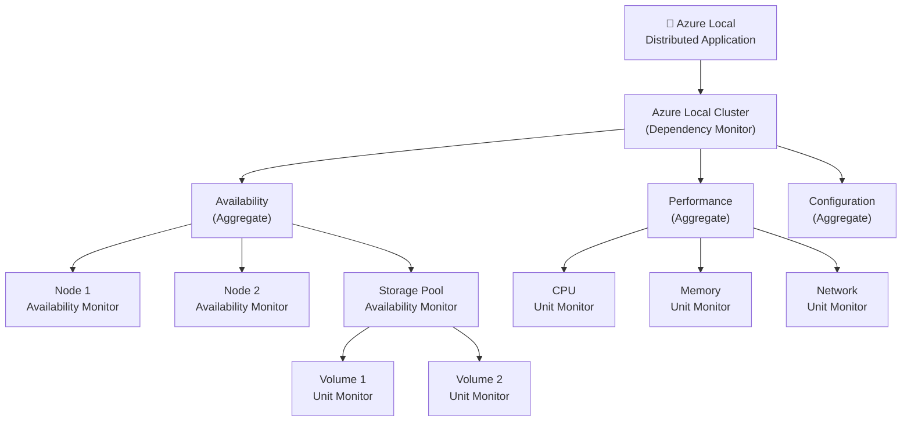
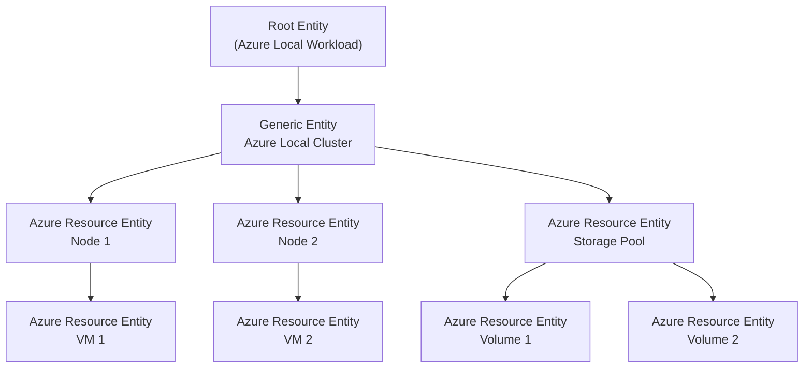
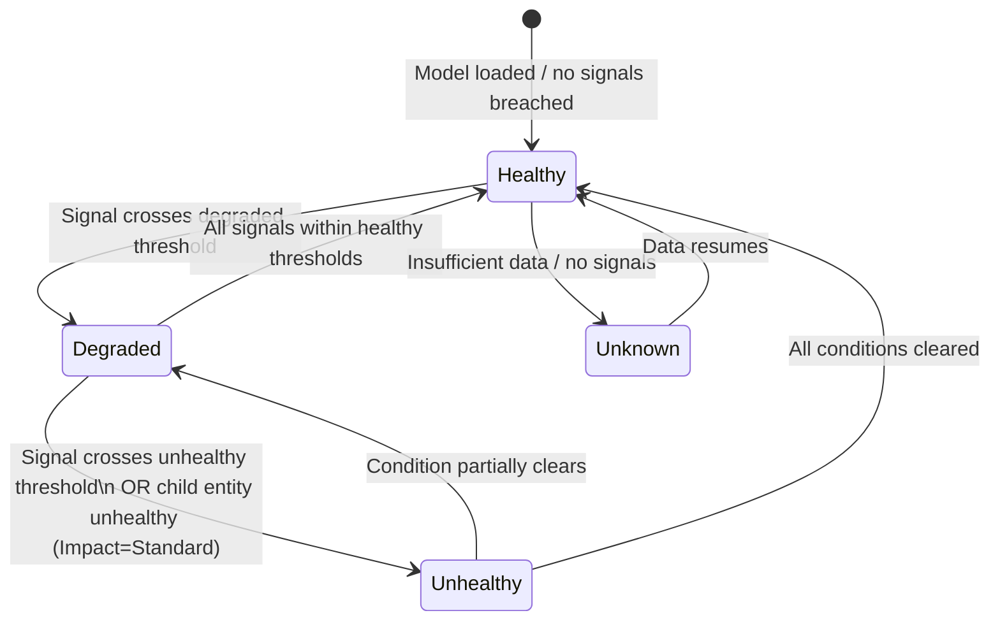

# Implementation Plan — azurelocal-scom-mp

> Last updated: May 2026  
> Status: **Phase 1 complete** — repo scaffold, docs platform, and site live at https://azurelocal.cloud/azurelocal-scom-mp/

---

## Project Goals

Build a comprehensive, well-documented health monitoring solution for **Azure Local (HCI)** clusters delivered via two parallel tracks:

1. **SCOM Management Pack** — a sealed `.mp` + override `.xml` authored using the classic SCOM health model (unit → aggregate → dependency → distributed application rollup tree).
2. **Azure Monitor Health Models** — a native Azure preview feature that models the same Azure Local health topology using service groups, entities, signals, and health propagation.

Both tracks will share:
- A single conceptual health model (what "healthy" means for an Azure Local cluster)
- A unified MkDocs Material documentation site
- draw.io diagrams and advanced Mermaid diagrams as first-class artifacts

---

## Repository Structure

```
azurelocal-scom-mp/
│
│   README.md                          # Project overview
│   PLAN.md                            # This file
│   REFERENCES.md                      # All reference links
│   mkdocs.yml                         # MkDocs site configuration
│   .gitignore
│
├── docs/                              # MkDocs source (Markdown + assets)
│   │
│   ├── index.md                       # Landing page — project overview
│   ├── references.md                  # Full references page (rendered from REFERENCES.md)
│   │
│   ├── scom-mp/                       # Track 1: SCOM Management Pack
│   │   ├── index.md                   # Track overview, scope, prerequisites
│   │   ├── health-model.md            # SCOM health model design for Azure Local
│   │   ├── monitors.md                # Unit / Aggregate / Dependency monitor inventory
│   │   ├── rules.md                   # Collection and alerting rules inventory
│   │   ├── authoring.md               # MP authoring guide (VSAE + fragments workflow)
│   │   ├── overrides.md               # Override strategy and naming conventions
│   │   ├── lifecycle.md               # Review → Tune → Deploy → Maintain cycle
│   │   └── diagrams/
│   │       ├── health-tree.md         # Mermaid: full health rollup tree
│   │       └── class-hierarchy.md     # Mermaid: class/hosting relationships
│   │
│   ├── azure-monitor/                 # Track 2: Azure Monitor Health Models
│   │   ├── index.md                   # Track overview, prerequisites, feature status
│   │   ├── concepts.md                # Entities, relationships, signals, health propagation
│   │   ├── health-states.md           # Healthy / Degraded / Unhealthy / Unknown; Impact settings
│   │   ├── service-groups.md          # Service Group setup for Azure Local
│   │   ├── signals.md                 # Signal inventory (metrics + KQL queries)
│   │   ├── alerts.md                  # Alert rules from health state vs individual signals
│   │   ├── create.md                  # Step-by-step: create the health model in Azure portal
│   │   ├── kql/
│   │   │   └── health-score.md        # KQL health score patterns (WAF Mission-Critical style)
│   │   └── diagrams/
│   │       ├── entity-graph.md        # Mermaid: entity relationship graph
│   │       └── health-propagation.md  # Mermaid: health propagation flow
│   │
│   └── comparison/
│       ├── index.md                   # SCOM ↔ Azure Monitor concept mapping table
│       └── migration.md              # SCOM → Azure Monitor migration guidance + tool
│
├── src/
│   │
│   ├── scom-mp/                       # Track 1: Management Pack XML source
│   │   │                              # 3-MP split per Brian Wren Module 7 / SC 2012 Authoring Guide:
│   │   │                              #   Library (sealed) → Monitoring (sealed, refs Library) → Override (unsealed)
│   │   ├── AzureLocal.SCOM.Library.mp          # Sealed: TypeDefinitions (classes, relationships), discoveries
│   │   ├── AzureLocal.SCOM.Monitoring.mp       # Sealed: monitors, rules, views, tasks (References Library)
│   │   ├── AzureLocal.SCOM.Override.xml        # Unsealed: operator-editable threshold overrides
│   │   └── fragments/                          # XML fragment building blocks, organized by target MP
│   │       ├── library/
│   │       │   ├── classes.xml                 # <TypeDefinitions>: all 24 AzureLocal.* classes
│   │       │   ├── relationships.xml           # Hosting + Containment + Reference relationships
│   │       │   ├── discovery-cluster.xml       # Cluster + Node discovery (PowerShell/WMI)
│   │       │   ├── discovery-storage.xml       # StoragePool, Volume, StorageTier, PhysicalDisk
│   │       │   └── discovery-network.xml       # NetworkIntent, NetworkAdapter
│   │       └── monitoring/
│   │           ├── monitor-unit-event.xml      # Event-based unit monitors template
│   │           ├── monitor-unit-perf.xml       # Performance threshold unit monitors template
│   │           ├── monitor-unit-service.xml    # Windows service unit monitors template
│   │           ├── monitor-aggregate.xml       # Aggregate monitor roll-up template
│   │           ├── monitor-dependency.xml      # Dependency monitor template
│   │           ├── rule-collection-perf.xml    # Performance collection rules template
│   │           ├── rule-collection-event.xml   # Event collection rules template
│   │           └── views.xml                   # State/alert/performance views
│   │
│   └── azure-monitor/                 # Track 2: Azure Monitor artifacts
│       │                              # Deployment strategy: Bicep-first (see ADR 0013)
│       │                              # Portal bootstrap once → export → Bicep is source of truth
│       ├── bicep/                     # Source: Bicep modules (checked in, versioned)
│       │   ├── main.bicep             # Orchestrator: deploys all modules in dependency order
│       │   ├── modules/
│       │   │   ├── service-group.bicep        # Microsoft.Management/serviceGroups
│       │   │   ├── health-model.bicep         # Microsoft.Monitor/healthModels
│       │   │   ├── entities.bicep             # Entity + relationship definitions, embedded KQL signals
│       │   │   ├── alerts.bicep               # Metric alert rules + scheduled query rules
│       │   │   ├── action-groups.bicep        # Notification routing (action groups)
│       │   │   └── dcr.bicep                  # Data Collection Rules (DCMA/AMA metrics)
│       │   └── parameters/
│       │       ├── lab.bicepparam             # Lab/dev: relaxed thresholds, no paging
│       │       ├── standard.bicepparam        # Standard production defaults
│       │       └── strict.bicepparam          # High-criticality: tighter thresholds
│       ├── scripts/
│       │   └── Deploy-HealthModel.ps1         # az deployment wrapper + pre-flight checks
│       ├── kql/
│       │   ├── signals/                       # One .kql per signal (matches signal-catalog.md)
│       │   │   └── (per-signal .kql files)
│       │   └── health-score.kql               # WAF-pattern layered health score query
│       ├── workbooks/
│       │   └── azurelocal-health.workbook.json  # Azure Monitor Workbook for visualization
│       └── dist/                      # Generated output — do not hand-edit
│           └── (bicep build artifacts, exported ARM JSON)
│
└── src/squaredup/                     # Optional visualization layer deliverables
    ├── ds/                            # SquaredUp Dashboard Server pack (SCOM track, Phase 3)
    │   └── (dashboard pack JSON files)
    └── cloud/                         # SquaredUp Cloud workspace export (Azure Monitor track, Phase 4)
        └── (workspace JSON files)
│
└── diagrams/                          # Diagram sources (originals only — rendered copies live under docs/)
    └── drawio/
        ├── scom-health-model.drawio            # Full SCOM health rollup tree (draw.io)
        ├── azure-monitor-entity-graph.drawio   # Azure Monitor health model entity graph
        └── concept-comparison.drawio           # Side-by-side SCOM ↔ Azure Monitor
```

> **Mermaid diagrams** live under `docs/` (`docs/scom-mp/diagrams/`, `docs/azure-monitor/diagrams/`,
> `docs/design/diagrams/`) so MkDocs renders them inline. The `diagrams/drawio/` directory holds
> editable `.drawio` originals only; PNG/SVG exports are committed alongside the rendered docs pages.


---

## MkDocs Configuration Overview

Platform: **MkDocs Material** with the following plugins and extensions planned:

| Feature | Plugin / Extension | Purpose |
|---|---|---|
| Theme | `material` | Base theme |
| Diagrams | `pymdownx.superfences` + `mermaid` | Render Mermaid diagrams inline in docs |
| draw.io embed | `drawio-exporter` or static PNG exports | Render draw.io diagrams |
| Navigation | `navigation.tabs`, `navigation.sections` | Two-track top-level nav |
| Search | `search` | Full-text search |
| Versioning | `mike` | Version the docs site alongside MP releases |
| Code blocks | `pymdownx.highlight` + `pymdownx.inlinehilite` | XML/KQL syntax highlighting |
| Admonitions | `admonition` + `pymdownx.details` | Note/Warning/Tip callouts |
| Tables | built-in | Reference tables |
| Tags | `tags` | Cross-cutting topic tags |

**`mkdocs.yml` nav structure:** see the live [`mkdocs.yml`](../mkdocs.yml) — nav is the source of truth
and evolves per phase. Top-level sections are: Home, **Design** (cross-cutting: scope, signals,
concept-mapping, customization, decisions/), **SCOM Management Pack**, **Azure Monitor Health Models**,
**Migration**, References.

---

## Diagrams Plan

### draw.io Diagrams

| File | Description | Key elements |
|---|---|---|
| `scom-health-model.drawio` | Full SCOM health rollup tree for Azure Local | Azure Local Distributed App → Cluster nodes → Storage pools → Volumes → VMs. Dependency + aggregate monitor symbols. |
| `azure-monitor-entity-graph.drawio` | Azure Monitor health model entity graph | Root entity → Cluster entity → Node entities → Storage Pool → Volume → VM. Color-coded health states. |
| `concept-comparison.drawio` | Side-by-side SCOM ↔ Azure Monitor | Dual-column layout. Matching concepts connected with dashed lines. |

### Mermaid Diagrams

#### 1. SCOM Health Rollup Tree (`scom-health-rollup.md`)



#### 2. Azure Monitor Entity Graph (`azure-monitor-entity-graph.md`)



#### 3. Health State Transition (`health-state-flow.md`)



---

## Azure Local Health Model Design

> **Scope (locked in Phase 2A — ADR 0001):** This project monitors **Azure Local infrastructure only** —
> everything that is deployed *as part of* an Azure Local deployment. Workloads running on top
> (VMs, AKS Arc pods, applications) are out of scope and tracked as future companion MPs in
> [Roadmap](docs/project/roadmap.md). Cluster-resident *platform* services (Arc Resource Bridge,
> MOC, AKS Arc platform) are in scope because they're part of the Azure Local platform itself.

### What "Healthy" Means for Azure Local Infrastructure

Health is modeled across **three layers**:

1. **On-prem layer** — physical and logical components of the cluster itself
2. **Cluster-resident platform layer** — Microsoft-supplied platform services that run *on* the cluster
3. **Azure-side layer** — every Azure resource provisioned as part of the Azure Local deployment

#### Layer 1 — On-prem (the cluster box)

| Component | Health Dimensions | Key Signals |
|---|---|---|
| **Cluster** | Availability, Configuration | Cluster service state, quorum status, cluster validation warnings, witness health |
| **Node** | Availability, Performance, Configuration | OS uptime, CPU %, memory %, NIC link state, BMC/IPMI alerts, pending reboots |
| **Storage Pool** | Availability, Performance | Pool health status, operational status, capacity, repair jobs |
| **Volume (CSV)** | Availability, Performance | Volume health, operational status, % full, IOPS, latency, redirected I/O |
| **Storage Tier (cache)** | Availability, Performance | Cache state, cache hit ratio, drive failures within tier |
| **Physical Disk health (rolled into pool)** | Availability | Disk health attributes, predictive failure, disk job state — surfaced *via* the storage pool |
| **Network ATC / Network Intent** | Availability, Performance, Configuration | Intent state, RDMA op status, vSwitch health, adapter state, MTU/VLAN drift |
| **Storage Replica** | Availability | Replication status, RPO, replication lag |
| **Update / LCM state** | Configuration | Available updates, last-update result, solution version drift |

#### Layer 2 — Cluster-resident platform services

| Component | Health Dimensions | Key Signals |
|---|---|---|
| **Arc Resource Bridge / MOC** | Availability, Configuration | Resource Bridge VM state, MOC service state, control plane health |
| **AKS Arc platform** *(if deployed)* | Availability | AKS host pool state, control plane reachability — *not* workload pods |
| **Azure Local agent (Cloud Agent / DCMA)** | Availability | Agent service state, last-heartbeat-to-Azure, telemetry pipeline |
| **HCI registration state** | Configuration | Registration status, license tier, billing connectivity |

#### Layer 3 — Azure-side infrastructure (provisioned as part of the deployment)

| Component | Health Dimensions | Key Signals |
|---|---|---|
| **HCI Cluster resource** (`Microsoft.AzureStackHCI/clusters`) | Availability, Configuration | Resource provisioning state, connection status, last connected time |
| **Arc-enabled Server (per node)** (`Microsoft.HybridCompute/machines`) | Availability | Agent connection status, heartbeat freshness |
| **Custom Location** | Availability, Configuration | Custom Location provisioning state, namespace presence |
| **Logical Networks** (`Microsoft.AzureStackHCI/logicalNetworks`) | Configuration | Provisioning state, IP pool exhaustion |
| **Managed Identity** (system-assigned + user-assigned) | Configuration | Identity exists, role assignments still present |
| **Service Principal (deployment SPN)** | Configuration | SPN exists, secret/cert not expiring, role assignments |
| **Key Vault** | Availability, Configuration | Key Vault reachable, required secrets present, access policies / RBAC, secret expiry |
| **Storage Account** | Availability, Configuration | Account reachable, redundancy tier as expected, network ACLs |
| **Storage container / blob path** | Availability, Configuration | Container exists, blob path accessible, lifecycle policy |
| **RBAC / role assignments** | Configuration | Required role assignments present (across cluster identity, deployment SPN, MI) |
| **Update Manager / Azure Update Manager linkage** | Availability, Configuration | Linkage healthy, last-assessment age, pending updates |
| **Azure Monitor data collection rule(s)** | Configuration | DCRs exist, associated, ingesting |
| **Log Analytics Workspace linkage** | Availability | Workspace reachable, ingestion latency, table presence |
| **Activity log / Resource Health stream** | Availability | Resource Health current state, recent activity log adverse events |

### Health Rollup Policy

Both tracks use **worst-state** rollup as the default:

- A cluster node going **Unhealthy** rolls up to the cluster as **Unhealthy**.
- A volume going **Degraded** (e.g. 92% full) rolls up to the storage pool as **Degraded**, which propagates to the cluster as **Degraded**.
- A missing role assignment on the deployment SPN rolls up to **Configuration: Unhealthy** at the Azure-side branch.
- An expiring Key Vault secret rolls up to **Warning** at 30 days, **Critical** at 7 days.
- VMs / workloads (out of scope here) that are stopped intentionally can be configured with **Suppressed** impact in workload-companion MPs.

### Customization Strategy *(see [Customization](docs/design/customization.md))*

Every threshold, alert severity, and behavior is **parameterized** so customers customize without forking:

- **SCOM track** — sealed `AzureLocal.SCOM.Library.mp` + sealed `AzureLocal.SCOM.Monitoring.mp` + unsealed `AzureLocal.SCOM.Override.xml` with three pre-built tiers (Lab / Standard / Strict). Customer-authored override packs reference our override pack, not the sealed MPs. Upgrade-safe by SCOM design.
- **Azure Monitor track** — every threshold is a Bicep `param` with a documented default. Three pre-built `*.bicepparam` files (lab / standard / strict). KQL signals are replaceable via named module inputs. Action group routing is parameter-driven.
- **Cross-track parity** — same logical threshold has the same name across both tracks (`Volume.FreeSpace.WarnPercent` ↔ `volumeFreeSpaceWarningThresholdPct`).

---

## Phased Delivery Roadmap

### Phase 0 — Research & Planning ✅ COMPLETE
- [x] Research SCOM health model concepts and authoring documentation
- [x] Research Azure Monitor health model (preview) concepts and API
- [x] Research community tools: Silect MP Author, Kevin Holman fragments
- [x] Research SCOM → Azure Monitor migration patterns
- [x] Define repo structure
- [x] Write README, PLAN, REFERENCES

### Phase 1 — Documentation Scaffold ✅ COMPLETE
- [x] Initialize MkDocs Material site (`mkdocs.yml` + `docs/index.md`)
- [x] Create stub pages for all doc sections (both tracks)
- [x] Add MkDocs plugins: mermaid, superfences, navigation tabs
- [x] Publish skeleton site (GitHub Pages → azurelocal.cloud/azurelocal-scom-mp/)
- [x] Add draw.io diagram stubs to `diagrams/drawio/`
- [x] Implement all three Mermaid diagrams in `diagrams/mermaid/`

### Phase 2 — Health Model Design
- [x] Reorg docs site: add top-level Design section (cross-cutting), make track sections track-specific only
- [x] Move ADRs into `docs/design/decisions/` so they render in MkDocs
- [x] Move Customization into `docs/design/`
- [x] Move SCOM ↔ AzMon concept mapping into `docs/design/concept-mapping.md`; comparison/ becomes Migration only
- [x] Author ADRs in `docs/design/decisions/` (matches `AzureLocal/platform` template)
  - [x] ADR 0001 — Scope & topology (infra only — 3 layers, ~25 entities) — Accepted
  - [x] ADR 0002 — Primary signal source (Azure Local PowerShell APIs + ARM/Resource Graph) — Accepted
  - [x] ADR 0003 — Health rollup policy (worst-state default + impact exceptions) — Accepted
  - [x] ADR 0004 — SCOM discovery strategy (PowerShell Discovery, not WMI) — Accepted
  - [x] ADR 0005 — SCOM class hierarchy + hosting relationships (3-layer model) — Accepted
  - [x] ADR 0006 — Azure Monitor entity model alignment (mirrors SCOM 1:1) — Accepted
  - [x] ADR 0007 — Naming convention (cross-track parity) — Accepted
  - [x] ADR 0008 — Customization strategy (sealed MP + override pack tiers; Bicep params + tiers) — Accepted
  - [x] ADR 0009 — Alert vs health-state separation policy — Accepted
  - [x] ADR 0010 — Cloud-side prerequisites contract (HCI Insights, AMA, DCMA, Service Group, RBAC, networking) — Accepted
  - [x] ADR 0011 — L3 Azure-side scope: agent-local Arc health checks (Tier A) vs. management server ARM probes (Tier B) — Accepted
  - [x] ADR 0012 — Azure Monitor Workspace vs Log Analytics Workspace: metrics routing for the health model (dual-topology support, LAW Perf fallback) — Accepted
  - [x] ADR 0013 — Azure Monitor Health Model deployment strategy (Bicep-first, portal-bootstrap) — Accepted
  - [x] ADR 0014 — CI/CD pipeline strategy (GitHub Actions, OIDC, release-please) — Accepted
  - [x] ADR 0015 — Testing strategy (5-layer pyramid, cross-track parity gate) — Accepted
  - [x] ADR 0016 — Signing & secrets management (two-key MP signing, OIDC SPNs) — Accepted
  - [x] ADR 0017 — Versioning & release policy (single repo SemVer, Conventional Commits, mike) — Accepted
  - [x] ADR 0018 — Self-observability (monitor the monitoring pipeline as a parallel root branch) — Accepted
  - [x] ADR 0019 — Cost, scale, and data retention (per-tier ingestion envelopes, retention policy) — Accepted
- [x] Build full structural inventory tables in `docs/design/`
  - [x] Component inventory (~27 entities across 3 layers — updated with `AzureLocal.PhysicalDisk`, `AzureLocal.NetworkAdapter`, Arc agent Tier A group) — `scope-topology.md`
  - [x] Signal inventory (~250+ signals × dimensions × thresholds × source × Default ON/OFF/Rule column) — `signal-catalog.md`
  - [x] SCOM ↔ Azure Monitor concept mapping table — `concept-mapping.md`
  - [x] Cloud-side prerequisites table — `azure-monitor/prerequisites.md`
- [x] Complete draw.io diagrams (replace Phase 1 stubs with real visuals)
  - [x] `scom-health-model.drawio` — full 3-layer rollup tree
  - [x] `azure-monitor-entity-graph.drawio` — entity graph w/ relationships
  - [x] `concept-comparison.drawio` — side-by-side mapping
- [x] Refine Mermaid sources to match ADR 0005 / 0006 names
- [x] Phase 2 sign-off gate: all 19 ADRs Accepted ✅; inventory reviewed ✅; draw.io diagrams complete ✅; SquaredUp optional integration documented in ADR 0008 + customization.md ✅; CI/CD + testing + signing + versioning + self-observability + cost design ratified via ADRs 0014–0019 ✅

**Phase 2 Definition of Done (exit criteria):**

- Every L1 / L2 / L3 entity in `scope-topology.md` has at least one signal in `signal-catalog.md` covering each declared health dimension (Availability / Performance / Configuration as applicable).
- Every threshold name in `signal-catalog.md` is unambiguous, kebab-case in Bicep, PascalCase-with-dots in SCOM, and the cross-track parity test (ADR 0015 Layer 4) is implementable from the catalog as-is.
- Every ADR has a `Status: Accepted` line and references at least one prior or sibling ADR where dependencies exist.
- `mkdocs.yml` nav contains every page under `docs/` (no orphan files); `mkdocs build --strict` passes.
- Self-Observability branch (ADR 0018) is reflected in `scope-topology.md` (`AzureLocal.Monitoring.*` entities) and `signal-catalog.md`.
### Phase 3 — Track 1: SCOM MP Authoring
- [ ] Watch/review Brian Wren's SC 2012 R2 video series (23 modules) as primary authoring reference — see [Brian Wren Resources](#brian-wren--mpauthor-resources) below
- [ ] **Wire CI/CD scaffolding (per ADR 0014)** — add `.github/workflows/{mp-build,bicep-validate,pwsh-test,kql-validate,parity-check,docs-build,docs-deploy,release-please}.yml`, `release-please-config.json`, `.release-please-manifest.json`, root `VERSION` file
- [ ] **Wire signing + identity (per ADR 0016)** — provision lab + release Key Vaults, three OIDC-federated SPNs, GitHub `lab` and `release` environments with required reviewers; gitleaks pre-commit hook
- [ ] **Wire test harness scaffolding (per ADR 0015)** — `tests/Test-Parity.ps1`, one Pester sample, one KQL signal test fixture as the pattern reference for all subsequent Phase 3/4 work
- [ ] Set up VSAE project + fragment library references (Kevin Holman fragments)
- [ ] Define Azure Local classes (Cluster, Node, Storage Pool, StorageTier, Volume, Network Intent, **Physical Disk**, **Network Adapter**) in XML — see `docs/design/scope-topology.md` for full class list
- [ ] Author PowerShell discovery rules for each class (including hosted `AzureLocal.PhysicalDisk` from `Get-PhysicalDisk` and `AzureLocal.NetworkAdapter` from `Get-NetAdapter`/`Get-NetAdapterRdma`)
- [ ] Author unit monitors — coverage per signal-catalog.md:
  - [ ] L1 availability + performance monitors (Cluster, Node, Storage Pool, Volume, Storage Tier, Physical Disk, Network Intent, Network Adapter, Storage Replica, LCM)
  - [ ] L2 Tier A "Arc agent local checks" monitors (HIMDS service, connection status, heartbeat age, extension installation — no ARM required, runs on SCOM agent)
  - [ ] L2 DCMA + AKS Arc monitors
  - [ ] L3 Tier B ARM probe monitors (HCI Cluster resource, KV expiry, RBAC drift, SPN expiry — management server only, Limited impact by default)
- [ ] Wire aggregate monitors (4 standard + custom rollups for Physical Disk → StoragePool, NetworkAdapter → NetworkIntent)
- [ ] Wire dependency monitors between classes
- [ ] Create Distributed Application for Azure Local
- [ ] Create override companion pack (including Tier B Limited → Standard impact overrides for L3 ARM probes)
- [ ] Run MP Best Practice Analyzer + MPVerify
- [ ] Author Self-Observability entities + monitors (per ADR 0018) — `AzureLocal.Monitoring.SCOMAgent`, `SCOMManagementServer`, plus the parallel root-branch aggregate
- [ ] Author tuning runbooks (`docs/scom-mp/runbooks/`) — one per high-noise monitor with override-pattern recipe
- [ ] Author SCOM DB sizing guidance (`docs/scom-mp/sizing.md`) per ADR 0019
- [ ] Test in pre-production SCOM environment

**Step 4 — SquaredUp DS dashboard pack (optional)**
- [ ] Install SquaredUp DS trial against test SCOM environment
- [ ] Author Azure Local dashboard pack in `src/squaredup/ds/` (Cluster Overview, Storage Detail, Network Detail, Platform Services, Alert NOC tiles)
- [ ] Export dashboard pack JSON; validate against DS catalog format
- [ ] Document DS setup and dashboard pack in `docs/scom-mp/squaredup/index.md`

### Phase 4 — Track 2: Azure Monitor Health Model
> Deployment strategy: **Bicep-first, portal-bootstrap** — see [ADR 0013](docs/design/decisions/0013-azmon-deployment-strategy.md)

**Step 1 — Bootstrap (portal, one-time)**
- [ ] Verify all cloud prerequisites met (ADR 0010): HCI Insights, AMA, DCMA, RBAC, networking
- [ ] Create Azure Service Group for Azure Local resources (ARM resource — script in `scripts/`)
- [ ] Build initial health model interactively in Azure portal to validate entity topology
- [ ] Validate KQL signal queries from `src/azure-monitor/kql/signals/` against live LAW
- [ ] Configure Impact settings (Standard/Limited/Suppressed per ADR 0003 + ADR 0006)
- [ ] Set Health Objectives on root entity

**Step 2 — Export and modularize (one-time)**
- [ ] Export portal model to ARM JSON; decompile to Bicep with `az bicep decompile`
- [ ] Split decompiled output into `src/azure-monitor/bicep/modules/` structure (ADR 0013)
- [ ] Parameterize all thresholds as Bicep `param` — generate `lab.bicepparam`, `standard.bicepparam`, `strict.bicepparam`
- [ ] Wire KQL signal files from `kql/signals/` into `entities.bicep` as module inputs
- [ ] Write `scripts/Deploy-HealthModel.ps1` wrapper (pre-flight checks + `az deployment sub create`)

**Step 3 — Alert rules and visualization**
- [ ] Author alert rules in `bicep/modules/alerts.bicep` (curated allow-list from ADR 0009)
- [ ] Author action group module with parameter-driven routing
- [ ] Write KQL health score queries in `kql/health-score.kql` (WAF Mission-Critical pattern)
- [ ] Build Azure Monitor Workbook for visualization (`workbooks/azurelocal-health.workbook.json`)

**Step 4 — Validate and document**
- [ ] Run `bicep build` → generate `dist/` ARM JSON for audit review
- [ ] Test end-to-end deployment with `lab.bicepparam` against pre-production environment
- [ ] **Run Phase 4 sizing exercise on a real lab cluster (per ADR 0019)** — measure actual MB/day per tier, update ADR 0019 envelope numbers if reality diverges
- [ ] Author Self-Observability entities + KQL signals (per ADR 0018) under `AzureLocal.Monitoring.*`
- [ ] Author cost-tuning playbook (`docs/azure-monitor/cost-tuning.md`) per ADR 0019 (5-step downgrade procedure)
- [ ] Write `docs/azure-monitor/` doc pages (entities, signals, health objectives, alerts, deployment guide)

**Step 5 — SquaredUp Cloud workspace (optional)**
- [ ] Connect SquaredUp Cloud to the Azure subscription (Azure plugin) and SCOM (SCOM plugin)
- [ ] Build Cluster Health, Azure-side Resources, Hybrid View, and Alerts dashboards in SquaredUp Cloud
- [ ] Export workspace JSON to `src/squaredup/cloud/`
- [ ] Document SquaredUp Cloud setup and workspace in `docs/azure-monitor/squaredup/index.md`

### Phase 5 — Migration Guidance
- [ ] Run SCOM→Azure Monitor migration tool against the new MP
- [ ] Document auto-migrated vs manual migration items
- [ ] Write `docs/comparison/migration.md`

### Phase 6 — Documentation Polish & Release
- [ ] Review all doc pages for completeness
- [ ] Publish full MkDocs site
- [ ] Tag v1.0.0 release
- [ ] Publish MP to release artifacts

---

## Org Standards — Internal

This repo follows org-internal standards from the private `AzureLocal/platform` repo (theme, plugins,
reusable workflows, repo audit). Compliance is enforced via `Invoke-RepoAudit.ps1` and the
`reusable-drift-check.yml` workflow — no public-facing artifacts in this repo should reference the
private platform repo by URL.

Phase 0 platform compliance items (`.editorconfig`, `.gitignore`, `CHANGELOG.md`, `CODEOWNERS`,
`STANDARDS.md` stub, `.azurelocal-platform.yml`, pinned `requirements-docs.txt`, reusable
workflows) were completed during Phase 1 and are validated continuously by the audit workflow.

<!-- internal-only details (file contents, badge URLs, version pins) live in the private platform
     repo and in repo memory; do not surface them in PLAN.md which is rendered publicly. -->

---

## SquaredUp Dashboards

SquaredUp provides best-in-class dashboards for both tracks of this project. They ship two distinct products:

### Dashboard Server (DS) — On-Premises SCOM

> **`ds.squaredup.com`** — The #1 dedicated dashboard solution for System Center Operations Manager. Installs on-premises alongside SCOM.

| Feature | Detail |
|---|---|
| Install model | On-premises Windows server, connects directly to SCOM SDK |
| VADA | Visual Application Discovery & Analysis — dynamically maps application dependencies from SCOM data |
| Integrations | 60+ including Azure, AWS, VMware, SolarWinds, Splunk, ServiceNow, Prometheus |
| Ready-made dashboards | 8 out-of-the-box SCOM packs (Alerts, Server Monitoring, NOC Operator, SQL, Groups, Management Server) |
| Free MPs | Cookdown/PowerShell MP, Self Maintenance MP, Community Catalog MP (all at `ds.squaredup.com/cookdown/`) |
| Trial | 30-day free trial, download at `download.squaredup.com` |
| SCOM MI support | Yes — blog: [Dashboarding Azure Monitor SCOM MI in SquaredUp](https://squaredup.com/blog/dashboarding-scom-mi-in-squaredup/) |
| Health roll-up blog | [A dive into health roll-up](https://squaredup.com/blog/a-dive-into-health-roll-up/) — explains DS's own health propagation model |

**Track 1 commitment:** SquaredUp DS is the chosen visualization layer for the SCOM MP. Authoring
tasks live under [Phase 3 Step 4](#phase-3--track-1-scom-mp-authoring); design docs at
[`docs/scom-mp/squaredup/`](docs/scom-mp/squaredup/index.md).

### SquaredUp Cloud — Azure + SCOM Plugin

> **`squaredup.com`** — SaaS platform with 80+ integrations. Relevant for both tracks.

| Plugin | Data streams | Ready-made dashboards | Documentation |
|---|---|---|---|
| **Azure plugin** | 55 (Azure Monitor metrics, KQL, Cost, Sentinel, Resource Graph, Log Analytics, App Insights, Service Health…) | 44 | https://docs.squaredup.com/data-sources/azure-plugin |
| **SCOM plugin** | 3 (Alerts, Health, Metrics) | 8 | https://docs.squaredup.com/data-sources/scom-plugin |

**Capabilities relevant to this project:**
- Aggregate Azure Monitor alerts and metrics **across subscriptions** in a single dashboard
- KQL query visualizations — turn health score queries into live dashboard tiles
- Combine SCOM health data + Azure Monitor data in a single pane (critical for the hybrid SCOM + Azure Monitor story)
- SCOM Managed Instance reporting: [SCOM MI reporting – New SquaredUp Plugin](https://squaredup.com/blog/scom-mi-reporting-new-squaredup-plugin/)
- Free tier: 2 users, 3 data sources, 10 monitors, unlimited dashboards

**Track 2 commitment:** SquaredUp Cloud is the chosen complement to Azure Monitor Workbooks for
the hybrid SCOM + Azure Monitor pane. Authoring tasks live under
[Phase 4 Step 5](#phase-4--track-2-azure-monitor-health-model); design docs at
[`docs/azure-monitor/squaredup/`](docs/azure-monitor/squaredup/index.md).

---

## Brian Wren / MPAuthor Resources

> Brian Wren was a **Microsoft technical writer on the Information Experience (IX) Team** who owned all SCOM management pack authoring documentation and education from ~2007–2016. He ran the `@mpauthor` Twitter handle. His 23-module Microsoft Virtual Academy video series on SC 2012 R2 is the most complete end-to-end MP authoring course ever produced.

### The Definitive Video Series — Microsoft Learn / Channel 9

**Series:** "System Center 2012 R2 Operations Manager Management Packs"  
**URL:** https://learn.microsoft.com/en-us/shows/system-center-2012-r2-operations-manager-management-packs/  
**Original Channel 9:** https://channel9.msdn.com/Series/System-Center-2012-R2-Operations-Manager-Management-Packs

| Module | Title | Date |
|---|---|---|
| 1 | Introduction to Management Packs | Jan 2, 2014 |
| 2 | Introduction to Authoring Tools | Jan 2, 2014 |
| 3 | Creating a Management Pack Solution | Jan 2, 2014 |
| 4 | Understanding Classes | Jan 2, 2014 |
| 5 | Understanding Relationships | Jan 2, 2014 |
| 6 | Designing a Service Model | Mar 10, 2014 |
| 7 | Building Classes and Relationships | Mar 10, 2014 |
| 8 | Intro to Discoveries | Mar 10, 2014 |
| 9 | Registry Discoveries | Mar 21, 2014 |
| 10 | WMI Discoveries | Mar 28, 2014 |
| 11 | Script Discoveries | Apr 17, 2014 |
| 12 | Testing and Troubleshooting Discoveries | Jun 10, 2014 |
| 13 | Discovering Relationships | Jun 29, 2014 |
| 14 | Advanced Discovery | Jun 29, 2014 |
| **15** | **Health Model Introduction** ⭐ | Aug 7, 2014 |
| **16** | **Designing a Health Model** ⭐ | Sep 11, 2014 |
| **17** | **Unit Monitors** ⭐ | Oct 1, 2014 |
| **18** | **Rules** ⭐ | Oct 1, 2014 |
| **19** | **Health Rollup** ⭐ | Dec 16, 2014 |
| 20 | Monitoring Scripts | Dec 16, 2014 |
| 21 | Modules and Workflows | Dec 17, 2014 |
| 22 | Building a Custom Workflow | Dec 18, 2014 |
| 23 | Cookdown | Mar 13, 2015 |

> Modules 15–19 are the most directly relevant to this project — they cover the health model, unit monitors, rules, and health rollup in depth.

### MPAuthor Blog Archive (Brian Wren's Primary Blog, 2010–2014)

**Archived URL:** https://learn.microsoft.com/en-us/archive/blogs/mpauthor/  
**Original URL:** `https://blogs.technet.com/MPAuthor` (no longer live)

Selected most-relevant posts:

| Date | Post | Archived URL |
|---|---|---|
| Jun 5, 2014 | Discovering Multiple Services of an Application | `/discovering-multiple-services-of-an-application` |
| Apr 7, 2014 | **Management Pack Development Training** | `/management-pack-development-training` |
| Jan 27, 2013 | Some Love for Visual Studio Authoring Extensions | `/some-love-for-visual-studio-authoring-extensions` |
| Jun 28, 2012 | The new authoring tools are here! | `/the-new-authoring-tools-are-here` |
| May 3, 2011 | **Designing Managed Applications Whitepaper** | `/designing-managed-applications-whitepaper` |
| Apr 17, 2011 | **Authoring Guide Health Model Section Live** | `/authoring-guide-health-model-section-live` |
| Jan 14, 2011 | Discovery Series Part 4 – Discovery Scripts | `/discovery-series-part-4-discovery-scripts` |
| Nov 16, 2010 | **Discovery Series – Parts 2 and 3** (Registry + WMI) | `/discovery-series-parts-2-and-3` |
| Oct 18, 2010 | **How Discovery Works** | `/how-discovery-works` |
| Aug 1, 2010 | **Complete MP Authoring Guide Available for Download** | `/complete-mp-authoring-guide-available-for-download` |
| Jul 14, 2010 | **Management Pack Authoring Guide Complete!** | `/management-pack-authoring-guide-complete` |
| Jun 7, 2010 | **How Do I? Videos** (first MP authoring video) | `/how-do-i-videos` |
| Jun 1, 2010 | **Management Pack Basics** | `/management-pack-basics` |
| Apr 30, 2010 | MP Samples | `/mp-samples` |

### BWren's Management Space (Earlier Blog, 2007–2010)

**Archived URL:** https://learn.microsoft.com/en-us/archive/blogs/brianwren/  
**Original URL:** `https://blogs.technet.microsoft.com/brianwren`

Selected posts:

| Date | Post |
|---|---|
| Jan 2010 | Management Pack Authoring Guide v2 |
| Oct 2009 | MP Author Resource Kit |
| Jun 2009 | PowerShell Scripts in a Management Pack Part 2 |
| Feb 2008 | Running PowerShell Scripts from a Management Pack - Part 1 |
| Feb 2008 | Management Pack Authoring Guide |
| Jan 2008 | Dynamically populating component groups in OM 2007 Distributed Applications |
| Aug 2007 | Targeting Rules and Monitors |
| Aug 2007 | WMI Events in OpsMgr 2007 |

### Downloadable Authoring Guide (PDF)

**SC 2012 Operations Manager Authoring (PDF):**  
https://download.microsoft.com/download/3/3/F/33F52373-3A75-422C-969B-61E05EEC5E72/SC2012_OpsMgr_Authoring.pdf

### VSAE YouTube Playlist (by Teknoglot)

"VSAE for Operations Manager - Intro by Brian Wren" — 5 videos:  
https://www.youtube.com/playlist?list=PL9Yal_Kg7hiHPirvvtlb5zQWsWb54Twmu

---

## Key Design Decisions

| Decision | Choice | Rationale |
|---|---|---|
| MP authoring tool | VSAE + Kevin Holman Fragment Library | Free, community-standard, fragments accelerate development significantly. |
| MP signing | Unsigned for development, signed for release | Sealed MPs require a key pair; use test key in dev, production key for release. |
| Override companion pack name | `AzureLocal.SCOM.Override.xml` (per ADR 0007) | Follows Microsoft 3-MP naming convention; see ADR 0007. |
| Aggregate structure | 4 standard categories + custom cluster rollup | Consistent with every other well-authored vendor MP. |
| Dependency monitor rollup policy | Worst-state (default) with per-entity exceptions | Matches operational reality — one bad node should surface. |
| Azure Monitor signal type | Platform metrics where available, KQL for complex logic | Platform metrics are always collected; KQL for Storage Spaces / S2D events. |
| Health model impact for intentional VM stops | Suppressed | VMs in maintenance/stopped state should not drive cluster unhealthy. |
| Documentation platform | MkDocs Material + mike versioning | Consistent with other AzureLocal repos in this organization. |
| Diagram tools | draw.io (design) + Mermaid (in-docs) | draw.io for rich design-time diagrams; Mermaid for version-controlled in-doc diagrams. |
| Dashboard visualization (SCOM) | SquaredUp Dashboard Server (DS) | Best-in-class SCOM dashboard layer. VADA topology maps app dependencies. 60+ integrations extend beyond SCOM. On-premises, installs alongside SCOM. |
| Dashboard visualization (Azure Monitor) | Azure Monitor Workbooks + SquaredUp Cloud | Workbooks for native Azure portal health model views; SquaredUp Cloud for cross-source unified SCOM+Azure view. |
| Org standards compliance | Internal `AzureLocal/platform` audit | Validated continuously via `Invoke-RepoAudit.ps1` and the reusable drift-check workflow. |

---

## References

> The root [`REFERENCES.md`](REFERENCES.md) is the authoritative source. The MkDocs page at
> [`docs/references.md`](docs/references.md) is generated from it via the `include-markdown` plugin
> — there is no hand-edited duplicate. Update only the root file.

See [REFERENCES.md](REFERENCES.md) for the complete annotated list of all upstream sources.
