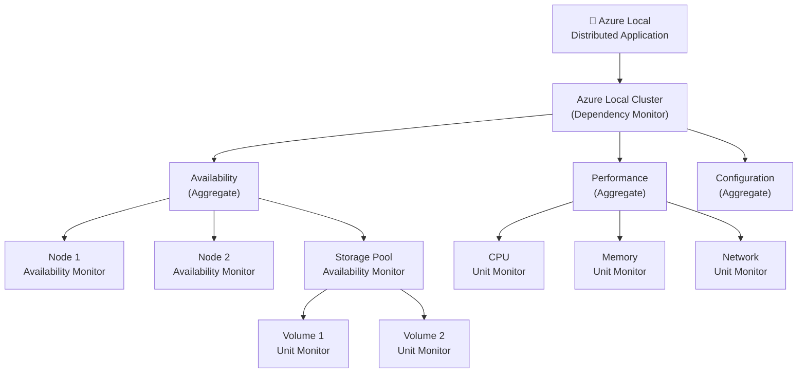
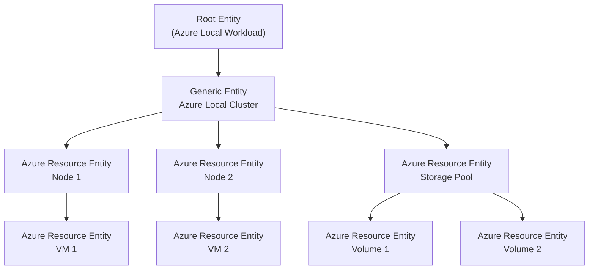
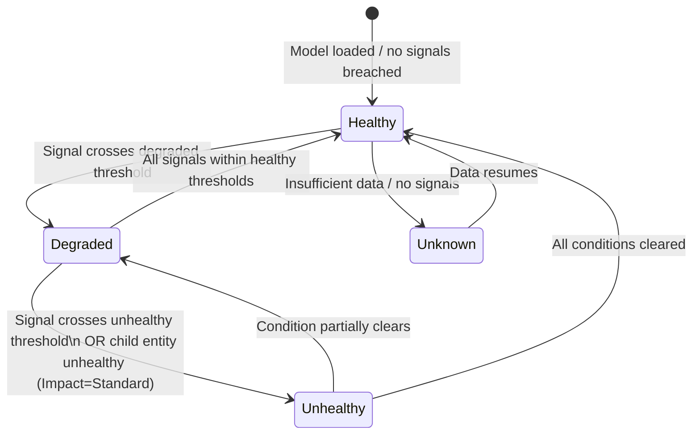

# Implementation Plan — azurelocal-scom-mp

> Last updated: May 2026  
> Status: **Phase 1 complete** — repo scaffold, docs platform, and site live at https://azurelocal.cloud/azurelocal-scom-mp/

---

## Project Goals

Build a comprehensive, well-documented health monitoring solution for **Azure Local (HCI)** clusters delivered via two parallel tracks:

1. **SCOM Management Pack** — a sealed `.mp` + override `.xml` authored using the classic SCOM health model (unit → aggregate → dependency → distributed application rollup tree).
2. **Azure Monitor Health Models** — a native Azure preview feature that models the same Azure Local health topology using service groups, entities, signals, and health propagation.

Both tracks will share:
- A single conceptual health model (what "healthy" means for an Azure Local cluster)
- A unified MkDocs Material documentation site
- draw.io diagrams and advanced Mermaid diagrams as first-class artifacts

---

## Repository Structure

```
azurelocal-scom-mp/
│
│   README.md                          # Project overview
│   PLAN.md                            # This file
│   REFERENCES.md                      # All reference links
│   mkdocs.yml                         # MkDocs site configuration
│   .gitignore
│
├── docs/                              # MkDocs source (Markdown + assets)
│   │
│   ├── index.md                       # Landing page — project overview
│   ├── references.md                  # Full references page (rendered from REFERENCES.md)
│   │
│   ├── scom-mp/                       # Track 1: SCOM Management Pack
│   │   ├── index.md                   # Track overview, scope, prerequisites
│   │   ├── health-model.md            # SCOM health model design for Azure Local
│   │   ├── monitors.md                # Unit / Aggregate / Dependency monitor inventory
│   │   ├── rules.md                   # Collection and alerting rules inventory
│   │   ├── authoring.md               # MP authoring guide (VSAE + fragments workflow)
│   │   ├── overrides.md               # Override strategy and naming conventions
│   │   ├── lifecycle.md               # Review → Tune → Deploy → Maintain cycle
│   │   └── diagrams/
│   │       ├── health-tree.md         # Mermaid: full health rollup tree
│   │       └── class-hierarchy.md     # Mermaid: class/hosting relationships
│   │
│   ├── azure-monitor/                 # Track 2: Azure Monitor Health Models
│   │   ├── index.md                   # Track overview, prerequisites, feature status
│   │   ├── concepts.md                # Entities, relationships, signals, health propagation
│   │   ├── health-states.md           # Healthy / Degraded / Unhealthy / Unknown; Impact settings
│   │   ├── service-groups.md          # Service Group setup for Azure Local
│   │   ├── signals.md                 # Signal inventory (metrics + KQL queries)
│   │   ├── alerts.md                  # Alert rules from health state vs individual signals
│   │   ├── create.md                  # Step-by-step: create the health model in Azure portal
│   │   ├── kql/
│   │   │   └── health-score.md        # KQL health score patterns (WAF Mission-Critical style)
│   │   └── diagrams/
│   │       ├── entity-graph.md        # Mermaid: entity relationship graph
│   │       └── health-propagation.md  # Mermaid: health propagation flow
│   │
│   └── comparison/
│       ├── index.md                   # SCOM ↔ Azure Monitor concept mapping table
│       └── migration.md              # SCOM → Azure Monitor migration guidance + tool
│
├── src/
│   │
│   ├── scom-mp/                       # Track 1: Management Pack XML source
│   │   ├── AzureLocal.SCOM.MP.xml              # Main sealed MP (classes, discoveries, monitors, rules)
│   │   ├── AzureLocal.SCOM.MP.Overrides.xml    # Companion unsealed overrides pack
│   │   └── fragments/                          # XML fragment building blocks
│   │       ├── discovery-wmi.xml
│   │       ├── monitor-unit-event.xml
│   │       ├── monitor-unit-perf.xml
│   │       ├── monitor-aggregate.xml
│   │       ├── monitor-dependency.xml
│   │       └── rule-collection-perf.xml
│   │
│   └── azure-monitor/                 # Track 2: Azure Monitor artifacts
│       ├── arm-templates/
│       │   ├── health-model.json              # ARM template: health model resource
│       │   ├── service-group.json             # ARM template: service group
│       │   └── alert-rules.json               # ARM template: health-state alert rules
│       ├── bicep/
│       │   ├── health-model.bicep
│       │   ├── service-group.bicep
│       │   └── alert-rules.bicep
│       ├── kql/
│       │   ├── azurelocal-health-score.kql    # Layered health score query (WAF pattern)
│       │   ├── node-availability.kql
│       │   ├── storage-pool-health.kql
│       │   └── vm-performance.kql
│       └── workbooks/
│           └── azurelocal-health.json          # Azure Monitor Workbook for SCOM migration users
│
└── diagrams/                          # Master diagram sources (check in originals)
    ├── drawio/
    │   ├── scom-health-model.drawio            # Full SCOM health rollup tree (draw.io)
    │   ├── azure-monitor-entity-graph.drawio   # Azure Monitor health model entity graph
    │   └── concept-comparison.drawio           # Side-by-side SCOM ↔ Azure Monitor
    └── mermaid/
        ├── scom-health-rollup.md               # Mermaid flowchart: SCOM rollup tree
        ├── azure-monitor-entity-graph.md       # Mermaid graph: entity relationships
        └── health-state-flow.md                # Mermaid stateDiagram: health state transitions
```

---

## MkDocs Configuration Overview

Platform: **MkDocs Material** with the following plugins and extensions planned:

| Feature | Plugin / Extension | Purpose |
|---|---|---|
| Theme | `material` | Base theme |
| Diagrams | `pymdownx.superfences` + `mermaid` | Render Mermaid diagrams inline in docs |
| draw.io embed | `drawio-exporter` or static PNG exports | Render draw.io diagrams |
| Navigation | `navigation.tabs`, `navigation.sections` | Two-track top-level nav |
| Search | `search` | Full-text search |
| Versioning | `mike` | Version the docs site alongside MP releases |
| Code blocks | `pymdownx.highlight` + `pymdownx.inlinehilite` | XML/KQL syntax highlighting |
| Admonitions | `admonition` + `pymdownx.details` | Note/Warning/Tip callouts |
| Tables | built-in | Reference tables |
| Tags | `tags` | Cross-cutting topic tags |

**`mkdocs.yml` nav structure:**

```yaml
nav:
  - Home: index.md
  - SCOM Management Pack:
    - Overview: scom-mp/index.md
    - Health Model Design: scom-mp/health-model.md
    - Monitors: scom-mp/monitors.md
    - Rules: scom-mp/rules.md
    - Authoring Guide: scom-mp/authoring.md
    - Overrides: scom-mp/overrides.md
    - Lifecycle: scom-mp/lifecycle.md
    - Diagrams:
      - Health Rollup Tree: scom-mp/diagrams/health-tree.md
      - Class Hierarchy: scom-mp/diagrams/class-hierarchy.md
  - Azure Monitor Health Models:
    - Overview: azure-monitor/index.md
    - Concepts: azure-monitor/concepts.md
    - Health States: azure-monitor/health-states.md
    - Service Groups: azure-monitor/service-groups.md
    - Signals: azure-monitor/signals.md
    - Alerts: azure-monitor/alerts.md
    - Create a Health Model: azure-monitor/create.md
    - KQL Health Scores: azure-monitor/kql/health-score.md
    - Diagrams:
      - Entity Graph: azure-monitor/diagrams/entity-graph.md
      - Health Propagation: azure-monitor/diagrams/health-propagation.md
  - Comparison & Migration:
    - SCOM ↔ Azure Monitor: comparison/index.md
    - Migration Guide: comparison/migration.md
  - References: references.md
```

---

## Diagrams Plan

### draw.io Diagrams

| File | Description | Key elements |
|---|---|---|
| `scom-health-model.drawio` | Full SCOM health rollup tree for Azure Local | Azure Local Distributed App → Cluster nodes → Storage pools → Volumes → VMs. Dependency + aggregate monitor symbols. |
| `azure-monitor-entity-graph.drawio` | Azure Monitor health model entity graph | Root entity → Cluster entity → Node entities → Storage Pool → Volume → VM. Color-coded health states. |
| `concept-comparison.drawio` | Side-by-side SCOM ↔ Azure Monitor | Dual-column layout. Matching concepts connected with dashed lines. |

### Mermaid Diagrams

#### 1. SCOM Health Rollup Tree (`scom-health-rollup.md`)



#### 2. Azure Monitor Entity Graph (`azure-monitor-entity-graph.md`)



#### 3. Health State Transition (`health-state-flow.md`)



---

## Azure Local Health Model Design

### What "Healthy" Means for Azure Local

The following signal areas drive health state in both tracks:

| Component | Health Dimensions | Key Signals |
|---|---|---|
| **Cluster** | Availability, Configuration | Cluster service state, quorum status, cluster validation warnings |
| **Node** | Availability, Performance, Configuration | OS uptime, CPU %, memory %, disk I/O, NIC status, BMC/IPMI alerts |
| **Storage Pool** | Availability, Performance | Pool health status, pool operational status, storage job status |
| **Volume (CSV)** | Availability, Performance | Volume health, volume operational status, volume % full, IOPS, latency |
| **Storage Replica** | Availability | Replication status, RPO, replication lag |
| **Virtual Machine** | Availability, Performance | VM uptime, integration services health, virtual disk health |
| **Network (SDN / RoCE)** | Availability, Performance | Adapter state, RDMA operational status, virtual switch health |
| **Arc Agent** | Availability | Agent heartbeat, connectivity to Azure |

### Health Rollup Policy

Both tracks use **worst-state** rollup as the default:

- A cluster node going **Unhealthy** rolls up to the cluster as **Unhealthy**.
- A volume going **Degraded** (e.g. 75% full) rolls up to the storage pool as **Degraded**, which propagates to the cluster as **Degraded**.
- VMs that are stopped intentionally can be configured with **Suppressed** impact so they don't affect cluster health.

---

## Phased Delivery Roadmap

### Phase 0 — Research & Planning ✅ COMPLETE
- [x] Research SCOM health model concepts and authoring documentation
- [x] Research Azure Monitor health model (preview) concepts and API
- [x] Research community tools: Silect MP Author, Kevin Holman fragments
- [x] Research SCOM → Azure Monitor migration patterns
- [x] Define repo structure
- [x] Write README, PLAN, REFERENCES

### Phase 1 — Documentation Scaffold ✅ COMPLETE
- [x] Initialize MkDocs Material site (`mkdocs.yml` + `docs/index.md`)
- [x] Create stub pages for all doc sections (both tracks)
- [x] Add MkDocs plugins: mermaid, superfences, navigation tabs
- [x] Publish skeleton site (GitHub Pages → azurelocal.cloud/azurelocal-scom-mp/)
- [ ] Add draw.io diagram stubs to `diagrams/drawio/`
- [ ] Implement all three Mermaid diagrams in `diagrams/mermaid/`

### Phase 2 — Health Model Design
- [ ] Define the full Azure Local health model inventory (all components + signals)
- [ ] Document SCOM class hierarchy for Azure Local
- [ ] Document Azure Monitor entity graph for Azure Local
- [ ] Complete draw.io diagrams (health rollup tree, entity graph, comparison)
- [ ] Write `docs/scom-mp/health-model.md` and `docs/azure-monitor/concepts.md` with embedded diagrams
- [ ] Write `docs/comparison/index.md` concept mapping table

### Phase 3 — Track 1: SCOM MP Authoring
- [ ] Watch/review Brian Wren's SC 2012 R2 video series (23 modules) as primary authoring reference — see [Brian Wren Resources](#brian-wren--mpauthor-resources) below
- [ ] Set up VSAE project + fragment library references (Kevin Holman fragments)
- [ ] Define Azure Local classes (Cluster, Node, Storage Pool, Volume, VM) in XML
- [ ] Author WMI discovery rules for each class
- [ ] Author unit monitors (availability + performance + configuration)
- [ ] Wire aggregate monitors (4 standard + custom rollups)
- [ ] Wire dependency monitors between classes
- [ ] Create Distributed Application for Azure Local
- [ ] Create override companion pack
- [ ] Run MP Best Practice Analyzer + MPVerify
- [ ] Test in pre-production SCOM environment

### Phase 4 — Track 2: Azure Monitor Health Model
- [ ] Create Azure Service Group for Azure Local resources
- [ ] Create health model in Azure portal (linked to service group)
- [ ] Configure entities and relationships to match the SCOM topology
- [ ] Add signals to each entity (metric + KQL)
- [ ] Configure Impact settings (Standard/Limited/Suppressed per component)
- [ ] Set Health Objectives on root entity
- [ ] Create alert rules at appropriate entity levels
- [ ] Export ARM/Bicep templates for the health model
- [ ] Write KQL health score queries (WAF Mission-Critical pattern)
- [ ] Build Azure Monitor Workbook for visualization

### Phase 5 — Migration Guidance
- [ ] Run SCOM→Azure Monitor migration tool against the new MP
- [ ] Document auto-migrated vs manual migration items
- [ ] Write `docs/comparison/migration.md`

### Phase 6 — Documentation Polish & Release
- [ ] Review all doc pages for completeness
- [ ] Publish full MkDocs site
- [ ] Tag v1.0.0 release
- [ ] Publish MP to release artifacts

---

## Org Standards — AzureLocal Platform Repo

> **Local path:** `e:\git\azurelocal-platform` | **GitHub:** `AzureLocal/platform` | **Docs:** https://AzureLocal.github.io/platform/

The `AzureLocal/platform` repo is the single source of truth for all standards, reusable workflows, test frameworks, and scaffolding across the ~28 repos in the AzureLocal org. Every product repo must carry three breadcrumbs pointing back to platform:

1. A README badge linking to `AzureLocal/platform`
2. A `STANDARDS.md` stub at repo root (points to `platform/docs/standards/` — does NOT keep a local copy)
3. A `.azurelocal-platform.yml` metadata file at repo root

### Required root files (from `_common/` template)

| File | Notes |
|---|---|
| `.azurelocal-platform.yml` | Declares `platformVersion`, `repoType`, `adopts.*`. Consumed by `Invoke-RepoAudit.ps1` and `reusable-drift-check.yml`. |
| `.editorconfig` | Canonical AzureLocal editor config — UTF-8, LF, 2-space indent (4 for `.ps1`/`.py`), preserve MD trailing spaces. |
| `.gitignore` | Canonical AzureLocal gitignore — includes OS, editors, MkDocs `site/`, PowerShell, Node, Claude Code local settings. |
| `CHANGELOG.md` | Keep-a-Changelog format + Semantic Versioning. Auto-generated by `release-please`. |
| `CODEOWNERS` | Required — must be present. |
| `STANDARDS.md` | Stub only. Points to platform repo. |

### `.azurelocal-platform.yml` for this repo

This repo is closest to the **`iac-solution`** template type (IaC + MkDocs). The metadata file to create:

```yaml
# AzureLocal platform self-descriptor
# Schema: https://AzureLocal.github.io/platform/reference/platform-metadata/

platformVersion: 1
repoType: iac-solution

adopts:
  standards: true
  reusableWorkflows:
    - release-please
    - validate-structure
  maproom: false
  trailhead: false

lastAudited: 2026-05-05
```

### MkDocs standards (from `templates/iac-solution/mkdocs.yml` + `platform/mkdocs.yml`)

The platform canonical MkDocs config defines:
- **Theme:** `material`, primary/accent = `blue`, font = `Inter` (text) + `JetBrains Mono` (code)
- **Navigation features:** `navigation.tabs`, `navigation.sections`, `navigation.top`, `navigation.footer`, `navigation.instant`, `navigation.tracking`, `navigation.indexes`, `toc.follow`
- **Search:** `search.suggest`, `search.highlight`, `search.share`
- **Code:** `content.code.copy`, `content.code.annotate`
- **Mermaid:** via `mermaid2` plugin with `pymdownx.superfences` custom fence

### Pinned pip dependencies (from `platform/requirements-docs.txt`)

```
mkdocs==1.6.1
mkdocs-material==9.5.49
mkdocs-material-extensions==1.3.1
pymdown-extensions==10.13
pygments==2.17.2          # pinned — >=2.19 breaks pymdownx.highlight
mkdocs-include-markdown-plugin==7.1.2
mkdocs-mermaid2-plugin==1.2.1
mkdocs-minify-plugin==0.8.0
mkdocs-git-revision-date-localized-plugin==1.3.0
```

### Reusable workflows

Consumer repos reference platform workflows by tag:
```yaml
jobs:
  ci:
    uses: AzureLocal/platform/.github/workflows/reusable-ps-module-ci.yml@v1
```
See `platform/docs/reusable-workflows/consumer-patterns.md` for copy-paste examples.

### Phase 0 platform compliance checklist

- [ ] Create `.azurelocal-platform.yml` at repo root (use `iac-solution` type, content above)
- [ ] Copy canonical `.editorconfig` from `platform/templates/_common/`
- [ ] Copy canonical `.gitignore` from `platform/templates/_common/`
- [ ] Create `CHANGELOG.md` (Keep-a-Changelog stub)
- [ ] Create `CODEOWNERS`
- [ ] Create `STANDARDS.md` stub pointing to platform
- [ ] Update `mkdocs.yml` to match platform canonical config (theme, plugins, pinned deps)
- [ ] Copy `requirements-docs.txt` with pinned platform versions
- [ ] Add README badge: `[](https://github.com/AzureLocal/platform)`
- [ ] Wire `release-please` + `validate-structure` reusable workflows
- [ ] Run `Invoke-RepoAudit.ps1` from platform repo to validate compliance
- [ ] Review `platform/docs/onboarding/adopt-from-existing-repo.md` for any additional steps

---

## SquaredUp Dashboards

SquaredUp provides best-in-class dashboards for both tracks of this project. They ship two distinct products:

### Dashboard Server (DS) — On-Premises SCOM

> **`ds.squaredup.com`** — The #1 dedicated dashboard solution for System Center Operations Manager. Installs on-premises alongside SCOM.

| Feature | Detail |
|---|---|
| Install model | On-premises Windows server, connects directly to SCOM SDK |
| VADA | Visual Application Discovery & Analysis — dynamically maps application dependencies from SCOM data |
| Integrations | 60+ including Azure, AWS, VMware, SolarWinds, Splunk, ServiceNow, Prometheus |
| Ready-made dashboards | 8 out-of-the-box SCOM packs (Alerts, Server Monitoring, NOC Operator, SQL, Groups, Management Server) |
| Free MPs | Cookdown/PowerShell MP, Self Maintenance MP, Community Catalog MP (all at `ds.squaredup.com/cookdown/`) |
| Trial | 30-day free trial, download at `download.squaredup.com` |
| SCOM MI support | Yes — blog: [Dashboarding Azure Monitor SCOM MI in SquaredUp](https://squaredup.com/blog/dashboarding-scom-mi-in-squaredup/) |
| Health roll-up blog | [A dive into health roll-up](https://squaredup.com/blog/a-dive-into-health-roll-up/) — explains DS's own health propagation model |

**Plan items for Track 1 (SCOM MP):**
- [ ] Evaluate Dashboard Server (DS) as the visualization layer for the SCOM MP
- [ ] Review DS dashboard packs at `ds.squaredup.com/dashboard-packs/` for any Azure Local or HCI packs
- [ ] Author an Azure Local SCOM Dashboard Pack for DS (aligned to the health model)
- [ ] Document DS setup and the Azure Local dashboard pack in `docs/scom-mp/`

### SquaredUp Cloud — Azure + SCOM Plugin

> **`squaredup.com`** — SaaS platform with 80+ integrations. Relevant for both tracks.

| Plugin | Data streams | Ready-made dashboards | Documentation |
|---|---|---|---|
| **Azure plugin** | 55 (Azure Monitor metrics, KQL, Cost, Sentinel, Resource Graph, Log Analytics, App Insights, Service Health…) | 44 | https://docs.squaredup.com/data-sources/azure-plugin |
| **SCOM plugin** | 3 (Alerts, Health, Metrics) | 8 | https://docs.squaredup.com/data-sources/scom-plugin |

**Capabilities relevant to this project:**
- Aggregate Azure Monitor alerts and metrics **across subscriptions** in a single dashboard
- KQL query visualizations — turn health score queries into live dashboard tiles
- Combine SCOM health data + Azure Monitor data in a single pane (critical for the hybrid SCOM + Azure Monitor story)
- SCOM Managed Instance reporting: [SCOM MI reporting – New SquaredUp Plugin](https://squaredup.com/blog/scom-mi-reporting-new-squaredup-plugin/)
- Free tier: 2 users, 3 data sources, 10 monitors, unlimited dashboards

**Plan items for Track 2 (Azure Monitor):**
- [ ] Evaluate SquaredUp Cloud Azure plugin as an alternative/complement to Azure Monitor Workbooks
- [ ] Build a combined SCOM + Azure Monitor dashboard in SquaredUp Cloud for the hybrid story
- [ ] Document SquaredUp Cloud setup in `docs/azure-monitor/`

---

## Blog & New Repo Reminders

> **BLOG POST TO WRITE:** SquaredUp has launched a new Azure dashboard experience in SquaredUp Cloud (Azure plugin v2.56.16, 55 data streams, 44 ready-made dashboards, full KQL + Azure Monitor + Cost + Sentinel coverage). Write a blog post covering:
> - What's new in SquaredUp's Azure dashboards
> - How it compares to native Azure Monitor Workbooks and Grafana
> - Azure Local monitoring use case — surfacing cluster/node/storage health in SquaredUp Cloud
> - Reference: [Dashboarding Azure: SquaredUp vs Grafana](https://squaredup.com/blog/dashboarding-azure-squaredup-vs-grafana/) (Feb 2026)
> - Reference: [Azure dashboard user story](https://squaredup.com/user-stories/azure-dashboards/)

> **NEW REPO TO CREATE:** Create `azurelocal/azurelocal-squaredup` in the azurelocal GitHub org. Dedicated repo for:
> - SquaredUp Dashboard Server dashboard packs for Azure Local (SCOM)
> - SquaredUp Cloud dashboard definitions for Azure Local (Azure Monitor + SCOM combined)
> - MkDocs docs site covering both SquaredUp products in the Azure Local context
> - Reference the `azurelocal/platform` repo standards from the start

---

## Brian Wren / MPAuthor Resources

> Brian Wren was a **Microsoft technical writer on the Information Experience (IX) Team** who owned all SCOM management pack authoring documentation and education from ~2007–2016. He ran the `@mpauthor` Twitter handle. His 23-module Microsoft Virtual Academy video series on SC 2012 R2 is the most complete end-to-end MP authoring course ever produced.

### The Definitive Video Series — Microsoft Learn / Channel 9

**Series:** "System Center 2012 R2 Operations Manager Management Packs"  
**URL:** https://learn.microsoft.com/en-us/shows/system-center-2012-r2-operations-manager-management-packs/  
**Original Channel 9:** https://channel9.msdn.com/Series/System-Center-2012-R2-Operations-Manager-Management-Packs

| Module | Title | Date |
|---|---|---|
| 1 | Introduction to Management Packs | Jan 2, 2014 |
| 2 | Introduction to Authoring Tools | Jan 2, 2014 |
| 3 | Creating a Management Pack Solution | Jan 2, 2014 |
| 4 | Understanding Classes | Jan 2, 2014 |
| 5 | Understanding Relationships | Jan 2, 2014 |
| 6 | Designing a Service Model | Mar 10, 2014 |
| 7 | Building Classes and Relationships | Mar 10, 2014 |
| 8 | Intro to Discoveries | Mar 10, 2014 |
| 9 | Registry Discoveries | Mar 21, 2014 |
| 10 | WMI Discoveries | Mar 28, 2014 |
| 11 | Script Discoveries | Apr 17, 2014 |
| 12 | Testing and Troubleshooting Discoveries | Jun 10, 2014 |
| 13 | Discovering Relationships | Jun 29, 2014 |
| 14 | Advanced Discovery | Jun 29, 2014 |
| **15** | **Health Model Introduction** ⭐ | Aug 7, 2014 |
| **16** | **Designing a Health Model** ⭐ | Sep 11, 2014 |
| **17** | **Unit Monitors** ⭐ | Oct 1, 2014 |
| **18** | **Rules** ⭐ | Oct 1, 2014 |
| **19** | **Health Rollup** ⭐ | Dec 16, 2014 |
| 20 | Monitoring Scripts | Dec 16, 2014 |
| 21 | Modules and Workflows | Dec 17, 2014 |
| 22 | Building a Custom Workflow | Dec 18, 2014 |
| 23 | Cookdown | Mar 13, 2015 |

> Modules 15–19 are the most directly relevant to this project — they cover the health model, unit monitors, rules, and health rollup in depth.

### MPAuthor Blog Archive (Brian Wren's Primary Blog, 2010–2014)

**Archived URL:** https://learn.microsoft.com/en-us/archive/blogs/mpauthor/  
**Original URL:** `https://blogs.technet.com/MPAuthor` (no longer live)

Selected most-relevant posts:

| Date | Post | Archived URL |
|---|---|---|
| Jun 5, 2014 | Discovering Multiple Services of an Application | `/discovering-multiple-services-of-an-application` |
| Apr 7, 2014 | **Management Pack Development Training** | `/management-pack-development-training` |
| Jan 27, 2013 | Some Love for Visual Studio Authoring Extensions | `/some-love-for-visual-studio-authoring-extensions` |
| Jun 28, 2012 | The new authoring tools are here! | `/the-new-authoring-tools-are-here` |
| May 3, 2011 | **Designing Managed Applications Whitepaper** | `/designing-managed-applications-whitepaper` |
| Apr 17, 2011 | **Authoring Guide Health Model Section Live** | `/authoring-guide-health-model-section-live` |
| Jan 14, 2011 | Discovery Series Part 4 – Discovery Scripts | `/discovery-series-part-4-discovery-scripts` |
| Nov 16, 2010 | **Discovery Series – Parts 2 and 3** (Registry + WMI) | `/discovery-series-parts-2-and-3` |
| Oct 18, 2010 | **How Discovery Works** | `/how-discovery-works` |
| Aug 1, 2010 | **Complete MP Authoring Guide Available for Download** | `/complete-mp-authoring-guide-available-for-download` |
| Jul 14, 2010 | **Management Pack Authoring Guide Complete!** | `/management-pack-authoring-guide-complete` |
| Jun 7, 2010 | **How Do I? Videos** (first MP authoring video) | `/how-do-i-videos` |
| Jun 1, 2010 | **Management Pack Basics** | `/management-pack-basics` |
| Apr 30, 2010 | MP Samples | `/mp-samples` |

### BWren's Management Space (Earlier Blog, 2007–2010)

**Archived URL:** https://learn.microsoft.com/en-us/archive/blogs/brianwren/  
**Original URL:** `https://blogs.technet.microsoft.com/brianwren`

Selected posts:

| Date | Post |
|---|---|
| Jan 2010 | Management Pack Authoring Guide v2 |
| Oct 2009 | MP Author Resource Kit |
| Jun 2009 | PowerShell Scripts in a Management Pack Part 2 |
| Feb 2008 | Running PowerShell Scripts from a Management Pack - Part 1 |
| Feb 2008 | Management Pack Authoring Guide |
| Jan 2008 | Dynamically populating component groups in OM 2007 Distributed Applications |
| Aug 2007 | Targeting Rules and Monitors |
| Aug 2007 | WMI Events in OpsMgr 2007 |

### Downloadable Authoring Guide (PDF)

**SC 2012 Operations Manager Authoring (PDF):**  
https://download.microsoft.com/download/3/3/F/33F52373-3A75-422C-969B-61E05EEC5E72/SC2012_OpsMgr_Authoring.pdf

### VSAE YouTube Playlist (by Teknoglot)

"VSAE for Operations Manager - Intro by Brian Wren" — 5 videos:  
https://www.youtube.com/playlist?list=PL9Yal_Kg7hiHPirvvtlb5zQWsWb54Twmu

---

## Key Design Decisions

| Decision | Choice | Rationale |
|---|---|---|
| MP authoring tool | VSAE + Kevin Holman Fragment Library | Free, community-standard, fragments accelerate development significantly. |
| MP signing | Unsigned for development, signed for release | Sealed MPs require a key pair; use test key in dev, production key for release. |
| Override companion pack name | `AzureLocal.SCOM.MP.Overrides.xml` | Follows Microsoft naming convention. |
| Aggregate structure | 4 standard categories + custom cluster rollup | Consistent with every other well-authored vendor MP. |
| Dependency monitor rollup policy | Worst-state (default) with per-entity exceptions | Matches operational reality — one bad node should surface. |
| Azure Monitor signal type | Platform metrics where available, KQL for complex logic | Platform metrics are always collected; KQL for Storage Spaces / S2D events. |
| Health model impact for intentional VM stops | Suppressed | VMs in maintenance/stopped state should not drive cluster unhealthy. |
| Documentation platform | MkDocs Material + mike versioning | Consistent with other AzureLocal repos in this organization. |
| Diagram tools | draw.io (design) + Mermaid (in-docs) | draw.io for rich design-time diagrams; Mermaid for version-controlled in-doc diagrams. |
| Dashboard visualization (SCOM) | SquaredUp Dashboard Server (DS) | Best-in-class SCOM dashboard layer. VADA topology maps app dependencies. 60+ integrations extend beyond SCOM. On-premises, installs alongside SCOM. |
| Dashboard visualization (Azure Monitor) | Azure Monitor Workbooks + SquaredUp Cloud | Workbooks for native Azure portal health model views; SquaredUp Cloud for cross-source unified SCOM+Azure view. |
| Org standards compliance | Defer to `azurelocal/platform` repo | All structural/CI/CD/MkDocs decisions to be validated against platform repo before Phase 1 kicks off. |

---

## References

See [REFERENCES.md](REFERENCES.md) for the complete annotated list of all upstream sources.
