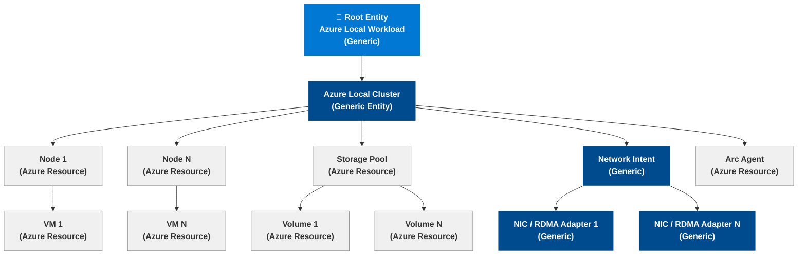

# Azure Monitor Entity Graph — Azure Local

> Source: `diagrams/mermaid/azure-monitor-entity-graph.md`
> Embed in docs using the `mermaid` fenced code block.

## Signal types per entity

| Entity | Signal type | Example metric / KQL |
|---|---|---|
| Azure Local Cluster | Azure Resource metric | `microsoft.azurestackhci/clusters` health metrics |
| Node | Azure Resource metric | CPU %, memory %, disk I/O |
| Storage Pool | Azure Resource metric | Pool health, operational status |
| Volume | Azure Resource metric | Volume % full, IOPS, latency |
| VM | Azure Resource metric | VM availability, integration services |
| Arc Agent | Log Analytics (KQL) | Heartbeat within last 5 min |
| Network Intent | Log Analytics (KQL) | NIC operational state, RDMA status |
