# Azure Monitor Entity Graph — Azure Local

> Source: `diagrams/mermaid/azure-monitor-entity-graph.md`  
> Entity names mirror [ADR 0006](../../docs/design/decisions/0006-azmon-entity-model.md) (1:1 with ADR 0005 SCOM classes).
> Embed in docs using the `mermaid` fenced code block.

```mermaid
graph TD
    SG["Azure Local\nService Group"]:::root

    SG --> CLUSTER["AzureLocal.Cluster\n(Generic — microsoft.azurestackhci/clusters)"]:::l1

    CLUSTER --> NODE["AzureLocal.Node\n(Azure Resource — /nodes)"]:::l2
    CLUSTER --> SPOOL["AzureLocal.StoragePool\n(Generic — pool state)"]:::l2
    CLUSTER --> NETINT["AzureLocal.NetworkIntent\n(Generic — intent state)"]:::l2
    CLUSTER --> UPST["AzureLocal.UpdateState\n(Generic — update compliance)"]:::l2
    CLUSTER --> RBR["AzureLocal.ResourceBridge\n(Azure Resource — /resourcebridges)"]:::l2
    CLUSTER --> DCMA["AzureLocal.DCMA\n(Azure Resource — MMA/DCMA extension)"]:::l2
    CLUSTER --> HCIREG["AzureLocal.HCIRegistration\n(Azure Resource — arc registration)"]:::l2

    SPOOL --> VOL["AzureLocal.Volume\n(Generic — volume metrics)"]:::l2
    SPOOL --> STIER["AzureLocal.StorageTier\n(Generic — tier health)"]:::l2
    SPOOL --> SREP["AzureLocal.StorageReplica\n(Generic — replication partnership)"]:::l2

    CLUSTER --> L3CL["AzureLocal.Azure.HCICluster\n(Azure Resource — arc registration)"]:::l3
    NODE    --> L3AM["AzureLocal.Azure.ArcMachine\n(Azure Resource — microsoft.hybridcompute/machines)"]:::l3
    CLUSTER --> L3KV["AzureLocal.Azure.KeyVault\n(Azure Resource — microsoft.keyvault/vaults)"]:::l3
    CLUSTER --> L3SA["AzureLocal.Azure.StorageAccount\n(Azure Resource — microsoft.storage/storageaccounts)"]:::l3
    CLUSTER --> L3RB["AzureLocal.Azure.RBAC\n(Generic — role assignment state)"]:::l3

    classDef root fill:#0078D4,color:#fff,stroke:none,font-weight:bold
    classDef l1   fill:#004B8D,color:#fff,stroke:none
    classDef l2   fill:#0072C6,color:#fff,stroke:none
    classDef l3   fill:#7719AA,color:#fff,stroke:none
```

## Entity type by layer

| Layer | Entity class | AzMon entity type | ARM resource type |
|---|---|---|---|
| L1 | `AzureLocal.Cluster` | Generic | `microsoft.azurestackhci/clusters` |
| L2 | `AzureLocal.Node` | Azure Resource | `microsoft.azurestackhci/clusters/nodes` |
| L2 | `AzureLocal.StoragePool` | Generic | PowerShell-sourced |
| L2 | `AzureLocal.Volume` | Generic | PowerShell-sourced |
| L2 | `AzureLocal.StorageTier` | Generic | PowerShell-sourced |
| L2 | `AzureLocal.NetworkIntent` | Generic | PowerShell-sourced |
| L2 | `AzureLocal.StorageReplica` | Generic | PowerShell-sourced |
| L2 | `AzureLocal.UpdateState` | Generic | `microsoft.azurestackhci/clusters/updates` |
| L2 | `AzureLocal.ResourceBridge` | Azure Resource | `microsoft.resourceconnector/appliances` |
| L2 | `AzureLocal.AKSArcPlatform` | Azure Resource | `microsoft.hybridcontainerservice/provisionedclusterinstances` |
| L2 | `AzureLocal.DCMA` | Azure Resource | VM extension (DCMA/MMA) |
| L2 | `AzureLocal.HCIRegistration` | Azure Resource | Arc registration |
| L3 | `AzureLocal.Azure.HCICluster` | Azure Resource | `microsoft.azurestackhci/clusters` |
| L3 | `AzureLocal.Azure.ArcMachine` | Azure Resource | `microsoft.hybridcompute/machines` |
| L3 | `AzureLocal.Azure.KeyVault` | Azure Resource | `microsoft.keyvault/vaults` |
| L3 | `AzureLocal.Azure.StorageAccount` | Azure Resource | `microsoft.storage/storageaccounts` |
| L3 | `AzureLocal.Azure.RBAC` | Generic | Role assignment (ARM RBAC) |
