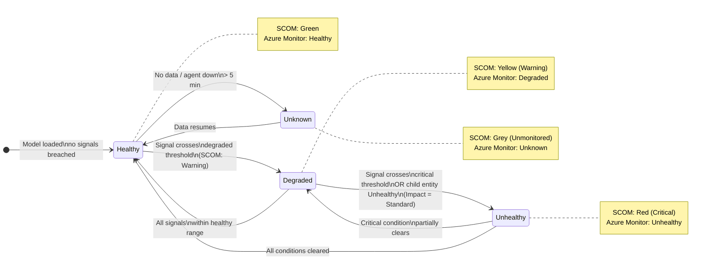

# Health State Flow — SCOM & Azure Monitor

> Source: `diagrams/mermaid/health-state-flow.md`
> Applies to both tracks: SCOM uses Green/Yellow/Red; Azure Monitor uses Healthy/Degraded/Unhealthy/Unknown.

## Impact settings (Azure Monitor)

| Impact | Behaviour |
|---|---|
| **Standard** | Child entity health propagates to parent — worst state wins |
| **Limited** | Child entity health shown but does NOT roll up to parent |
| **Suppressed** | Child entity health completely excluded from rollup (e.g. intentionally stopped VMs) |
