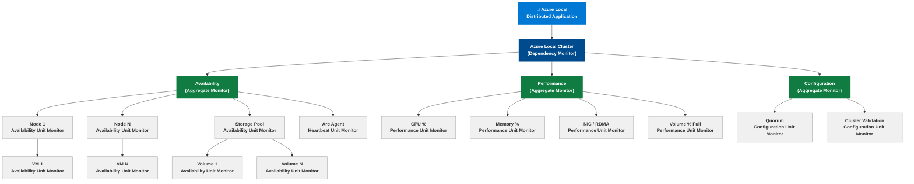

# SCOM Health Rollup Tree — Azure Local

> Source: `diagrams/mermaid/scom-health-rollup.md`
> Embed in docs using the `mermaid` fenced code block.

```mermaid
flowchart TD
    DA["🏢 Azure Local\nDistributed Application"]:::root
    DA --> CL["Azure Local Cluster\n(Dependency Monitor)"]:::dep

    CL --> AV["Availability\n(Aggregate Monitor)"]:::agg
    CL --> PF["Performance\n(Aggregate Monitor)"]:::agg
    CL --> CF["Configuration\n(Aggregate Monitor)"]:::agg

    AV --> N1["Node 1\nAvailability Unit Monitor"]:::unit
    AV --> N2["Node N\nAvailability Unit Monitor"]:::unit
    AV --> SP["Storage Pool\nAvailability Unit Monitor"]:::unit
    AV --> ARC["Arc Agent\nHeartbeat Unit Monitor"]:::unit

    PF --> CPU["CPU %\nPerformance Unit Monitor"]:::unit
    PF --> MEM["Memory %\nPerformance Unit Monitor"]:::unit
    PF --> NET["NIC / RDMA\nPerformance Unit Monitor"]:::unit
    PF --> VOL["Volume % Full\nPerformance Unit Monitor"]:::unit

    CF --> QUO["Quorum\nConfiguration Unit Monitor"]:::unit
    CF --> VAL["Cluster Validation\nConfiguration Unit Monitor"]:::unit

    SP --> V1["Volume 1\nAvailability Unit Monitor"]:::unit
    SP --> V2["Volume N\nAvailability Unit Monitor"]:::unit

    N1 --> VM1["VM 1\nAvailability Unit Monitor"]:::unit
    N2 --> VM2["VM N\nAvailability Unit Monitor"]:::unit

    classDef root fill:#0078D4,color:#fff,stroke:none,font-weight:bold
    classDef dep  fill:#004B8D,color:#fff,stroke:none
    classDef agg  fill:#107C41,color:#fff,stroke:none
    classDef unit fill:#F0F0F0,color:#333,stroke:#999
```
