# ADR 0005 — SCOM class hierarchy + hosting relationships (3-layer model)

- **Status**: Accepted
- **Date**: 2026-05-05
- **Deciders**: @AzureLocal/azurelocal-scom-mp-maintainers

## Context

[ADR 0001](0001-scope-and-topology.md) locks the entity inventory; [ADR 0004](0004-scom-discovery-strategy.md)
locks how those entities are discovered. This ADR specifies **the SCOM class
hierarchy itself** — what classes exist, how they inherit, and how they relate.

> **Primary reference:** Brian Wren, SC 2012 R2 MP series —
> [Module 6 "Designing a Service Model"](https://learn.microsoft.com/en-us/shows/system-center-2012-r2-operations-manager-management-packs/)
> and [Module 7 "Building Classes and Relationships"](https://learn.microsoft.com/en-us/shows/system-center-2012-r2-operations-manager-management-packs/).
> The [SC 2012 OpsMgr Authoring PDF](https://download.microsoft.com/download/3/3/F/33F52373-3A75-422C-969B-61E05EEC5E72/SC2012_OpsMgr_Authoring.pdf)
> is the definitive written reference; the authoring guide's
> [Understanding Classes and Objects](https://learn.microsoft.com/en-us/previous-versions/system-center/system-center-2012-R2/hh457568(v=sc.12))
> and [Distributed Applications](https://learn.microsoft.com/en-us/previous-versions/system-center/system-center-2012-R2/hh457612(v=sc.12))
> pages are secondary. All design choices below trace back to one of these sources.

In SCOM, the class graph determines:

- **Targeting** — what runs on what (a monitor targeting `AzureLocal.Volume` runs on every
  Volume instance, and only on Volume instances)
- **Hosting** — child instances are auto-deleted when the host instance is deleted; `Volume`
  *hosted by* `StoragePool`, `StoragePool` *hosted by* `Cluster`
- **Containment** — non-host parent/child; `Cluster` *contains* `Node` because the Node
  lives on its own Windows Computer and has an independent lifecycle
- **Reference** — cross-tree pointer, no lifecycle coupling; `Cluster` *references*
  `AzureLocal.Azure.HCICluster` for correlation display in Health Explorer

Brian Wren (Module 7) specifies the System MP base class choices:

| Base class | Use when |
|---|---|
| `Microsoft.Windows.LocalApplication` | The monitored entity *runs on* a specific Windows computer — discovered from an agent on that computer |
| `Microsoft.Windows.ApplicationComponent` | A component *of* a `LocalApplication` or another `ApplicationComponent` — shares the same agent/host |
| `System.LogicalEntity` | An abstract logical entity not tied to a specific computer (used for L3 Azure-side classes) |
| `Microsoft.SystemCenter.ManagementServer` | Used as the **hosting class** for L3 entities whose workflows run on the SCOM management server |

## Decision

The SCOM class hierarchy mirrors the 3-layer entity model from
[ADR 0001](0001-scope-and-topology.md). Every entity becomes one class. Hosting/containment
follows the *deployment* relationships — per Brian Wren Module 6, the service model starts
by asking: "what components does this service have, and what are their relationships?"

### Base-class inheritance tree

The full inheritance path for every class in this MP (per Brian Wren Module 7,
[Understanding Classes and Objects](https://learn.microsoft.com/en-us/previous-versions/system-center/system-center-2012-R2/hh457568(v=sc.12))):

```
System.Entity (Operations Manager root)
  └─ System.LogicalEntity
       ├─ Microsoft.Windows.LocalApplication        ← app running on a Windows computer
       │    ├─ AzureLocal.Cluster                   hosted by: Microsoft.Windows.Computer
       │    ├─ AzureLocal.Node                      hosted by: Microsoft.Windows.Computer
       │    └─ AzureLocal.ArcResourceBridge         hosted by: Microsoft.Windows.Computer (ARB VM host node)
       ├─ Microsoft.Windows.ApplicationComponent    ← component of a LocalApplication
       │    ├─ AzureLocal.StoragePool               hosted by: AzureLocal.Cluster
       │    ├─ AzureLocal.Volume                    hosted by: AzureLocal.StoragePool
       │    ├─ AzureLocal.StorageTier               hosted by: AzureLocal.StoragePool
       │    ├─ AzureLocal.PhysicalDisk              hosted by: AzureLocal.StoragePool
       │    ├─ AzureLocal.NetworkIntent             hosted by: AzureLocal.Cluster
       │    ├─ AzureLocal.NetworkAdapter            hosted by: AzureLocal.NetworkIntent
       │    ├─ AzureLocal.StorageReplica            hosted by: AzureLocal.Cluster
       │    ├─ AzureLocal.LCMState                 hosted by: AzureLocal.Cluster
       │    ├─ AzureLocal.AKSArcPlatform           hosted by: AzureLocal.ArcResourceBridge
       │    ├─ AzureLocal.DCMA                     hosted by: AzureLocal.Cluster
       │    └─ AzureLocal.HCIRegistration          hosted by: AzureLocal.Cluster
       └─ (direct System.LogicalEntity)            ← no Windows agent; management-server side
            ├─ AzureLocal.Azure.HCICluster          hosted by: Microsoft.SystemCenter.ManagementServer
            ├─ AzureLocal.Azure.ArcMachine          hosted by: Microsoft.SystemCenter.ManagementServer
            ├─ AzureLocal.Azure.CustomLocation      hosted by: Microsoft.SystemCenter.ManagementServer
            ├─ AzureLocal.Azure.LogicalNetwork      hosted by: Microsoft.SystemCenter.ManagementServer
            ├─ AzureLocal.Azure.KeyVault            hosted by: Microsoft.SystemCenter.ManagementServer
            ├─ AzureLocal.Azure.StorageAccount      hosted by: Microsoft.SystemCenter.ManagementServer
            ├─ AzureLocal.Azure.RBAC                hosted by: Microsoft.SystemCenter.ManagementServer
            ├─ AzureLocal.Azure.UpdateManager       hosted by: Microsoft.SystemCenter.ManagementServer
            ├─ AzureLocal.Azure.DCR                 hosted by: Microsoft.SystemCenter.ManagementServer
            └─ AzureLocal.Azure.LAW                 hosted by: Microsoft.SystemCenter.ManagementServer
```

### Class diagram (hosting and containment)

> **Mermaid ID note:** Mermaid node IDs use underscores (`AzureLocal_Cluster`). The
> actual SCOM class ID in XML is always dot-separated: `AzureLocal.Cluster`. These are
> the same class — the underscore is purely a Mermaid syntax constraint.

```mermaid
classDiagram
    class AzureLocal_Cluster {
        <<LocalApplication>>
        +String ClusterName [KEY]
        +String AzureSubscriptionId
        +String AzureResourceGroup
        +String AzureResourceName
    }
    class AzureLocal_Node {
        <<LocalApplication>>
        +String NodeName [KEY]
        +String ArcMachineId
    }
    class AzureLocal_StoragePool {
        <<ApplicationComponent>>
        +String PoolName [KEY]
    }
    class AzureLocal_Volume {
        <<ApplicationComponent>>
        +String VolumePath [KEY]
        +String VolumeLabel
    }
    class AzureLocal_StorageTier {
        <<ApplicationComponent>>
        +String TierName [KEY]
        +String MediaType
    }
    class AzureLocal_PhysicalDisk {
        <<ApplicationComponent>>
        +String DiskDeviceId [KEY]
        +String MediaType
        +String BusType
    }
    class AzureLocal_NetworkIntent {
        <<ApplicationComponent>>
        +String IntentName [KEY]
        +String IntentType
    }
    class AzureLocal_NetworkAdapter {
        <<ApplicationComponent>>
        +String AdapterName [KEY]
        +String InterfaceDescription
    }
    class AzureLocal_StorageReplica {
        <<ApplicationComponent>>
        +String PartnershipName [KEY]
    }
    class AzureLocal_LCMState {
        <<ApplicationComponent>>
    }
    class AzureLocal_ArcResourceBridge {
        <<LocalApplication>>
        +String BridgeName [KEY]
    }
    class AzureLocal_AKSArcPlatform {
        <<ApplicationComponent>>
        +String AKSName [KEY]
    }
    class AzureLocal_DCMA {
        <<ApplicationComponent>>
    }
    class AzureLocal_HCIRegistration {
        <<ApplicationComponent>>
    }
    class AzureLocal_Azure_HCICluster {
        <<LogicalEntity / MgmtServer>>
        +String ResourceId [KEY]
    }
    class AzureLocal_Azure_ArcMachine {
        <<LogicalEntity / MgmtServer>>
        +String ResourceId [KEY]
    }
    class AzureLocal_Azure_KeyVault {
        <<LogicalEntity / MgmtServer>>
        +String ResourceId [KEY]
    }
    class AzureLocal_Azure_StorageAccount {
        <<LogicalEntity / MgmtServer>>
        +String ResourceId [KEY]
    }
    class AzureLocal_Azure_RBAC {
        <<LogicalEntity / MgmtServer>>
        +String ScopeId [KEY]
    }
    AzureLocal_Cluster *-- AzureLocal_StoragePool : hosts
    AzureLocal_Cluster *-- AzureLocal_NetworkIntent : hosts
    AzureLocal_Cluster *-- AzureLocal_StorageReplica : hosts
    AzureLocal_Cluster *-- AzureLocal_LCMState : hosts
    AzureLocal_Cluster *-- AzureLocal_DCMA : hosts
    AzureLocal_Cluster *-- AzureLocal_HCIRegistration : hosts
    AzureLocal_StoragePool *-- AzureLocal_Volume : hosts
    AzureLocal_StoragePool *-- AzureLocal_StorageTier : hosts
    AzureLocal_StoragePool *-- AzureLocal_PhysicalDisk : hosts
    AzureLocal_NetworkIntent *-- AzureLocal_NetworkAdapter : hosts
    AzureLocal_ArcResourceBridge *-- AzureLocal_AKSArcPlatform : hosts
    AzureLocal_Cluster o-- AzureLocal_Node : contains
    AzureLocal_Cluster o-- AzureLocal_ArcResourceBridge : contains
    AzureLocal_Cluster ..> AzureLocal_Azure_HCICluster : references
    AzureLocal_Node ..> AzureLocal_Azure_ArcMachine : references
    AzureLocal_Cluster ..> AzureLocal_Azure_KeyVault : references
    AzureLocal_Cluster ..> AzureLocal_Azure_StorageAccount : references
    AzureLocal_Cluster ..> AzureLocal_Azure_RBAC : references
```



### Key properties

Per Brian Wren Module 7: every class must declare a **key property** — the value that
uniquely identifies an instance within its hosting parent. SCOM builds the console
**Path Name** from the chain of key properties up the hosting tree.

| Class | Key property | Example path name |
|---|---|---|
| `AzureLocal.Cluster` | `ClusterName` | `AzureLocal01` |
| `AzureLocal.Node` | `NodeName` | `AzureLocal01\Node1` |
| `AzureLocal.StoragePool` | `PoolName` | `AzureLocal01\S2D on AzureLocal01` |
| `AzureLocal.Volume` | `VolumePath` | `AzureLocal01\S2D on AzureLocal01\C:\ClusterStorage\Volume1` |
| `AzureLocal.StorageTier` | `TierName` | `AzureLocal01\S2D on AzureLocal01\Capacity` |
| `AzureLocal.PhysicalDisk` | `DiskDeviceId` | `AzureLocal01\S2D on AzureLocal01\{GUID}` |
| `AzureLocal.NetworkIntent` | `IntentName` | `AzureLocal01\Management` |
| `AzureLocal.NetworkAdapter` | `AdapterName` | `AzureLocal01\Management\NIC1` |
| `AzureLocal.StorageReplica` | `PartnershipName` | `AzureLocal01\{partnership-name}` |
| `AzureLocal.LCMState` | *(singleton — inherits cluster path)* | `AzureLocal01\LCMState` |
| `AzureLocal.ArcResourceBridge` | `BridgeName` | `AzureLocal01\{bridge-name}` |
| `AzureLocal.AKSArcPlatform` | `AKSName` | `AzureLocal01\{bridge-name}\{aks-name}` |
| `AzureLocal.DCMA` | *(singleton per cluster)* | `AzureLocal01\DCMA` |
| `AzureLocal.HCIRegistration` | *(singleton per cluster)* | `AzureLocal01\HCIRegistration` |
| `AzureLocal.Azure.*` | `ResourceId` (ARM resource ID) | *(console: management server path)* |

### Proxy agent pattern for cluster and pool

`AzureLocal.Cluster` and all classes it hosts (`StoragePool`, `NetworkIntent`, etc.) are
discovered by a script running on **one agent** — the node that owns the cluster name
object (CNO). That agent acts as a **proxy** for the cluster object per Brian Wren's
proxy agent / watcher node guidance:

- Discovery runs on `AzureLocal.Node` with the `ProxyingEnabled` attribute set `True`
- The cluster's `ClusterName` key property binds the cluster object to the proxy node
- If the CNO moves (node failover), discovery re-runs on the new owner and the proxy
  relationship is updated automatically — no stale instances
- This is the same pattern used by the Windows Server Failover Cluster MPs

### Hosting vs. containment vs. reference rules

Per Brian Wren authoring guide — relationship type IDs in parentheses:

| Relationship | SCOM type ID | Used when | Effect |
|---|---|---|---|
| **Hosting** (`*--`) | `System.Hosting` | Child cannot exist without parent on the same (or proxy) agent | Child instance auto-deleted when parent is deleted |
| **Containment** (`o--`) | `System.Containment` | Child belongs to parent but lives independently (different agent / lifecycle) | `Cluster contains Node`: Node hosted by Windows Computer, not Cluster |
| **Reference** (`..>`) | `System.Reference` | Cross-tree correlation pointer | No lifecycle coupling; enables Health Explorer cross-tree drill-down |

### Key design rules

1. **L1 cluster-level objects** (`StoragePool`, `NetworkIntent`, `StorageReplica`, `LCMState`)
   are *hosted by* `Cluster`. They are discovered via the cluster proxy agent and are
   deleted when the Cluster instance is deleted.
2. **L1 node-level objects** are modeled on `AzureLocal.Node` as properties or attribute
   groups — not as separate hosted classes. Per-node performance signals target `Node`
   directly. This avoids discovery fan-out for signals that are conceptually node-level.
3. **`AzureLocal.PhysicalDisk` is hosted by `StoragePool`**, not by `Cluster` directly.
   A disk's health state is its own SCOM object and rolls up to the pool via an aggregate
   dependency monitor.
4. **`AzureLocal.NetworkAdapter` is hosted by `NetworkIntent`**. NIC failures propagate
   to the parent intent via a dependency monitor.
5. **L2 entities are *contained by* Cluster**, not hosted, because `ArcResourceBridge`
   runs as a VM on Windows Hyper-V with its own independent lifecycle. Exception:
   `AKSArcPlatform` is *hosted by* `ArcResourceBridge` — it cannot exist without the
   bridge.
6. **L3 entities target `Microsoft.SystemCenter.ManagementServer`**. Their discovery,
   monitoring workflows, and Run As profile all execute on the designated SCOM management
   server — never on cluster nodes. This keeps Azure credentials off the cluster.
7. **Reference relationships** (`Cluster → Azure_HCICluster`, `Node → Azure_ArcMachine`)
   enable cross-tree correlation: Health Explorer on a Node shows the linked ARM resource
   and its Resource Health state.
8. **Every class has exactly one key property.** Singletons (one instance per parent)
   can use a fixed string constant as the key value — the SCOM authoring guide permits
   this pattern (used here for `LCMState`, `DCMA`, `HCIRegistration`).

### Class naming

All classes follow `AzureLocal.<EntityName>` per [ADR 0007](0007-naming-convention.md).
This is the standard `Vendor.Product.Component` pattern from Brian Wren Module 7. Naming rules:

- L1 + L2: `AzureLocal.<EntityName>` — e.g., `AzureLocal.Cluster`, `AzureLocal.Volume`
- L3: `AzureLocal.Azure.<EntityName>` — the `Azure.` infix signals "management-server
  side, not cluster-node side"
- Class IDs in XML use dots, not underscores — Mermaid diagrams use underscores as a
  rendering workaround only
- Display names (what appears in the SCOM console) are human-readable with spaces:
  "Azure Local Cluster", "Azure Local Volume (CSV)"

### Distributed Application

Per Brian Wren Module 6 and the authoring guide
[Distributed Applications](https://learn.microsoft.com/en-us/previous-versions/system-center/system-center-2012-R2/hh457612(v=sc.12)):

> A Distributed Application (DA) in SCOM groups multiple objects under a single health
> view. The DA's health is the worst health of any object it contains. The DA does **not**
> add monitoring — it only provides a combined view of already-monitored objects.

The authoring guide warns that the DA Designer console tool has two significant
limitations: (1) component group membership is static/explicit only, and (2) multi-level
health rollup through component groups is not supported in the designer. Both limitations
are bypassed by authoring the DA directly in MP XML.

**`AzureLocal.Deployment`** is the single DA class for this MP, authored in XML:

| Component group | Contains | Health rollup |
|---|---|---|
| `Infrastructure` | All `AzureLocal.Cluster` instances (and their hosted/contained tree via dependency monitors) | Worst-of all cluster health states |
| `Platform` | All `AzureLocal.ArcResourceBridge` + `AzureLocal.AKSArcPlatform` instances | Worst-of |
| `AzureServices` | All `AzureLocal.Azure.*` instances for the deployment | Worst-of |

Health from `Infrastructure → AzureLocal.Deployment` and from `Platform → Deployment` and
`AzureServices → Deployment` all use **dependency monitors** with worst-state rollup policy.
The DA itself has an availability aggregate monitor rolled up from these three groups.

This gives operators a single object to look at: "Is the full Azure Local deployment
healthy?" — the answer is `AzureLocal.Deployment` health state.

**DA class XML base:** `AzureLocal.Deployment` extends `Microsoft.SystemCenter.Service`
(the standard DA base class per authoring guide). Each component group extends
`Microsoft.SystemCenter.ComputerGroup` with a typed class filter.


## Consequences

- **Positive**: Hosting reflects deployment topology — pool/volume lifecycle coupling is
  correctly modeled, reducing stale state in Health Explorer.
- **Positive**: `PhysicalDisk` and `NetworkAdapter` are first-class SCOM objects with
  their own health state, which rolls up to the pool/intent via dependency monitors.
  This was added in the scope update over the original 8-entity model.
- **Positive**: L3 classes targeting the management server keep Azure-side credentials
  off cluster nodes — better security posture.
- **Positive**: Reference relationships give operators a single Health Explorer view
  spanning on-prem and Azure-side state.
- **Positive**: Proxy agent pattern for cluster objects is standard SCOM practice —
  no special infrastructure required beyond enabling proxy on each cluster node.
- **Negative**: Containment (`Cluster contains Node`) doesn't auto-delete Node instances
  when the Cluster is deleted — discovery cleanup must handle this. Standard SCOM
  authoring practice but explicitly noted here per Brian Wren's guidance.
- **Negative**: ~24 SCOM classes to author (added `PhysicalDisk`, `NetworkAdapter`,
  renamed `UpdateState` → `LCMState` vs. original design). Class authoring is the
  largest single line item in Phase 3 — mitigated by Kevin Holman fragment library.
- **Negative**: DA with 3 component groups authored in XML is more complex than the DA
  Designer supports — but the designer's static-membership and single-level-rollup
  limitations would have forced XML anyway.
- **Affected**: All Phase 3 SCOM authoring (every class file, every discovery, every
  hosting relationship), the proxy agent configuration, the Run As profile model, and
  the management-server targeting strategy for L3.

## Alternatives considered

- **Single mega-class with lots of properties** — rejected: collapses every entity into
  one row, breaks SCOM's monitor-targeting model. Explicitly rejected by Brian Wren
  Module 6 as an antipattern.
- **Separate L3 classes hosted on each cluster node** — rejected: forces every node to
  hold Azure credentials and run Azure discoveries, exploding both attack surface and
  discovery load.
- **Skip Distributed Application** — rejected: operators expect a single roll-up object
  ("Azure Local Deployment Health") in the SCOM console. Brian Wren Module 6 explicitly
  covers the DA as the standard roll-up pattern.
- **`UpdateState` vs `LCMState` class name** — renamed to `LCMState` to match the actual
  Azure Local component name (LCM = Lifecycle Manager). The SCOM class ID follows
  the entity name per ADR 0007.

## References

- ADR 0001 — [Scope & topology](0001-scope-and-topology.md)
- ADR 0004 — [Discovery strategy](0004-scom-discovery-strategy.md)
- ADR 0007 — [Naming convention](0007-naming-convention.md)
- **Brian Wren, Module 6 — "Designing a Service Model"** (primary — service model methodology)
- **Brian Wren, Module 7 — "Building Classes and Relationships"** (primary — class hierarchy, base classes, key properties, proxy agents)
- [SC 2012 R2 MP Video Series](https://learn.microsoft.com/en-us/shows/system-center-2012-r2-operations-manager-management-packs/)
- [SC 2012 OpsMgr Authoring PDF](https://download.microsoft.com/download/3/3/F/33F52373-3A75-422C-969B-61E05EEC5E72/SC2012_OpsMgr_Authoring.pdf) — Classes and Relationships chapter
- [Understanding Classes and Objects](https://learn.microsoft.com/en-us/previous-versions/system-center/system-center-2012-R2/hh457568(v=sc.12))
- [Distributed Applications](https://learn.microsoft.com/en-us/previous-versions/system-center/system-center-2012-R2/hh457612(v=sc.12))
- [Kevin Holman Fragment Library](https://github.com/thekevinholman/FragmentLibrary) — Phase 3 class authoring fragments
- ADR 0004 — [SCOM discovery strategy](0004-scom-discovery-strategy.md)
- ADR 0006 — [Azure Monitor entity model alignment](0006-azmon-entity-model.md)
- ADR 0007 — [Naming convention](0007-naming-convention.md)
- [Brian Wren, "Understanding Classes" (SC 2012 R2 module 4)](https://learn.microsoft.com/en-us/shows/system-center-2012-r2-operations-manager-management-packs/)
- [Brian Wren, "Understanding Relationships" (module 5)](https://learn.microsoft.com/en-us/shows/system-center-2012-r2-operations-manager-management-packs/)
- [Brian Wren, "Designing a Service Model" (module 6)](https://learn.microsoft.com/en-us/shows/system-center-2012-r2-operations-manager-management-packs/)
- [Brian Wren, "Building Classes and Relationships" (module 7)](https://learn.microsoft.com/en-us/shows/system-center-2012-r2-operations-manager-management-packs/)
- [Kevin Holman — SCOM Management Pack Fragment Library](https://kevinholman.com/2017/02/05/scom-management-pack-fragment-library/)
