# ADR 0005 — SCOM class hierarchy + hosting relationships (3-layer model)

- **Status**: Accepted
- **Date**: 2026-05-05
- **Deciders**: @AzureLocal/azurelocal-scom-mp-maintainers

## Context

[ADR 0001](0001-scope-and-topology.md) locks the entity inventory; [ADR 0004](0004-scom-discovery-strategy.md)
locks how those entities are discovered. This ADR specifies **the SCOM class
hierarchy itself** — what classes exist, how they inherit, and how they relate.

In SCOM, the class graph determines:

- **Targeting** — what runs on what (a monitor targeting `AzureLocal.Volume` runs on every
  Volume instance)
- **Hosting** — child instances die when the host dies (Volume *hosted by* StoragePool;
  StoragePool *hosted by* Cluster)
- **Containment** — non-host parent/child (Cluster *contains* Nodes — node lives on the
  Windows OS, not on the cluster, so it can't be hosted by Cluster)
- **Reference relationships** — cross-tree pointers (Cluster *uses* Key Vault)

Brian Wren's [SC 2012 R2 module 7](https://learn.microsoft.com/en-us/shows/system-center-2012-r2-operations-manager-management-packs/)
("Building Classes and Relationships") is the canonical reference.

Every SCOM class inherits from one of these base classes (Microsoft system MP):

- `Microsoft.Windows.LocalApplication` — for things that run on a Windows computer
- `Microsoft.Windows.ApplicationComponent` — for things that *belong to* a Windows
  application
- `Microsoft.SystemCenter.ManagementServer` — for things discovered/run from the
  management server (used here for L3 Azure-side classes)
- `System.LogicalEntity` / `System.Group` — abstract logical groupings

## Decision

The SCOM class hierarchy mirrors the 3-layer entity model from
[ADR 0001](0001-scope-and-topology.md). Every entity becomes one class. Hosting/containment
follows the *deployment* relationships, not the abstract entity tree.

### Class diagram

```mermaid
classDiagram
    class AzureLocal_Cluster {
        <<LocalApplication>>
        ClusterName
        AzureSubscriptionId
        AzureResourceGroup
        AzureResourceName
    }
    class AzureLocal_Node {
        <<LocalApplication>>
        NodeName
        ArcMachineId
    }
    class AzureLocal_StoragePool {
        <<ApplicationComponent>>
        PoolName
    }
    class AzureLocal_Volume {
        <<ApplicationComponent>>
        VolumeName
        Path
    }
    class AzureLocal_StorageTier {
        <<ApplicationComponent>>
        TierName
    }
    class AzureLocal_NetworkIntent {
        <<ApplicationComponent>>
        IntentName
        IntentType
    }
    class AzureLocal_StorageReplica {
        <<ApplicationComponent>>
        PartnershipName
    }
    class AzureLocal_UpdateState {
        <<ApplicationComponent>>
    }
    class AzureLocal_ResourceBridge {
        <<LocalApplication>>
    }
    class AzureLocal_AKSArcPlatform {
        <<ApplicationComponent>>
    }
    class AzureLocal_DCMA {
        <<ApplicationComponent>>
    }
    class AzureLocal_HCIRegistration {
        <<ApplicationComponent>>
    }
    class AzureLocal_Azure_HCICluster {
        <<MgmtServer-hosted>>
    }
    class AzureLocal_Azure_ArcMachine {
        <<MgmtServer-hosted>>
    }
    class AzureLocal_Azure_KeyVault {
        <<MgmtServer-hosted>>
    }
    class AzureLocal_Azure_StorageAccount {
        <<MgmtServer-hosted>>
    }
    class AzureLocal_Azure_RBAC {
        <<MgmtServer-hosted>>
    }
    AzureLocal_Cluster *-- AzureLocal_StoragePool : hosts
    AzureLocal_Cluster *-- AzureLocal_NetworkIntent : hosts
    AzureLocal_Cluster *-- AzureLocal_StorageReplica : hosts
    AzureLocal_Cluster *-- AzureLocal_UpdateState : hosts
    AzureLocal_StoragePool *-- AzureLocal_Volume : hosts
    AzureLocal_StoragePool *-- AzureLocal_StorageTier : hosts
    AzureLocal_Cluster o-- AzureLocal_Node : contains
    AzureLocal_Cluster o-- AzureLocal_ResourceBridge : contains
    AzureLocal_Cluster o-- AzureLocal_AKSArcPlatform : contains
    AzureLocal_Cluster o-- AzureLocal_DCMA : contains
    AzureLocal_Cluster o-- AzureLocal_HCIRegistration : contains
    AzureLocal_Cluster ..> AzureLocal_Azure_HCICluster : references
    AzureLocal_Node ..> AzureLocal_Azure_ArcMachine : references
    AzureLocal_Cluster ..> AzureLocal_Azure_KeyVault : references
    AzureLocal_Cluster ..> AzureLocal_Azure_StorageAccount : references
    AzureLocal_Cluster ..> AzureLocal_Azure_RBAC : references
```

### Hosting vs containment vs reference rules

| Relationship | Used when | Effect |
|---|---|---|
| **Hosting** (`*--`) | Child cannot exist without parent on the same node | Child instance auto-deleted when parent goes away |
| **Containment** (`o--`) | Child belongs to parent but lives independently (different agent / lifecycle) | Used for `Cluster contains Node` — Node is hosted by Windows Computer, not Cluster |
| **Reference** (`..>`) | Cross-tree relationship to L3 entity | No lifecycle coupling; used for SCOM ↔ Azure correlation |

### Key design rules

1. **L1 cluster-level objects** (StoragePool, NetworkIntent, StorageReplica, UpdateState)
   are *hosted by* the Cluster. They die when the cluster goes away.
2. **L1 node-level objects** are not modeled separately — Node is the only node-level
   class. Per-node performance signals target the Node class directly.
3. **Volumes are hosted by StoragePool**, not by Cluster. This matches operational
   reality: lose the pool, lose all its volumes.
4. **L2 entities are *contained by* Cluster**, not hosted, because they live on
   Windows VMs (Resource Bridge) or as separate services (DCMA agent on each node) — they
   don't share Cluster's lifecycle directly.
5. **L3 entities** are all targeted at `Microsoft.SystemCenter.ManagementServer`. Their
   discovery, monitoring, and Run As account live on a designated SCOM management
   server — not on the cluster nodes.
6. **Reference relationships** (Cluster → Azure_HCICluster, Node → Azure_ArcMachine, etc.)
   enable cross-tree correlation: hovering over a Node in Health Explorer shows the
   linked `Microsoft.HybridCompute/machines` resource and its Resource Health.

### Class naming

All classes use the `AzureLocal.*` prefix per [ADR 0007](0007-naming-convention.md):

- L1 + L2: `AzureLocal.<EntityName>` (e.g., `AzureLocal.Cluster`, `AzureLocal.Volume`)
- L3: `AzureLocal.Azure.<EntityName>` (e.g., `AzureLocal.Azure.KeyVault`,
  `AzureLocal.Azure.HCICluster`) — the `Azure.` prefix signals "discovered/monitored from
  the management server, not the cluster node".

### Distributed Application

A single Distributed Application class `AzureLocal.Deployment` rolls up:
- The Cluster (and everything it hosts/contains via dependency)
- All L3 reference targets (HCICluster, KeyVault, StorageAccount, RBAC, etc.)

This is the only object operators need to look at for the "is the whole deployment
healthy?" question.

## Consequences

- **Positive**: Hosting reflects deployment topology — pool/volume lifecycle coupling is
  correctly modeled, reducing stale state in Health Explorer.
- **Positive**: L3 classes targeting the management server keep Azure-side credentials
  off cluster nodes — better security posture.
- **Positive**: Reference relationships give operators a single Health Explorer view
  spanning on-prem and Azure-side state.
- **Negative**: Containment (Cluster contains Node) doesn't auto-delete Node instances
  when Cluster is deleted — discovery has to handle cleanup. Standard SCOM authoring
  practice but worth noting.
- **Negative**: ~22 SCOM classes to author. Class authoring is the single biggest line
  item in Phase 3 (mitigated heavily by Kevin Holman fragment library).
- **Affected**: All Phase 3 SCOM authoring (every class file, every discovery, every
  hosting relationship), the Run As account model, and the management-server class
  targeting strategy.

## Alternatives considered

- **Single mega-class with lots of properties** — rejected: collapses every entity into
  one row, breaks SCOM's monitor-targeting model. No real-world MP works this way.
- **Separate L3 classes hosted on each cluster node** — rejected: forces every node to
  hold Azure credentials and run Azure discoveries, exploding both attack surface and
  discovery load.
- **Skip Distributed Application** — rejected: operators expect a single roll-up object
  ("Azure Local Deployment Health") in the SCOM console.

## References

- ADR 0001 — [Scope & topology](0001-scope-and-topology.md)
- ADR 0004 — [SCOM discovery strategy](0004-scom-discovery-strategy.md)
- ADR 0006 — [Azure Monitor entity model alignment](0006-azmon-entity-model.md)
- ADR 0007 — [Naming convention](0007-naming-convention.md)
- [Brian Wren, "Understanding Classes" (SC 2012 R2 module 4)](https://learn.microsoft.com/en-us/shows/system-center-2012-r2-operations-manager-management-packs/)
- [Brian Wren, "Understanding Relationships" (module 5)](https://learn.microsoft.com/en-us/shows/system-center-2012-r2-operations-manager-management-packs/)
- [Brian Wren, "Designing a Service Model" (module 6)](https://learn.microsoft.com/en-us/shows/system-center-2012-r2-operations-manager-management-packs/)
- [Brian Wren, "Building Classes and Relationships" (module 7)](https://learn.microsoft.com/en-us/shows/system-center-2012-r2-operations-manager-management-packs/)
- [Kevin Holman — SCOM Management Pack Fragment Library](https://kevinholman.com/2017/02/05/scom-management-pack-fragment-library/)
