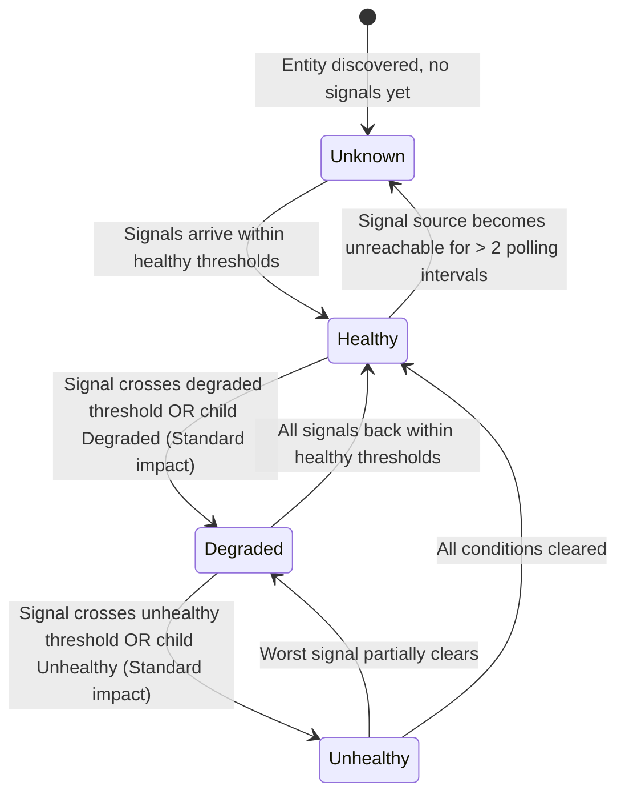

# Health Model

> The structural rules that govern how *anything* in this project transitions, rolls up,
> and reports a health state. Locked by [ADR 0003](decisions/0003-health-rollup-policy.md)
> (rollup policy) and [ADR 0009](decisions/0009-alert-vs-health-state.md) (alerts vs state).

## Health dimensions

Every entity in the model carries up to four parallel health dimensions, mirroring the
SCOM standard aggregate categories and the Azure Monitor Health Model recommended
breakdown:

| Dimension | What it answers | Examples |
|---|---|---|
| **Availability** | Is this thing up and reachable? | Cluster service running, node Arc-connected, Key Vault reachable |
| **Performance** | Is this thing meeting its performance targets? | CPU %, memory %, volume IOPS/latency, ingestion latency |
| **Configuration** | Is this thing configured correctly? | Network intent state, RBAC assignments present, secret expiry, DCR associated |
| **Security** *(L3 only)* | Is this thing secure? | RBAC drift, key/secret rotation overdue, network ACLs |

> **Why four?** Operators reason about cluster health along these axes. Mixing them into a
> single composite state hides the *kind* of failure. Both tracks expose all four dimensions
> as separate aggregate monitors / model categories.

## Health states

Both tracks use the SCOM-standard four-state scheme. Azure Monitor Health Models map cleanly:

| State | SCOM | Azure Monitor | When |
|---|---|---|---|
| **Healthy** | `Success` | `Healthy` | All signals within healthy thresholds |
| **Warning / Degraded** | `Warning` | `Degraded` | Signal crosses degraded threshold; child entity Degraded (Standard impact) |
| **Critical / Unhealthy** | `Error` | `Unhealthy` | Signal crosses unhealthy threshold; child entity Unhealthy (Standard impact) |
| **Unknown** | `Uninitialized` | `Unknown` | Insufficient data; signal source unreachable; entity not yet discovered |

### State flow

## Rollup policy — worst-state default

**Default rollup is `worst-state`** in both tracks. A cluster node going Unhealthy makes
the cluster Unhealthy. A volume going Degraded makes the storage pool Degraded.

This is the SCOM dependency monitor default and the Azure Monitor Health Model `Standard`
impact default. Departures are documented exceptions and listed below.

### Rollup table — defaults

| Parent entity | Children that roll up | Rollup mode | Notes |
|---|---|---|---|
| Cluster | Nodes, Storage Pool, Network Intents, Update/LCM | Worst-state | Standard SCOM dependency rollup |
| Storage Pool | Volumes, Storage Tiers | Worst-state | Physical disks roll into pool, surfaced as a pool-level signal |
| Node | (none — leaf) | n/a | |
| Volume | (none — leaf) | n/a | |
| HCI Cluster (L3) | Arc-enabled Servers, Custom Location, DCRs, LAW linkage | Worst-state | |
| Deployment | HCI Cluster (L3), KV, SA, MIs, SPN, RBAC | Worst-state | The "umbrella" health for the entire deployment |

### Documented exceptions to worst-state

| Entity | Behavior | Why |
|---|---|---|
| **Update Manager / LCM state** | `Best-of` rollup at Configuration dimension | Pending updates ≠ broken cluster. Surface as Warning, never Critical. |
| **Storage Replica** *(if configured)* | `Worst-state` Availability, but `Suppressed` impact when partner site unreachable | Don't make the local cluster Unhealthy because the DR partner is offline. |
| **Stopped Arc Resource Bridge during planned maintenance** | `Suppressed` via maintenance window | Operator-driven; honor maintenance mode |
| **Update Manager linkage missing** | `Warning` (not `Critical`) | Linkage missing is a configuration drift, not a cluster failure |
| **Key Vault secret approaching expiry** | `Warning` at 30 days, `Critical` at 7 days | Tiered configuration signal |

## Impact / propagation modifiers

Both tracks support per-child impact overrides:

| Impact | SCOM equivalent | Effect |
|---|---|---|
| **Standard** | Dependency monitor with worst-state algorithm | Child contributes fully to parent rollup |
| **Limited** | Dependency monitor with policy = "Worst Of" but capped at Warning | Child can degrade parent to Warning but not Critical |
| **Suppressed** | Dependency monitor disabled / health override = Disabled | Child does not affect parent rollup |

Suppressed is the right answer for *intentional* states (planned maintenance, intentional
VM stops, scheduled DR failover testing).

## Suppression / maintenance windows

| Track | Mechanism |
|---|---|
| **SCOM** | Native maintenance mode at the entity (or class instance) — health rolls up with the entity in maintenance state |
| **Azure Monitor** | Custom impact override on the entity OR a manual `Healthy` health objective during the window — see [ADR 0009](decisions/0009-alert-vs-health-state.md) |

## Alerts vs health state

A health state transition does **not** automatically generate an alert. Alerts and health
states are intentionally separated — see [ADR 0009](decisions/0009-alert-vs-health-state.md).

| Concern | SCOM | Azure Monitor |
|---|---|---|
| **Health state** | Monitors set state via condition detection | Health Model entity state via signal threshold |
| **Alert** | Monitor configured to "generate alert"; severity tunable via override | Separate alert rule on the *signal* (not the state); severity = action group routing |
| **Why separate?** | Operators don't want every Degraded → Healthy transition to page someone; they want pageable alerts on a small subset of state-bearing signals routed through the right action group |

## Customer customization touch points

Operators tune three things, in this order of frequency:

1. **Thresholds** (most common) — see [Customization](customization.md) for tier files
2. **Impact** (occasional) — promote a Suppressed entity to Standard if you care about its DR partner
3. **Alert severity / action group routing** (per-deployment) — Bicep params (Azure Monitor) or override pack (SCOM)

## References

- ADR 0003 — [Health rollup policy](decisions/0003-health-rollup-policy.md)
- ADR 0009 — [Alert vs health-state separation](decisions/0009-alert-vs-health-state.md)
- [Brian Wren, "Health Rollup" (SC 2012 R2 module 19)](https://learn.microsoft.com/en-us/shows/system-center-2012-r2-operations-manager-management-packs/)
- [Azure Monitor Health Models — overview](https://learn.microsoft.com/en-us/azure/azure-monitor/health-models/)
- [Resource Health overview](https://learn.microsoft.com/en-us/azure/service-health/resource-health-overview)
