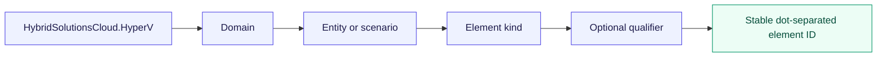
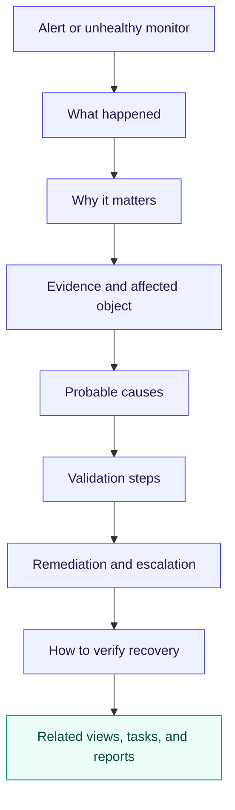
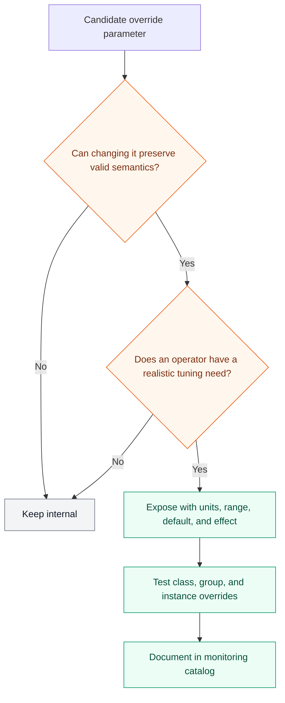
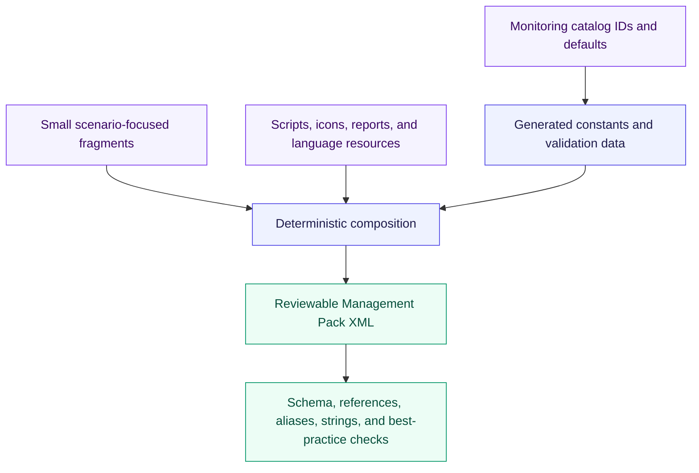

# Hyper-V Management Pack authoring standards

These rules turn the architecture into consistent, supportable Management Pack XML. They apply to
every Hyper-V class, relationship, discovery, module type, monitor, rule, task, view, report, and
language resource.

## Element naming

Working examples:

| Element | Working ID pattern |
|---|---|
| Class | `HybridSolutionsCloud.HyperV.VirtualMachine` |
| Relationship | `HybridSolutionsCloud.HyperV.Deployment.Contains.VirtualMachine` |
| Discovery | `HybridSolutionsCloud.HyperV.VirtualMachine.Discovery` |
| Unit monitor | `HybridSolutionsCloud.HyperV.VirtualMachine.RuntimeState.Monitor` |
| Collection rule | `HybridSolutionsCloud.HyperV.Host.LogicalProcessorRuntime.Collection` |
| Task | `HybridSolutionsCloud.HyperV.Host.CollectDiagnostics.Task` |
| View | `HybridSolutionsCloud.HyperV.VirtualMachine.State.View` |

IDs describe semantics, not implementation mechanics. Do not include script names, ticket numbers,
temporary version labels, or mutable threshold values in public IDs.

## Display strings and knowledge

Microsoft identifies knowledge, views, reports, tasks, monitors, rules, and discoveries as core MP
content. Every operator-visible element therefore needs a localized display string and useful
description. Product knowledge must explain the condition without requiring the author to be
present. See [Add knowledge to a Management Pack](https://learn.microsoft.com/en-us/system-center/scom/manage-mp-add-knowledge?view=sc-om-2025).

Required conventions:

- Use concise sentence-case display names and descriptions that identify the target and behavior.
- Localize every visible string through language packs; do not embed operator text only in scripts.
- Alert descriptions include discovered context through safe parameters, never credentials or
  sensitive configuration.
- Product knowledge distinguishes platform remediation from guest/application remediation.
- Company-specific procedures belong in customer company knowledge or their override/documentation
  process, not in the sealed product MP.

## Override design

- All threshold, interval, sample-count, timeout, severity, priority, and enabled-state overrides
  use documented units and safe ranges.
- Related workflows expose matching parameters consistently.
- The guide recommends group-based overrides for policy tiers and explains when class or instance
  targeting is justified.
- Discovery overrideable parameters are documented separately from monitor/rule overrideable
  parameters and stored in their corresponding customer-owned override MPs.
- Lab, Standard, and Strict examples contain only reviewed settings for the matching product
  version; they never contain customer identity, credentials, or notification destinations.
- No workflow stores changes in the Default Management Pack.
- Override compatibility is an explicit upgrade test.

Microsoft's override guidance calls for a separate MP, deliberate `Enabled=False` overrides instead
of an ambiguous console disable operation, group targeting where practical, and test-environment
validation. See [Best practices for configuring overrides](https://learn.microsoft.com/en-us/troubleshoot/system-center/scom/best-practices-configure-overrides).

The full parameter, ownership, targeting, template, and lifecycle contract is defined in
[Override and tuning architecture](override-and-tuning-architecture.md).

## Module and script standards

| Concern | Required rule |
|---|---|
| Reuse | Repeated acquisition and state logic becomes a typed composite module with a reviewed contract |
| Cookdown | Identical expensive acquisition uses identical module configuration; test actual cookdown |
| Input | Validate nulls, types, ranges, duplicate keys, escaping, and unsupported provider versions |
| Output | Emit typed discovery data or property bags with stable field names and units |
| Errors | Fail explicitly, emit throttled diagnostic evidence, and surface stale telemetry |
| Timeout | Every external call and script has a bounded timeout below its schedule interval |
| Logging | Structured source, workflow ID, target, duration, result code, and correlation identifier |
| Secrets | Never accept, print, serialize, or alert on credentials or secret values |
| Side effects | Discoveries, monitors, and collection rules are read-only; recovery actions are separate and explicit |
| Runtime | PowerShell engine/version and module prerequisites must be proven in the supported SCOM agent matrix |

The repository's automation scripts remain PowerShell 7+. Embedded SCOM workflow scripts are not
authored until runtime research proves the supported host engine. If SCOM cannot execute the governed runtime
directly, ADR 0028 must select a supportable execution mechanism rather than silently introducing a
Windows PowerShell dependency.

## Authoring source layout

Fragments are source organization, not permission to copy community XML without review. Useful
patterns from Microsoft's legacy Hyper-V MP, Kevin Holman's fragment library, or Silect material
must be traced, revalidated, renamed into this product, and tested against the supported matrix.

## Definition of done for an element

An element is not complete until it has:

1. a stable ID and localized display string;
2. a narrow target and documented execution location;
3. source semantics, units, supported versions, and topology applicability;
4. safe defaults and overrides with range validation;
5. product knowledge and related diagnostic surfaces;
6. cookdown, security, scale, failure, and stale-data analysis;
7. normal, negative, transition, and upgrade fixtures; and
8. a traceable monitoring-catalog row and work item.
