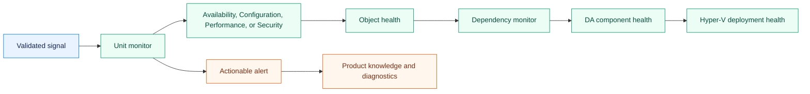
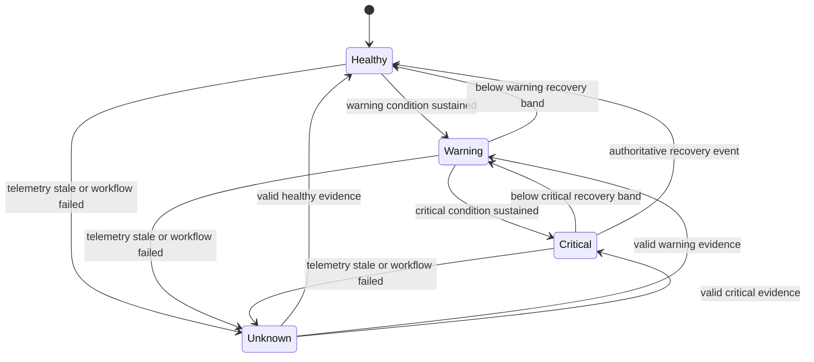
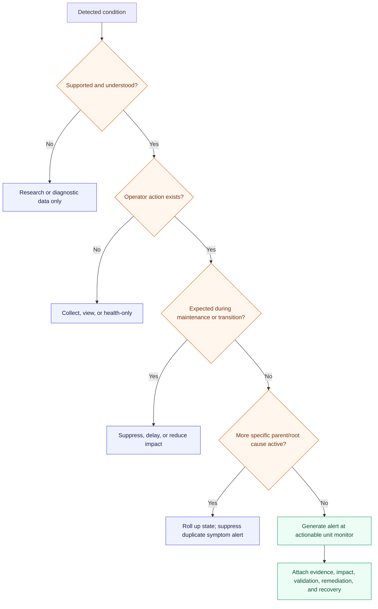
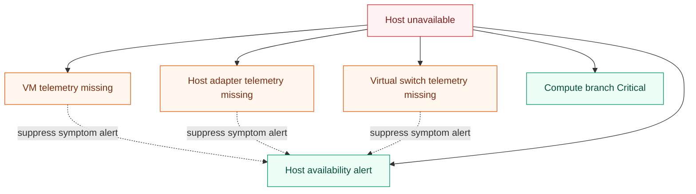
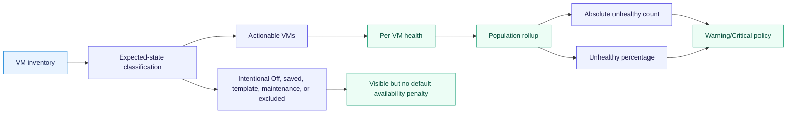

# Hyper-V health and alert architecture

Health answers **what is currently unhealthy**; alerts answer **what an operator should act on**.
They are related but not identical. Unit monitors establish object health, aggregate monitors organize
the four SCOM health dimensions, dependency monitors propagate service impact, and alerts originate
at the most actionable layer. Rules collect diagnostic history or alert on discrete events that do
not have a durable state model.

## Health construction

Aggregate and dependency monitors normally do not generate duplicate alerts. The leaf monitor that
has the evidence and remediation context alerts; its state then rolls up for service impact.

## Standard health dimensions

| Dimension | Hyper-V examples | Typical evidence |
|---|---|---|
| Availability | Host role, VM service, cluster/node/resource, CSV online, Replica availability | Service state, cluster state, authoritative events, heartbeat |
| Configuration | Version drift, unsupported topology, integration configuration, network authority drift | Registry, CIM, PowerShell, configuration provider |
| Performance | Sustained CPU pressure, memory pressure, latency, queue, packet loss | Performance counters and calculated property bags |
| Security | Explicit security posture signals that are both supported and actionable | Security/configuration provider; disabled unless evidence supports default health |

Security is not a catch-all for general configuration. The first release includes Security health
only for signals with a documented source, owner, remediation, and support boundary.

## Stateful threshold pattern

SCOM may render a missing or uninitialized state as unmonitored rather than a custom fourth state;
the implementation must map that platform behavior explicitly. It must not substitute Healthy for
missing evidence.

## Threshold contract

Every numeric monitor defines the complete time behavior, not only a percentage:

```mermaid
flowchart LR
    SAMPLE[Sample interval] --> WINDOW[Consecutive samples or duration]
    WINDOW --> ENTRY[Warning and critical entry bands]
    ENTRY --> HYST[Recovery bands and hysteresis]
    HYST --> STATE[Health transition]
    STATE --> ALERT[Alert severity, priority, and repeat behavior]
    ALERT --> ROLL[Object and DA impact]
    ROLL --> OVERRIDE[Safe override parameters]

    classDef contract fill:#eef2ff,stroke:#4f46e5,color:#1e1b4b
    classDef result fill:#ecfdf5,stroke:#059669,color:#064e3b
    class SAMPLE,WINDOW,ENTRY,HYST,OVERRIDE contract
    class STATE,ALERT,ROLL result
```

The default host-memory design does not alert at 75% utilization alone. It combines available or
reserved host memory, Hyper-V pressure, paging, sustained duration, topology, and lab evidence.
The same evidence contract applies to CPU, storage, network, and VM pressure.

## Alert decision flow

## Alert contract

Every enabled alert-generating workflow must define:

- source object and monitor/rule ID;
- condition, operational impact, and evidence captured in alert parameters;
- severity and priority with a consistent mapping;
- whether the alert auto-resolves, and the exact healthy/reset evidence;
- suppression key and repeat-count behavior for event storms;
- maintenance, migration, backup, checkpoint, drain, and failover behavior;
- probable causes, validation commands or views, remediation, escalation, and recovery verification;
- related performance, event, state, and task views; and
- DA branch and parent impact.

## Dependency and symptom suppression

Suppression must be implemented only where targeting and correlation are deterministic. When SCOM
cannot safely suppress a symptom, the MP should delay the child condition or provide correlation
knowledge instead of hiding a potentially independent fault.

## Population-aware VM health

An intentionally powered-off VM must not make the DA unhealthy by default. Expected state is an
explicit discovered or configured policy, not a guess based on one sample.

## Rollup defaults

| Scope | Proposed default | Reason |
|---|---|---|
| Unit monitor to dimension | Worst state within that dimension | Preserve the most severe supported condition |
| Dimension to object | Standard SCOM object health behavior | Keep Health Explorer predictable |
| Critical infrastructure child to branch | Worst state | One failed quorum, CSV, or required host dependency can be service-critical |
| Redundant host population | Topology-aware or percentage rollup | One drained node may not equal cluster outage |
| VM population | Expected-state plus absolute and percentage policy | Avoid one intentionally stopped VM poisoning a large service |
| Monitoring pipeline | Worst state with explicit freshness deadlines | Prevent false confidence when telemetry is absent |
| Branch to DA root | Impact-weighted dependency monitors | Availability-critical branches may affect root differently from advisory configuration |

## Monitoring profiles

| Profile | Intended behavior |
|---|---|
| Core | Low-noise availability, data-integrity, and monitoring-pipeline health enabled |
| Balanced | Core plus validated predictive performance and configuration monitoring |
| Deep diagnostic | High-cardinality collection and disabled-by-default monitors enabled selectively |

Profiles are documented override recommendations, not separate sealed runtime products. Customer
changes remain in their unsealed override MP.

## Decision gate

ADR 0029 cannot be accepted until AB#7351–AB#7353 provide threshold evidence, lab fault/recovery
results, noise assessment, VM expected-state policy, and final Must/Should/Could/Collect/Diagnostic
classification.
