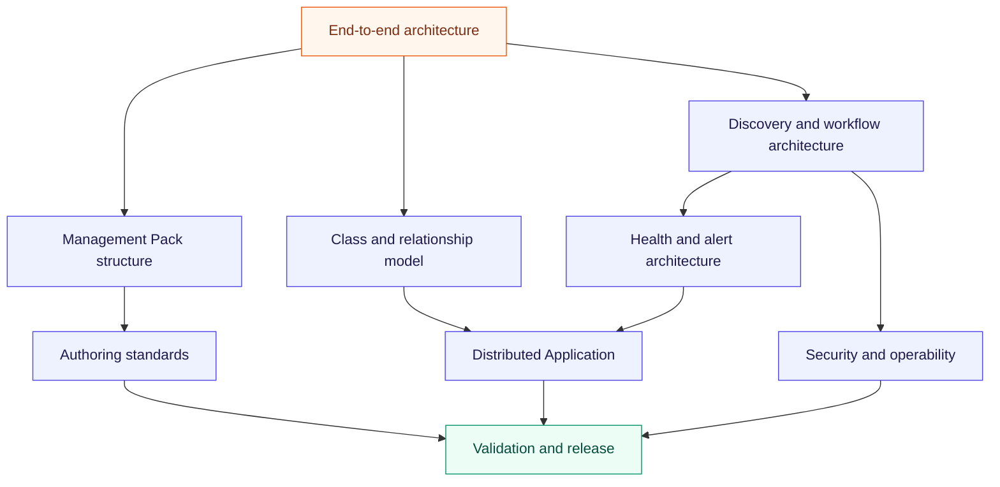

# Hyper-V SCOM Management Pack design

This is the active first delivery lane. The Management Pack and platform-owned Distributed
Application are committed; implementation remains gated by topology, signal, threshold, workflow,
and lab evidence.

## Design map

| Design contract | Purpose |
|---|---|
| [End-to-end architecture](architecture.md) | Requirements, topology variants, runtime planes, data flow, and non-functional requirements |
| [Management Pack structure](management-pack-structure.md) | Proposed sealed artifacts, dependencies, override boundary, and release bundle |
| [Class and relationship model](class-and-relationship-model.md) | Stable identity, hosting, containment, reference relationships, and VM mobility |
| [Discovery and workflow architecture](discovery-and-workflow-architecture.md) | Staged discovery, source selection, execution placement, cookdown, monitors, rules, and tasks |
| [Health and alert architecture](health-and-alert-architecture.md) | Health dimensions, thresholds, state, alerting, suppression, expected state, and rollup |
| [Distributed Application](distributed-application.md) | Cluster/standalone service roots, dynamic membership, branches, rollup, and operator surfaces |
| [Authoring standards](authoring-standards.md) | IDs, display strings, knowledge, overrides, modules, scripts, and definition of done |
| [Security and operability](security-and-operability.md) | Least privilege, Run As, task safety, monitoring-pipeline health, and diagnostics |
| [Validation and release](validation-and-release.md) | Static, fixture, lab, fault, scale, lifecycle, signing, and publishing gates |

## Proposed architecture decisions

| ADR | Decision | Status and gate |
|---|---|---|
| [0027](../decisions/0027-hyper-v-scom-management-pack-decomposition.md) | Modular sealed Library, Discovery, Monitoring, Presentation, optional Reporting, and customer override MPs | Proposed; AB#7319 and AB#7327 |
| [0028](../decisions/0028-hyper-v-object-and-discovery-architecture.md) | Stable boundary identity, mobile VM model, staged discovery, execution placement, and cookdown | Proposed; AB#7343–AB#7352 |
| [0029](../decisions/0029-hyper-v-health-alert-and-da-rollup.md) | Evidence-driven health, actionable alerts, topology-aware rollup, and monitoring-pipeline branch | Proposed; AB#7351–AB#7357 |

These refine accepted ADRs [0022](../decisions/0022-scom-management-pack-packaging-boundaries.md),
[0025](../decisions/0025-hyper-v-network-management-authority.md), and
[0026](../decisions/0026-platform-owned-scom-distributed-applications.md). They do not change the
independent product boundary.

## Current design baseline

| Concern | Current authority |
|---|---|
| Support matrix and topology | [AB#7343](https://dev.azure.com/hybridcloudsolutions/Hybrid%20Infrastructure%20Health%20Monitoring/_workitems/edit/7343) |
| Raw Windows Server, Hyper-V, cluster, storage, and network inventories | AB#7344–AB#7348 |
| Prior Microsoft MP research | [AB#7349](https://dev.azure.com/hybridcloudsolutions/Hybrid%20Infrastructure%20Health%20Monitoring/_workitems/edit/7349), evidence only with no dependency |
| SCOM workflow mapping | [AB#7350](https://dev.azure.com/hybridcloudsolutions/Hybrid%20Infrastructure%20Health%20Monitoring/_workitems/edit/7350) |
| Threshold and tuning policy | [AB#7351](https://dev.azure.com/hybridcloudsolutions/Hybrid%20Infrastructure%20Health%20Monitoring/_workitems/edit/7351) |
| Lab and fault validation | [AB#7352](https://dev.azure.com/hybridcloudsolutions/Hybrid%20Infrastructure%20Health%20Monitoring/_workitems/edit/7352) |
| Curated default catalog | [AB#7353](https://dev.azure.com/hybridcloudsolutions/Hybrid%20Infrastructure%20Health%20Monitoring/_workitems/edit/7353) |
| DA classes and membership | [AB#7356](https://dev.azure.com/hybridcloudsolutions/Hybrid%20Infrastructure%20Health%20Monitoring/_workitems/edit/7356) |
| DA rollups and operator surfaces | [AB#7357](https://dev.azure.com/hybridcloudsolutions/Hybrid%20Infrastructure%20Health%20Monitoring/_workitems/edit/7357) |
| Architecture validation and ADR resolution | [AB#7359](https://dev.azure.com/hybridcloudsolutions/Hybrid%20Infrastructure%20Health%20Monitoring/_workitems/edit/7359) |

## Authoring boundary

The Microsoft Hyper-V 2019 MP is research evidence only. The new product does not import, extend,
override, require, or take a runtime dependency on it. The same prohibition applies to Azure Local
MPs. Approved Microsoft System, Windows Server, and Failover Cluster libraries can be referenced
when the support and compatibility matrix explicitly identifies them.

The design follows current Microsoft guidance for MP contents, separate overrides, Run As
assignment, pre-production lifecycle validation, Distributed Applications, and service-level
objectives. Detailed legacy authoring concepts remain useful only when revalidated against the
supported SCOM releases.

## Research and implementation pages

- [Phase-one research plan](../../hyper-v/monitoring-research.md)
- [Monitoring catalog and threshold policy](../../hyper-v/monitoring-catalog.md)
- [Hyper-V SCOM product page](../../hyper-v/scom-mp.md)
