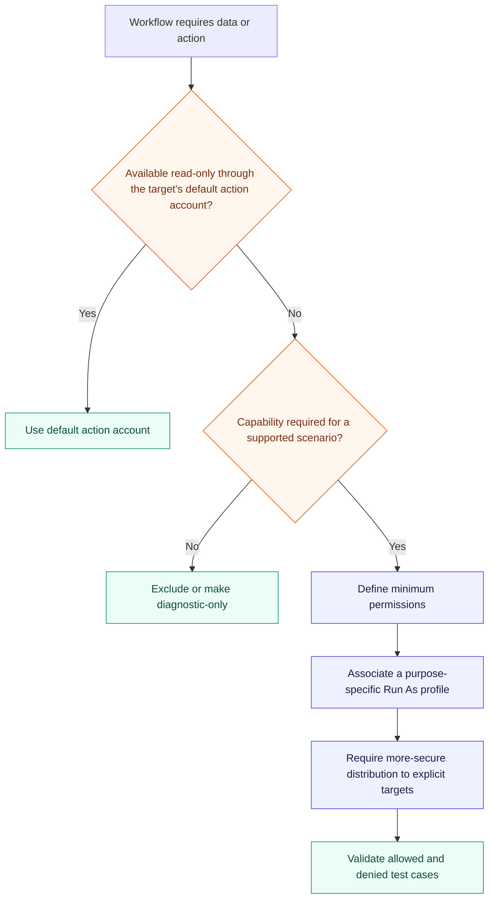
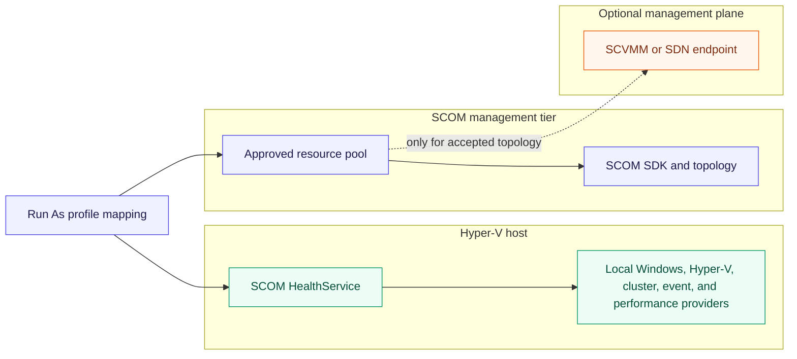
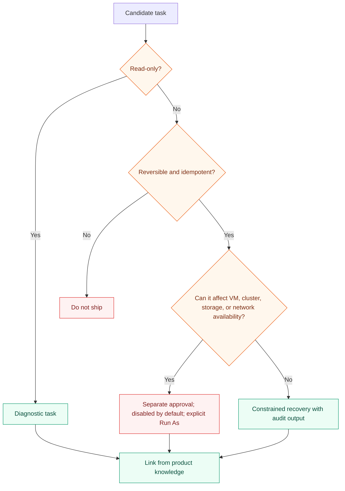
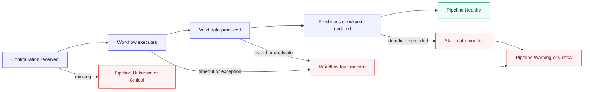

# Hyper-V security and operability

The default architecture executes local read-only workflows under the agent's existing action
account. A named Run As profile is introduced only when a supported topology requires privileges
that cannot be granted safely to that account. The MP defines profiles but never ships credentials
or automatically binds accounts.

Microsoft documents that rules, monitors, discoveries, and tasks run under an applicable Run As
account and that more-secure distribution limits credentials to specified computers. See
[Run As accounts and profiles](https://learn.microsoft.com/en-us/system-center/scom/plan-security-runas-accounts-profiles?view=sc-om-2025)
and [Manage Run As accounts and profiles](https://learn.microsoft.com/en-us/system-center/scom/manage-security-maintain-runas-profiles?view=sc-om-2025).

## Credential decision flow

## Proposed execution boundaries

| Workflow family | Default identity | Escalation policy |
|---|---|---|
| Local discovery and monitoring | Agent default action account | Add no Run As profile unless negative tests prove a required read is unavailable |
| Cluster topology | Agent or approved cluster workflow identity | Minimum remote cluster-provider access only if local ownership cannot supply the view |
| SCVMM/SDN topology | Dedicated optional profile | Scoped only to management servers/resource pools and endpoints in that topology |
| Diagnostic task | Console-supplied or purpose-specific task profile | Read-only by default; explicit operator invocation |
| Recovery task | Separate elevated profile if shipped at all | Disabled by default, auditable, idempotent, and independently approved |

## Task safety classes

The first release prioritizes diagnostics over automatic remediation. It must not automatically
restart VMs, move roles, modify quorum, change networking, delete checkpoints, or alter storage.

## Monitoring-pipeline health

Each DA has a Monitoring pipeline branch covering:

- SCOM agent/HealthService availability and heartbeat;
- discovery success and age for required topology stages;
- monitor/rule script failures, timeouts, and malformed output;
- data freshness for required signal families;
- excessive runtime, event storms, duplicate keys, and object-count limits; and
- optional management-plane connectivity only when that plane is part of the boundary.

## Diagnostic event contract

| Field | Requirement |
|---|---|
| Source | Stable Hyper-V MP event source |
| Event identifier | Allocated by workflow family and documented centrally |
| Level | Information only for explicit debug; Warning/Error for actionable faults |
| Correlation | Workflow ID, target key, execution ID, and provider operation |
| Timing | Start/end duration for expensive workflows; UTC timestamps |
| Error | Sanitized exception type, result code, and bounded message |
| Volume | Suppression/throttling to one event per failure episode where possible |
| Privacy | No credentials, tokens, personal data, or full sensitive configuration dumps |

## Supportability contract

- All required privileges appear in the Management Pack guide by workflow family.
- The default path works without a custom privileged account wherever Windows exposes the required
  data to the agent identity.
- Access denied produces a monitoring-pipeline condition with corrective knowledge; it never causes
  object deletion or a Healthy state.
- Debug logging is disabled by default, bounded in duration and volume, and overrideable by group.
- Every remote endpoint, port, protocol, identity, and credential-distribution target is documented.
- The MP exposes a non-destructive task that collects sanitized configuration, workflow, and
  topology diagnostics for support.
