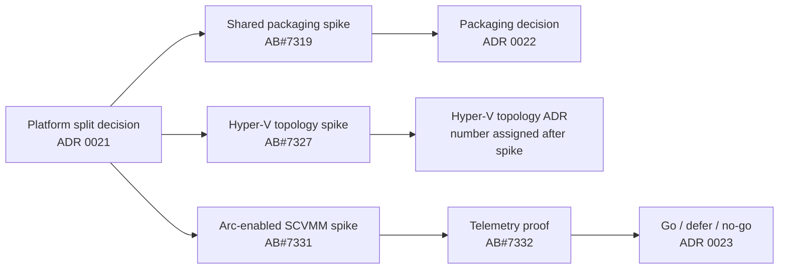

# Research spikes

Research is tracked as time-boxed Azure DevOps User Stories. Each spike must produce evidence,
update the relevant proposed ADR, and identify executable follow-up work. A spike is not complete
when it merely collects links.

## Current spike backlog

| Spike | Platform / surface | Required evidence | Work item |
|---|---|---|---|
| Shared SCOM packaging boundaries | Shared SCOM foundation | Type-ownership matrix, dependency alternatives, versioning and upgrade analysis, artifact naming recommendation | [AB#7319](https://dev.azure.com/hybridcloudsolutions/Azure%20Local%20SCOM%20MP/_workitems/edit/7319) |
| Hyper-V topology, signals, and support matrix | Hyper-V / SCOM | Supported-version matrix, topology variants, discovery sources, signal proof, lab fixture plan | [AB#7327](https://dev.azure.com/hybridcloudsolutions/Azure%20Local%20SCOM%20MP/_workitems/edit/7327) |
| Azure Local Health Models API and signal revalidation | Azure Local / Azure Monitor | Current API versions, preview limits, identity and RBAC contract, signal-source delta report | [AB#7323](https://dev.azure.com/hybridcloudsolutions/Azure%20Local%20SCOM%20MP/_workitems/edit/7323) |
| Arc-enabled SCVMM inventory and guest management | Hyper-V / Azure Monitor | ARM resource map, Arc Resource Bridge behavior, guest-management distinction, support and network matrix, repeatable lab steps | [AB#7331](https://dev.azure.com/hybridcloudsolutions/Azure%20Local%20SCOM%20MP/_workitems/edit/7331) |
| Hyper-V telemetry and Health Models feasibility | Hyper-V / Azure Monitor | Minimum viable entity graph, supported signals, fault-injection result, identity, latency, scale and cost findings | [AB#7332](https://dev.azure.com/hybridcloudsolutions/Azure%20Local%20SCOM%20MP/_workitems/edit/7332) |

## Planned ADR flow

## Spike completion contract

Every spike must include:

1. the question and explicit non-goals;
2. first-party source citations and tested product versions;
3. repeatable lab steps, fixtures, or API queries;
4. observed results, including negative results and unsupported paths;
5. risks, gaps, cost, scale, and security implications;
6. a recommendation with confidence level; and
7. ADR and backlog updates driven by the evidence.
