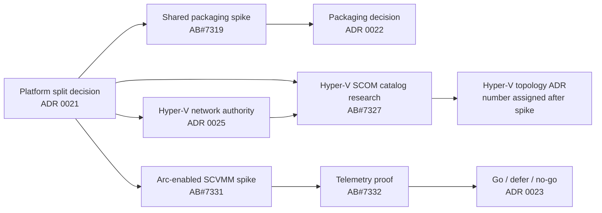

# Research spikes

Research is tracked as time-boxed Azure DevOps User Stories. Each spike must produce evidence,
update the relevant proposed ADR, and identify executable follow-up work. A spike is not complete
when it merely collects links.

## Current spike backlog

| Spike | Platform / surface | Required evidence | Work item |
|---|---|---|---|
| Shared SCOM packaging boundaries | Shared SCOM foundation | Type-ownership matrix, dependency alternatives, versioning and upgrade analysis, artifact naming recommendation | [AB#7319](https://dev.azure.com/hybridcloudsolutions/Hybrid%20Infrastructure%20Health%20Monitoring/_workitems/edit/7319) |
| Hyper-V SCOM monitoring catalog | Hyper-V / SCOM | Complete raw signal inventory, incumbent-MP gap analysis, SCOM workflow mapping, threshold evidence, lab validation, curated defaults, and successor ADR inputs | [AB#7327](https://dev.azure.com/hybridcloudsolutions/Hybrid%20Infrastructure%20Health%20Monitoring/_workitems/edit/7327) |
| Azure Local Health Models API and signal revalidation | Azure Local / Azure Monitor | Current API versions, preview limits, identity and RBAC contract, signal-source delta report | [AB#7323](https://dev.azure.com/hybridcloudsolutions/Hybrid%20Infrastructure%20Health%20Monitoring/_workitems/edit/7323) |
| Arc-enabled SCVMM inventory and guest management | Hyper-V / Azure Monitor | ARM resource map, Arc Resource Bridge behavior, guest-management distinction, support and network matrix, repeatable lab steps | [AB#7331](https://dev.azure.com/hybridcloudsolutions/Hybrid%20Infrastructure%20Health%20Monitoring/_workitems/edit/7331) |
| Hyper-V telemetry and Health Models feasibility | Hyper-V / Azure Monitor | Minimum viable entity graph, supported signals, fault-injection result, identity, latency, scale and cost findings | [AB#7332](https://dev.azure.com/hybridcloudsolutions/Hybrid%20Infrastructure%20Health%20Monitoring/_workitems/edit/7332) |

## Planned ADR flow

## Hyper-V SCOM phase-one child spikes

AB#7327 is the umbrella research Story. Its bounded child Tasks can execute in the dependency order
shown on the [Hyper-V monitoring research](../hyper-v/monitoring-research.md) page:

| Work item | Focus |
|---|---|
| [AB#7343](https://dev.azure.com/hybridcloudsolutions/Hybrid%20Infrastructure%20Health%20Monitoring/_workitems/edit/7343) | Support matrix and topology |
| [AB#7344](https://dev.azure.com/hybridcloudsolutions/Hybrid%20Infrastructure%20Health%20Monitoring/_workitems/edit/7344) | Windows Server host and platform signals |
| [AB#7345](https://dev.azure.com/hybridcloudsolutions/Hybrid%20Infrastructure%20Health%20Monitoring/_workitems/edit/7345) | Hyper-V, hypervisor, and VM signals |
| [AB#7346](https://dev.azure.com/hybridcloudsolutions/Hybrid%20Infrastructure%20Health%20Monitoring/_workitems/edit/7346) | Failover Cluster, quorum, and CSV signals |
| [AB#7347](https://dev.azure.com/hybridcloudsolutions/Hybrid%20Infrastructure%20Health%20Monitoring/_workitems/edit/7347) | Storage, VHD/VHDX, and Replica signals |
| [AB#7348](https://dev.azure.com/hybridcloudsolutions/Hybrid%20Infrastructure%20Health%20Monitoring/_workitems/edit/7348) | Network ATC, manual, and SCVMM/SDN Hyper-V networking signals |
| [AB#7349](https://dev.azure.com/hybridcloudsolutions/Hybrid%20Infrastructure%20Health%20Monitoring/_workitems/edit/7349) | Existing Microsoft MP research inputs; no runtime dependency or reuse of its package |
| [AB#7350](https://dev.azure.com/hybridcloudsolutions/Hybrid%20Infrastructure%20Health%20Monitoring/_workitems/edit/7350) | Supported SCOM workflow mapping and cost |
| [AB#7351](https://dev.azure.com/hybridcloudsolutions/Hybrid%20Infrastructure%20Health%20Monitoring/_workitems/edit/7351) | Threshold, duration, recovery, and tuning policy |
| [AB#7352](https://dev.azure.com/hybridcloudsolutions/Hybrid%20Infrastructure%20Health%20Monitoring/_workitems/edit/7352) | Lab source, fault, latency, recovery, and overhead validation |
| [AB#7353](https://dev.azure.com/hybridcloudsolutions/Hybrid%20Infrastructure%20Health%20Monitoring/_workitems/edit/7353) | Final Must/Should/Could/collect-only/excluded catalog |

## Spike completion contract

Every spike must include:

1. the question and explicit non-goals;
2. first-party source citations and tested product versions;
3. repeatable lab steps, fixtures, or API queries;
4. observed results, including negative results and unsupported paths;
5. risks, gaps, cost, scale, and security implications;
6. a recommendation with confidence level; and
7. ADR and backlog updates driven by the evidence.
