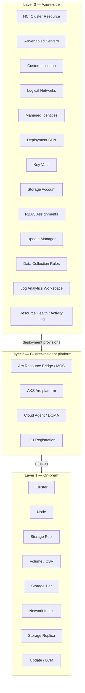

# Scope & Topology

> **Locked by [ADR 0001](decisions/0001-scope-and-topology.md).** This page is the
> reader-friendly view of that decision.

## What we monitor

**Azure Local infrastructure only** — every component that is deployed *as part of* an
Azure Local deployment. Three layers, ~25 entities. Workloads (VMs, AKS pods, applications)
are explicitly out of scope and tracked as future companion MPs in the
[Roadmap](../project/roadmap.md).

## Three-layer entity model

### Layer 1 — On-prem (the cluster box)

| Entity | Purpose | Source |
|---|---|---|
| **Cluster** | The Azure Local cluster (S2D + Failover Clustering) | `Get-Cluster` / `Get-ClusterResource` |
| **Node** | Each cluster member node | `Get-ClusterNode` / WMI |
| **Storage Pool** | The Storage Spaces Direct pool | `Get-StoragePool` / `Get-PhysicalDisk` |
| **Volume (CSV)** | Each cluster shared volume | `Get-Volume` / `Get-ClusterSharedVolume` |
| **Storage Tier** | Pool's cache + capacity tiers | `Get-StorageTier` |
| **Network Intent** | Each named Network ATC intent (Mgmt / Compute / Storage) | `Get-NetIntent` / `Get-NetIntentStatus` |
| **Storage Replica** | Replication relationship (if configured) | `Get-SRPartnership` |
| **Update / LCM state** | Solution-level update posture | `Get-SolutionUpdate` (Azure Local LCM) |

> **Granularity note:** Physical disks roll into **Storage Pool**. Individual NICs roll
> into **Network Intent**. This is the "standard" topology — pragmatic depth without
> exploding the class count.

### Layer 2 — Cluster-resident platform services

| Entity | Purpose | Source |
|---|---|---|
| **Arc Resource Bridge / MOC** | The Resource Bridge VM and its MOC components | `az arcappliance` / Resource Health |
| **AKS Arc platform** | AKS *platform* only (host pool, control plane reachability) | AKS extension status |
| **Cloud Agent / DCMA** | Microsoft-supplied management agents | Service state + last heartbeat |
| **HCI registration state** | Registration / billing / license tier | ARM resource state |

### Layer 3 — Azure-side infrastructure

| Entity | Purpose | Source |
|---|---|---|
| **HCI Cluster resource** | `Microsoft.AzureStackHCI/clusters` | ARM / Resource Graph |
| **Arc-enabled Server** (per node) | `Microsoft.HybridCompute/machines` | ARM + Connected Machine Agent |
| **Custom Location** | The Custom Location Azure resource | ARM |
| **Logical Networks** | `Microsoft.AzureStackHCI/logicalNetworks` | ARM |
| **Managed Identities** | System- + user-assigned MIs used by the deployment | ARM + Microsoft Graph |
| **Deployment SPN** | The SPN performing deployment / ongoing operations | Microsoft Graph |
| **Key Vault** | Secrets, access policies, expiry | ARM + Resource Health |
| **Storage Account** | Account, ACLs, redundancy | ARM + Resource Health |
| **RBAC / role assignments** | Required role assignments on cluster identity, SPN, MI | ARM Authorization |
| **Update Manager linkage** | Azure Update Manager linkage for the cluster | ARM |
| **Data Collection Rules** | DCRs associated with the cluster | ARM |
| **Log Analytics Workspace linkage** | Workspace reachability + ingestion | ARM + KQL `Heartbeat` |
| **Resource Health / Activity Log** | Per-resource health stream | Activity Log stream |

**Total: ~25 entities across 3 layers.**

## Out of scope (deferred)

These are tracked in the [Roadmap](../project/roadmap.md) as future companion MPs that take
a *dependency* on this health model:

- Guest OS health inside HCI VMs
- Application services running inside VMs
- AKS Arc workload pods, deployments, ingress
- SQL MI / AVD / other workloads
- Customer applications and their dependencies

## How tracks consume this scope

| Track | Implementation |
|---|---|
| **SCOM MP** | One SCOM class per entity. L1+L2 discovered via PowerShell Discovery on each cluster node. L3 discovered via ARM/Resource Graph from a designated management server. See [ADR 0004](decisions/0004-scom-discovery-strategy.md) and [ADR 0005](decisions/0005-scom-class-hierarchy.md). |
| **Azure Monitor Health Model** | One model entity per entity. L1+L2 surfaced through HCI Insights + DCMA metrics + Resource Health on `AzureStackHCI/clusters`. L3 surfaced through Resource Health + Activity Log + Resource Graph signals. See [ADR 0006](decisions/0006-azmon-entity-model.md). |

## References

- ADR 0001 — [Scope & topology](decisions/0001-scope-and-topology.md)
- [Azure Local monitoring overview](https://learn.microsoft.com/en-us/azure/azure-local/concepts/monitoring-overview?view=azloc-2604)
- [Azure Arc-enabled servers overview](https://learn.microsoft.com/en-us/azure/azure-arc/servers/overview)
- [Azure Local — required permissions](https://learn.microsoft.com/en-us/azure/azure-local/deploy/deployment-arc-register-server-permissions?view=azloc-2604)
