# Scope & Topology

> **Locked by [ADR 0001](decisions/0001-scope-and-topology.md).** This page is the
> reader-friendly view of that decision.

## What we monitor

**Azure Local infrastructure only** — every component that is deployed *as part of* an
Azure Local deployment. Three layers, ~25 entities. Workloads (VMs, AKS pods, applications)
are explicitly out of scope and tracked as future companion MPs in the
[Roadmap](../project/roadmap.md).

## Three-layer entity model

```mermaid
flowchart TD
    subgraph L3["Layer 3 — Azure-side"]
        HCI[HCI Cluster Resource]
        ARC[Arc-enabled Servers]
        CL[Custom Location]
        LN[Logical Networks]
        MI[Managed Identities]
        SPN[Deployment SPN]
        KV[Key Vault]
        SA[Storage Account]
        RBAC[RBAC Assignments]
        UM[Update Manager]
        DCR[Data Collection Rules]
        LAW[Log Analytics Workspace]
        RH[Resource Health / Activity Log]
    end
    subgraph L2["Layer 2 — Cluster-resident platform"]
        ARB[Arc Resource Bridge / MOC]
        AKS[AKS Arc platform]
        DCMA[Cloud Agent / DCMA]
        ARCAGENT["Arc Agent&#xa;&#40;per node — Tier A&#41;"]
        REG[HCI Registration]
    end
    subgraph L1["Layer 1 — On-prem"]
        CLU[Cluster]
        N[Node]
        SP[Storage Pool]
        PD[Physical Disk]
        VOL[Volume / CSV]
        ST[Storage Tier]
        NI[Network Intent]
        NA[Network Adapter]
        SR[Storage Replica]
        UP[Update / LCM]
    end
    L3 -->|deployment provisions| L2
    L2 -->|runs on| L1
    PD -->|rolls up to| SP
    NA -->|rolls up to| NI
```

### Layer 1 — On-prem (the cluster box)

| Entity | SCOM class | Purpose | Source |
|---|---|---|---|
| **Cluster** | `AzureLocal.Cluster` | The Azure Local cluster (S2D + Failover Clustering) | `Get-Cluster` / `Get-ClusterResource` |
| **Node** | `AzureLocal.Node` | Each cluster member node | `Get-ClusterNode` / WMI |
| **Storage Pool** | `AzureLocal.StoragePool` | The Storage Spaces Direct pool | `Get-StoragePool` |
| **Volume (CSV)** | `AzureLocal.Volume` | Each cluster shared volume | `Get-Volume` / `Get-ClusterSharedVolume` |
| **Storage Tier** | `AzureLocal.StorageTier` | Pool's cache + capacity tiers | `Get-StorageTier` |
| **Physical Disk** | `AzureLocal.PhysicalDisk` | Each physical disk in the S2D pool — health, media type, usage | `Get-PhysicalDisk` |
| **Network Intent** | `AzureLocal.NetworkIntent` | Each named Network ATC intent (Mgmt / Compute / Storage) | `Get-NetIntent` / `Get-NetIntentStatus` |
| **Network Adapter** | `AzureLocal.NetworkAdapter` | Each physical NIC bound to a Network Intent — link speed, RDMA, PFC/ETS | `Get-NetAdapter` / `Get-NetAdapterRdma` |
| **Storage Replica** | `AzureLocal.StorageReplica` | Replication relationship (if configured) | `Get-SRPartnership` |
| **Update / LCM state** | `AzureLocal.LCMState` | Solution-level update posture | `Get-SolutionUpdate` (Azure Local LCM) |

> **Granularity note (updated):** `AzureLocal.PhysicalDisk` is a hosted class beneath
> `AzureLocal.StoragePool`. A disk's health state is its own SCOM object, but it rolls up
> to the pool via an aggregated health roll-up monitor. Similarly `AzureLocal.NetworkAdapter`
> is hosted beneath `AzureLocal.NetworkIntent`; individual NIC failures propagate to the
> parent intent. This extends the original 8-entity model to 10 L1 entities without
> breaking existing aggregation logic.

### Layer 2 — Cluster-resident platform services

| Entity | SCOM class | Purpose | Source |
|---|---|---|---|
| **Arc Resource Bridge / MOC** | `AzureLocal.ArcResourceBridge` | The Resource Bridge VM and its MOC components | `az arcappliance` / Resource Health |
| **AKS Arc platform** | `AzureLocal.AKSArcPlatform` | AKS *platform* only (host pool, control plane reachability) | AKS extension status |
| **Cloud Agent / DCMA** | `AzureLocal.DCMA` | Microsoft-supplied management agents — locally observable | Service state + registry + last heartbeat |
| **Arc agent (per node)** | `AzureLocal.Node` (attribute group) | Arc Connected Machine Agent services + extension health — locally observable, no ARM required (see ADR 0011 Tier A) | `Get-Service HIMDS`, registry, event log |
| **HCI registration state** | `AzureLocal.HCIRegistration` | Registration / billing / license tier | ARM resource state + local registry |

> **ADR 0011 Tier A signals:** Arc agent connectivity and extension health signals are
> collected on `AzureLocal.Node` (not a separate class) using agent-local data sources.
> See [signal-catalog.md — Arc agent locally observable](signal-catalog.md#arc-agent--locally-observable-adr-0011-tier-a).

### Layer 3 — Azure-side infrastructure

| Entity | Purpose | Source |
|---|---|---|
| **HCI Cluster resource** | `Microsoft.AzureStackHCI/clusters` | ARM / Resource Graph |
| **Arc-enabled Server** (per node) | `Microsoft.HybridCompute/machines` | ARM + Connected Machine Agent |
| **Custom Location** | The Custom Location Azure resource | ARM |
| **Logical Networks** | `Microsoft.AzureStackHCI/logicalNetworks` | ARM |
| **Managed Identities** | System- + user-assigned MIs used by the deployment | ARM + Microsoft Graph |
| **Deployment SPN** | The SPN performing deployment / ongoing operations | Microsoft Graph |
| **Key Vault** | Secrets, access policies, expiry | ARM + Resource Health |
| **Storage Account** | Account, ACLs, redundancy | ARM + Resource Health |
| **RBAC / role assignments** | Required role assignments on cluster identity, SPN, MI | ARM Authorization |
| **Update Manager linkage** | Azure Update Manager linkage for the cluster | ARM |
| **Data Collection Rules** | DCRs associated with the cluster | ARM |
| **Log Analytics Workspace linkage** | Workspace reachability + ingestion | ARM + KQL `Heartbeat` |
| **Resource Health / Activity Log** | Per-resource health stream | Activity Log stream |

**Total: ~27 entities across 3 layers** (10 L1, 5 L2, 13 L3 — up from the original ~25 with the addition of `AzureLocal.PhysicalDisk`, `AzureLocal.NetworkAdapter`, and the Arc agent Tier A group).

## Out of scope (deferred)

These are tracked in the [Roadmap](../project/roadmap.md) as future companion MPs that take
a *dependency* on this health model:

- Guest OS health inside HCI VMs
- Application services running inside VMs
- AKS Arc workload pods, deployments, ingress
- SQL MI / AVD / other workloads
- Customer applications and their dependencies

## How tracks consume this scope

| Track | Implementation |
|---|---|
| **SCOM MP** | One SCOM class per entity. L1+L2 discovered via PowerShell Discovery on each cluster node. L3 discovered via ARM/Resource Graph from a designated management server. See [ADR 0004](decisions/0004-scom-discovery-strategy.md) and [ADR 0005](decisions/0005-scom-class-hierarchy.md). |
| **Azure Monitor Health Model** | One model entity per entity. L1+L2 surfaced through HCI Insights + DCMA metrics + Resource Health on `AzureStackHCI/clusters`. L3 surfaced through Resource Health + Activity Log + Resource Graph signals. See [ADR 0006](decisions/0006-azmon-entity-model.md). |

## References

- ADR 0001 — [Scope & topology](decisions/0001-scope-and-topology.md)
- [Azure Local monitoring overview](https://learn.microsoft.com/en-us/azure/azure-local/concepts/monitoring-overview?view=azloc-2604)
- [Azure Arc-enabled servers overview](https://learn.microsoft.com/en-us/azure/azure-arc/servers/overview)
- [Azure Local — required permissions](https://learn.microsoft.com/en-us/azure/azure-local/deploy/deployment-arc-register-server-permissions?view=azloc-2604)
