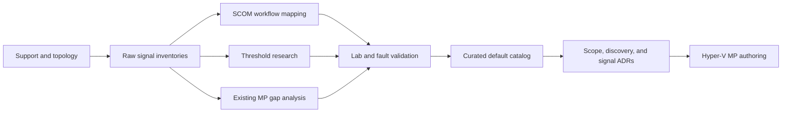

# Hyper-V SCOM monitoring research

Phase one is active under
[AB#7327](https://dev.azure.com/hybridcloudsolutions/Hybrid%20Infrastructure%20Health%20Monitoring/_workitems/edit/7327).
Its purpose is to determine, with evidence, what the Hyper-V Management Pack can observe and what
it should monitor by default. Management Pack authoring does not begin until this research is
synthesized and the resulting architecture decisions are accepted.

## Two different questions

The research deliberately produces two artifacts:

1. A **raw capability inventory** of every supported metric, performance counter, event, log,
   service state, configuration property, health state, relationship, and synthetic test that can
   be obtained from the approved Hyper-V topologies.
2. A **curated monitoring catalog** that decides which candidates are valuable enough to become
   default monitors, disabled monitors, collection rules, diagnostic tasks, or explicit exclusions.

Technical availability does not justify enabling a workflow. A complete inventory preserves
options; a smaller default profile protects operators, agents, databases, and notification channels
from duplicate or low-value noise.

## Work breakdown

| Phase | Research spike | Required outcome |
|---|---|---|
| Scope | [AB#7343 — support matrix and topology](https://dev.azure.com/hybridcloudsolutions/Hybrid%20Infrastructure%20Health%20Monitoring/_workitems/edit/7343) | Supported versions, topology variants, entities, relationships, keys, and exclusions |
| Inventory | [AB#7344 — Windows Server host signals](https://dev.azure.com/hybridcloudsolutions/Hybrid%20Infrastructure%20Health%20Monitoring/_workitems/edit/7344) | OS, services, CPU, memory, disks, volumes, NICs, time, reliability, and Windows-exposed platform data |
| Inventory | [AB#7345 — Hyper-V, hypervisor, and VM signals](https://dev.azure.com/hybridcloudsolutions/Hybrid%20Infrastructure%20Health%20Monitoring/_workitems/edit/7345) | Host, scheduler, VM, integration service, checkpoint, metering, and migration signals |
| Inventory | [AB#7346 — Failover Cluster, quorum, and CSV signals](https://dev.azure.com/hybridcloudsolutions/Hybrid%20Infrastructure%20Health%20Monitoring/_workitems/edit/7346) | Cluster, node, quorum, group, resource, network, clustered VM role, CSV, and CSV cache signals |
| Inventory | [AB#7347 — storage, VHD, and Replica signals](https://dev.azure.com/hybridcloudsolutions/Hybrid%20Infrastructure%20Health%20Monitoring/_workitems/edit/7347) | Host and virtual storage, VHD/VHDX, checkpoint chains, QoS, latency, errors, capacity, and Replica |
| Inventory | [AB#7348 — virtual-network signals](https://dev.azure.com/hybridcloudsolutions/Hybrid%20Infrastructure%20Health%20Monitoring/_workitems/edit/7348) | Physical NIC through vSwitch, port, and VM adapter; QoS, offloads, drops, errors, queues, and saturation |
| Gap analysis | [AB#7349 — existing MP coverage](https://dev.azure.com/hybridcloudsolutions/Hybrid%20Infrastructure%20Health%20Monitoring/_workitems/edit/7349) | Microsoft Hyper-V, Windows Server, and Cluster MP overlap, gaps, dependencies, and coexistence policy |
| Engineering | [AB#7350 — SCOM workflow mapping](https://dev.azure.com/hybridcloudsolutions/Hybrid%20Infrastructure%20Health%20Monitoring/_workitems/edit/7350) | Target, discovery/monitor/rule type, interval, cookdown, permissions, cardinality, and estimated cost |
| Engineering | [AB#7351 — thresholds and tuning](https://dev.azure.com/hybridcloudsolutions/Hybrid%20Infrastructure%20Health%20Monitoring/_workitems/edit/7351) | Evidence-backed conditions, durations, hysteresis, recovery, missing-data behavior, and override tiers |
| Validation | [AB#7352 — lab and fault validation](https://dev.azure.com/hybridcloudsolutions/Hybrid%20Infrastructure%20Health%20Monitoring/_workitems/edit/7352) | Repeatable fixtures, captures, faults, latency, recovery, duplicate-event, overhead, and negative results |
| Synthesis | [AB#7353 — default monitoring catalog](https://dev.azure.com/hybridcloudsolutions/Hybrid%20Infrastructure%20Health%20Monitoring/_workitems/edit/7353) | Must/Should/Could/collect-only/excluded decisions and authoring-ready signal contracts |

## Exhaustive enumeration method

Documentation lists are not treated as exhaustive. Each supported lab fixture must enumerate its
installed surface and preserve the output for comparison:

- performance counter sets and instances, including every `Hyper-V`, `Cluster`, `CSV`, processor,
  memory, storage, volume, and network object;
- event logs, channels, providers, event metadata, and task/category information for Hyper-V,
  Failover Clustering, storage, networking, services, and relevant Windows components;
- commands and returned properties from the `Hyper-V` and `FailoverClusters` PowerShell modules;
- CIM/WMI classes and properties in `root/virtualization/v2`, `root/MSCluster`, and applicable
  Windows namespaces;
- services, role/feature state, registry-backed configuration, VHD/VHDX metadata, resource
  metering, and supported cluster validation output; and
- the discoveries, monitors, rules, thresholds, and dependencies already shipped in applicable
  Microsoft Management Packs.

The inventory records version and topology availability. A counter or event seen on one host is not
assumed to exist, mean the same thing, or remain supported on another Windows Server release.

## Evidence hierarchy

Research uses sources in this order:

1. current Microsoft product, support, performance-tuning, PowerShell, CIM/WMI, and SCOM
   documentation;
2. manifests and exported elements from the current Microsoft Management Packs;
3. repeatable observation and fault injection on supported lab versions; and
4. current vendor documentation as a comparison point, never as proof of Microsoft support.

The [monitoring catalog](monitoring-catalog.md) defines the row schema, classification policy, and
initial threshold hypotheses. The complete project source register is in
[`REFERENCES.md`](https://github.com/Hybrid-Solutions-Cloud/hybrid-health-monitoring/blob/main/REFERENCES.md).

## Exit gate

AB#7327 can close only when:

- the raw inventory and curated catalog are both published;
- every selected signal has a supported acquisition path and repeatable evidence;
- default behavior and threshold evidence are explicit;
- Microsoft MP overlap and duplicate-alert behavior are resolved;
- unknown, missing, maintenance, dependency, and recovery behavior are defined;
- rejected candidates remain traceable with a reason; and
- successor scope/topology, discovery, and signal/rollup ADRs are ready for approval.
