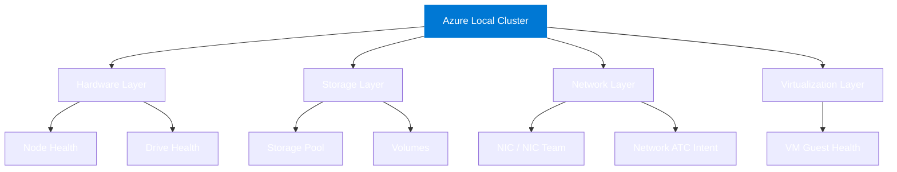

# Azure Local — Health Monitoring

> Health monitoring for Azure Local delivered two ways: a **SCOM Management Pack** and **Azure Monitor Health Models**.

---

## What this is

This repo delivers production-grade health monitoring for **Azure Local (HCI) clusters** at the health-model level — not just raw metric thresholds. Two parallel tracks share the same conceptual health model and documentation platform:

- :material-monitor-eye: **Track 1 — SCOM Management Pack**

    ---

    Sealed `.mp` + unsealed `.xml` overrides for System Center Operations Manager.

    Monitors clusters, nodes, storage pools, volumes, and VMs using unit, aggregate, and dependency monitors with the classic SCOM health rollup tree.

    **Target audience:** Organizations running SCOM on-premises.

    [:octicons-arrow-right-24: SCOM MP overview](scom-mp/index.md)

- :material-cloud-check: **Track 2 — Azure Monitor Health Models**

    ---

    Service-group-backed health models in Azure Monitor (public preview).

    Entities, signals, relationships, and health propagation for the same Azure Local resources — surfaced natively in the Azure portal.

    **Target audience:** Azure-native / cloud-first operations teams.

    [:octicons-arrow-right-24: Azure Monitor overview](azure-monitor/index.md)

---

## Health model components

Both tracks implement the same logical health model for Azure Local:

---

## Companion tooling

[**SquaredUp DS**](https://ds.squaredup.com) (on-prem SCOM dashboards) and [**SquaredUp Cloud**](https://squaredup.com) (SaaS — Azure + SCOM plugins) are evaluated as visualization layers on top of both tracks.

---

## Tracks at a glance

| | SCOM Management Pack | Azure Monitor Health Models |
|---|---|---|
| **Delivery format** | `.mp` sealed + `.xml` overrides | ARM / Bicep + Azure portal designer |
| **Health rollup** | Unit → Aggregate → Dependency | Entity signals → parent entity |
| **Alerting** | SCOM alert rules | Azure Monitor alert rules + Action Groups |
| **Dashboards** | SquaredUp DS | Azure portal + Workbooks + SquaredUp Cloud |
| **Scripting** | PowerShell (VSAE fragments) | KQL |
| **Status** | Phase 3 (planned) | Phase 3 (planned) |

See [SCOM ↔ Azure Monitor concept mapping](comparison/index.md) for the full crosswalk.

---

## Project status

!!! info "Phase 0 — Research & Planning (complete)"
    All upstream research is complete. Repo structure and documentation platform are being established.
    See [PLAN.md](https://github.com/AzureLocal/azurelocal-scom-mp/blob/main/PLAN.md) for the full phased roadmap.

| Phase | Description | Status |
|---|---|---|
| 0 | Research & Planning | ✅ Complete |
| 1 | Repo structure + docs platform | 🔄 In progress |
| 2 | Health model design | ⬜ Planned |
| 3 | Track 1 — SCOM MP authoring | ⬜ Planned |
| 4 | Track 2 — Azure Monitor Health Models | ⬜ Planned |
| 5 | SquaredUp integration + dashboards | ⬜ Planned |
| 6 | Testing, validation, release | ⬜ Planned |
