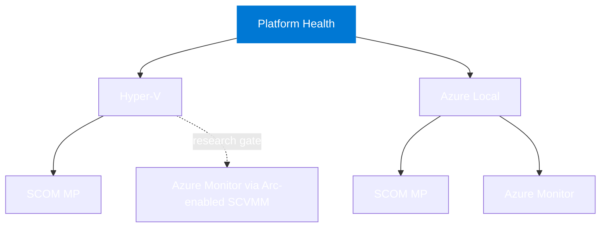

## What this project is

This project defines production-grade health monitoring for **Hyper-V and Azure Local
infrastructure** at the health-model level, rather than treating monitoring as a collection of
unrelated metric thresholds. Planning is organized by platform first and delivery surface second.

## Health model components

Both platforms use the same health-model grammar while retaining their own supported topology:

```mermaid
graph TD
    Root["Platform Health"]:::root
    Root --> HV["Hyper-V"]
    Root --> AzL["Azure Local"]
    HV --> HVS["SCOM MP"]
    HV -. research gate .-> HVA["Azure Monitor via Arc-enabled SCVMM"]
    AzL --> AzLS["SCOM MP"]
    AzL --> AzLA["Azure Monitor"]

    classDef root fill:#0078D4,color:#fff,stroke:none
```

## Tracks at a glance

| Platform | SCOM Management Pack | Azure Monitor Health Models |
|---|---|---|
| **Azure Local** | Committed | Committed |
| **Hyper-V** | Committed | Conditional on Arc-enabled SCVMM research |

## Companion tooling

[SquaredUp DS](https://ds.squaredup.com) and [SquaredUp Cloud](https://squaredup.com) are optional
visualization layers for the SCOM and Azure Monitor tracks respectively.

## Project status

::: info Independent platform products are planned
The original Azure Local design baseline is complete. The roadmap now separates Azure Local and
Hyper-V into their own Epics and delivery Features. Accepted ADRs require independent SCOM runtime
products and a platform-owned Distributed Application in each. Hyper-V topology, signal, and DA
membership research comes before authoring. See the [project roadmap](/project/roadmap) and
[implementation plan](https://github.com/Hybrid-Solutions-Cloud/hybrid-health-monitoring/blob/main/PLAN.md).
:::

| Phase | Description | Status |
|---|---|---|
| 0 | Research and planning | Complete |
| 1 | Documentation scaffold | Complete |
| 2 | Azure Local health-model design baseline | Complete |
| 3 | Platform split, delivery hierarchy, ADR and spike planning | Complete |
| 4 | Research and architecture gates | Next |
| 5 | Azure Local and Hyper-V delivery work | Planned |
| 6 | Validation, documentation, and releases | Planned |
