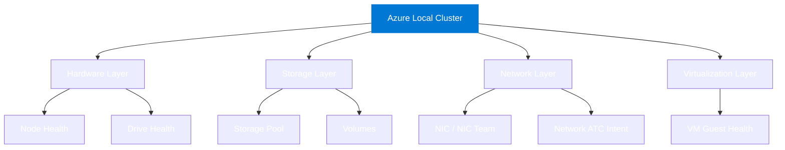

## What this project is

This project defines production-grade health monitoring for **Azure Local infrastructure** at the
health-model level, rather than treating monitoring as a collection of unrelated metric thresholds.
The design is complete; implementation of the two delivery tracks is the next phase of work.

## Health model components

Both tracks implement the same logical health model for Azure Local:

```mermaid
graph TD
    AzL["Azure Local Cluster"]:::root
    AzL --> HW["Hardware Layer"]
    AzL --> Storage["Storage Layer"]
    AzL --> Network["Network Layer"]
    AzL --> VM["Virtualization Layer"]

    HW --> Node["Node Health"]
    HW --> Drive["Drive Health"]
    Storage --> Pool["Storage Pool"]
    Storage --> Vol["Volumes"]
    Network --> NIC["NIC / NIC Team"]
    Network --> ATC["Network ATC Intent"]
    VM --> VMGuest["VM Guest Health"]

    classDef root fill:#0078D4,color:#fff,stroke:none
```

## Tracks at a glance

| | SCOM Management Pack | Azure Monitor Health Models |
|---|---|---|
| **Delivery format** | Sealed `.mp` files plus unsealed `.xml` overrides | Bicep, KQL, alert rules, and Azure portal resources |
| **Health rollup** | Unit → aggregate → dependency | Entity signals → parent entity |
| **Alerting** | SCOM alert rules | Azure Monitor alert rules and action groups |
| **Dashboards** | SCOM Health Explorer and SquaredUp DS | Azure portal, Workbooks, and SquaredUp Cloud |
| **Status** | Phase 3 — not started | Phase 4 — not started |

## Companion tooling

[SquaredUp DS](https://ds.squaredup.com) and [SquaredUp Cloud](https://squaredup.com) are optional
visualization layers for the SCOM and Azure Monitor tracks respectively.

## Project status

::: info Phase 2 is complete
Research, documentation scaffolding, the shared health-model design, all 20 architecture decisions,
the signal catalog, and the source diagrams are complete. Management Pack and Azure Monitor authoring
have not started. See the [project roadmap](/project/roadmap) and
[implementation plan](https://github.com/AzureLocal/azurelocal-scom-mp/blob/main/PLAN.md).
:::

| Phase | Description | Status |
|---|---|---|
| 0 | Research and planning | Complete |
| 1 | Documentation scaffold | Complete |
| 2 | Health-model design | Complete |
| 3 | SCOM Management Pack authoring | Not started |
| 4 | Azure Monitor Health Models | Not started |
| 5 | Migration guidance | Not started |
| 6 | Documentation polish and release | Not started |
