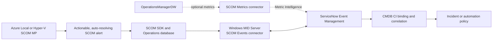
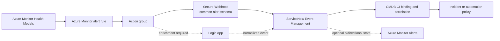

# ServiceNow integration roadmap

ServiceNow integration is planned as an optional layer for organizations that want monitoring
events to participate in ITOM Event Management, CMDB-aware correlation, incident management, and
operational workflows. It is not embedded in a core Management Pack or Azure Monitor health model.

::: warning Development status
The SCOM-to-ServiceNow connector boundary, mapping profiles, lifecycle policy, administration
guidance, and offline contract validation are implemented. A real ServiceNow/SCOM/MID Server lab
is still required. Azure Monitor-to-ServiceNow remains a later implementation.
:::

For the implemented SCOM path, continue to the
[SCOM-to-ServiceNow integration guide](scom-servicenow.md).

## Solution boundaries

| Monitoring solution | ServiceNow delivery boundary |
|---|---|
| Azure Local SCOM MP | Development connector profile, namespace allow-list, mappings, validation, and operator guidance |
| Hyper-V SCOM MP | Separate development profile, allow-list, mappings, and tests targeting Hyper-V classes and alerts |
| Azure Local Azure Monitor | Optional action-group, webhook, mapping, and deployment guidance |
| Hyper-V Azure Monitor | Reserved until the parent Azure Monitor solution receives a go decision |

There is no shared ServiceNow runtime package that makes one solution depend on another. A common
event-field contract may be documented and tested across solutions.

## SCOM candidate architecture

The selected architecture is the ServiceNow SCOM Events connector running through a Windows MID
Server. It collects SCOM alerts and can synchronize supported close, reopen, acknowledgement, and
ticket-reference behavior. The separate SCOM Metrics connector is evaluated only when ServiceNow
Metric Intelligence is licensed and metric ingestion provides demonstrated value.

The Management Packs remain connector-neutral. Their responsibility is to provide stable object
identity, actionable alerts, consistent severity, complete context, predictable auto-resolution,
and documented maintenance behavior. Credentials, MID Server configuration, ServiceNow mappings,
and incident policy stay outside the sealed MPs.

## Azure Monitor candidate architecture

The preferred candidate is an Azure Monitor action group using a **Secure Webhook** with the common
alert schema to the ServiceNow Event Management endpoint. Direct integration is preferred when
standard field mapping is sufficient. Azure Logic Apps is evaluated when the workflow needs CMDB
lookups, routing, payload enrichment, approval, retry queues, or multiple destinations.

New development will not target legacy Azure Monitor ITSM actions. Microsoft directs existing
ServiceNow ITSM-action integrations toward Secure Webhook actions. Basic-authentication webhook
URLs are not the preferred production design; authentication must use the least-privileged supported
OAuth or Secure Webhook pattern.

## Dual-source authority

An environment may run SCOM and Azure Monitor at the same time. Sending equivalent conditions from
both tools directly to ServiceNow can create duplicate events, alerts, and incidents.

Each deployment must choose one of these policies:

1. **SCOM authoritative** — SCOM sends the condition; Azure Monitor remains informational.
2. **Azure Monitor authoritative** — Azure Monitor sends the condition; SCOM remains operationally
   visible but does not forward the equivalent alert.
3. **ServiceNow correlation** — both sources send events only after a proof demonstrates reliable
   CI binding and a stable correlation key.

A candidate correlation contract includes platform, solution, environment, stable entity identity,
condition or monitor identity, and lifecycle state. Display names and alert text are not stable keys.

## Research and decision gates

| Workstream | Evidence required |
|---|---|
| Product and licensing | Supported SCOM, Azure Monitor, ServiceNow release, ITOM/Event Management, Metric Intelligence, and IntegrationHub requirements |
| Connectivity | MID Server placement, firewall paths, proxies, private ServiceNow constraints, Azure endpoints, and failover behavior |
| Identity and security | Least privilege, OAuth/service principal roles, credential storage, rotation, audit logs, and no secrets in source |
| Data contract | Alert/event fields, entity and CI keys, severity, priority, ownership, knowledge links, health state, and custom properties |
| Lifecycle | Open, update, acknowledge, assign, suppress, maintain, resolve, reopen, close, and stale-connector behavior |
| Noise control | Allow-listing, flapping, deduplication, correlation, root-cause versus symptom policy, and rate limits |
| Reliability | Retry, dead-letter handling, outage recovery, replay safety, connector monitoring, and service-level targets |
| Operations | Runbooks, dashboards, tests, troubleshooting, upgrade, rollback, and removal |

## Proof-of-concept acceptance

The proof must demonstrate:

- one SCOM alert and one Azure Monitor alert opening with correct CI, severity, owner, and context;
- repeated observations updating rather than duplicating the ServiceNow alert;
- source recovery closing or resolving the correct record;
- maintenance and suppression preventing unwanted incidents;
- a ServiceNow or connector outage recovering without silent loss or uncontrolled replay;
- bidirectional behavior, if enabled, changing only the intended source alert;
- dual-source tests producing one operational incident for one underlying condition; and
- complete audit evidence with no credential material in logs or repository artifacts.

## Delivery status

- supported integration and licensing matrix — research baseline complete; installed-release and
  SCOM 2025 confirmation remain;
- SCOM event, alert, CI, severity, and lifecycle mapping — development contract complete;
- Azure Monitor common-alert-schema mapping;
- authoritative-source and correlation decision record;
- security and connectivity design;
- repeatable lab fixtures and fault tests — offline contract complete; live fixtures remain;
- optional configuration profiles owned by each source solution — development baseline complete;
- administrator, troubleshooting, upgrade, and rollback documentation — SCOM guide complete;
- Azure Monitor integration implementation — later.

## Current references

- [ServiceNow SCOM connector configuration](https://www.servicenow.com/docs/r/it-operations-management/event-management/t_EMConfigureSCOMConnector.html)
- [ServiceNow Event Management Connectors release notes](https://www.servicenow.com/docs/r/store-release-notes/store-rn-itom-event-mgmt-connectors.html)
- [ServiceNow Azure Monitor authenticated data source](https://www.servicenow.com/docs/r/it-operations-management/event-management/azure-integration.html)
- [Microsoft Azure Monitor Secure Webhook configuration](https://learn.microsoft.com/en-us/azure/azure-monitor/alerts/itsm-connector-secure-webhook-connections-azure-configuration)
- [Microsoft guidance for converting legacy ServiceNow ITSM actions](https://learn.microsoft.com/en-us/azure/azure-monitor/alerts/itsm-convert-servicenow-to-webhook)
- [Microsoft Azure Monitor Logic Apps integration](https://learn.microsoft.com/en-us/azure/azure-monitor/alerts/alerts-logic-apps)
- [Microsoft SCOM product connector subscriptions](https://learn.microsoft.com/en-us/system-center/scom/manage-integration-config-integration?view=sc-om-2025)
