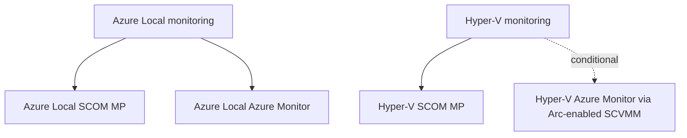
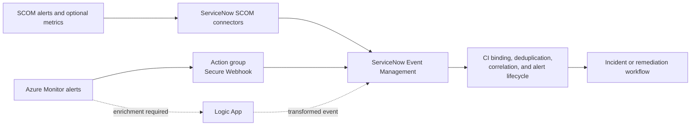

# Roadmap

The roadmap is organized by platform first and solution second. This page is the public delivery
summary. Repository and publishing identity are governed by
[ADR 0024](../design/decisions/0024-repository-and-publishing-identity.md).

## Portfolio structure

| Epic | Delivery feature | Commitment | Status |
|---|---|---|---|
| Azure Local monitoring | Azure Local SCOM MP | Committed | Planned |
| Azure Local monitoring | Azure Local Azure Monitor | Committed | Planned |
| Hyper-V monitoring | Hyper-V SCOM MP | Committed | Comprehensive architecture proposed; evidence research active |
| Hyper-V monitoring | Hyper-V Azure Monitor through Arc-enabled SCVMM | Conditional | Research gate; future roadmap |

## Now — foundation and decision gates

These items unblock safe implementation:

| Item | Outcome | Dependency |
|---|---|---|
| Independent SCOM packaging contract | Validate independent namespaces, artifacts, signing, coexistence, upgrade, and removal behavior | Implements accepted ADR 0022 for both SCOM Features |
| Hyper-V SCOM monitoring research | Validate proposed ADRs 0027–0029 through exhaustive signal inventory, workflow/threshold research, lab evidence, and curated defaults | Active; gates Hyper-V authoring |
| Hyper-V SCOM architecture validation | Trace the comprehensive package, object, discovery, workflow, health, alert, DA, security, scale, and release design to spike evidence | Resolves ADRs 0027–0029 |
| Azure Local Health Models revalidation | Revalidate APIs, preview limits, identity, and signal contracts | Gates Azure Local Azure Monitor authoring |
| Arc-enabled SCVMM inventory spike | Prove inventory and guest-management boundaries | Precedes telemetry proof |
| Hyper-V Health Models feasibility spike | Prove or disprove a useful supported entity and signal model | Precedes go/no-go ADR |

See [Research spikes](../design/research-spikes.md) for the evidence contract.
The complete phase-one Hyper-V breakdown is published in
[Hyper-V SCOM monitoring research](../hyper-v/monitoring-research.md).

## Next — committed delivery

### Azure Local SCOM Management Pack

1. Author classes, discoveries, and DA membership.
2. Author monitoring, DA rollups/operator surfaces, and overrides.
3. Validate, package, and document the independent release.

### Azure Local Azure Monitor

1. Author entities and signals.
2. Implement deployment, alerts, and workbooks.
3. Validate and document the release.

### Hyper-V SCOM Management Pack

1. Validate the [comprehensive architecture](../design/hyper-v/architecture.md), DA boundary,
   membership, and rollup, then resolve proposed ADRs 0027–0029.
2. Author classes, discoveries, and DA membership.
3. Author monitoring, DA rollups/operator surfaces, and overrides.
4. Validate, package, and document the independent release.

The execution order between the three committed Features will be set after research provides
credible effort and lab-capacity estimates. Adding Hyper-V does not silently compress the existing
Azure Local work.

## Later — conditional Hyper-V Azure Monitor

The Hyper-V Azure Monitor Feature stays deferred until:

1. Arc-enabled SCVMM inventory and guest management are proven.
2. Supported telemetry and Health Models behavior are proven.
3. [ADR 0023](../design/decisions/0023-hyper-v-azure-monitor-through-arc-enabled-scvmm.md)
   records a go decision.
4. The conditional implementation plan is approved and activated.

A defer or no-go result is a valid outcome. The roadmap will not promise Azure Monitor parity where
Microsoft-supported inventory or telemetry cannot provide it.

## Later — ServiceNow integrations

ServiceNow integration is an optional cross-cutting roadmap area with separate paths for each
monitoring solution. It does not change the independence of the four solution boundaries.

| Source solution | Preferred integration candidate | Commitment |
|---|---|---|
| Azure Local SCOM MP | ServiceNow SCOM Events connector through a Windows MID Server | Research and proof of concept |
| Hyper-V SCOM MP | ServiceNow SCOM Events connector through a Windows MID Server | Research after MP alert contracts stabilize |
| Azure Local Azure Monitor | Azure Monitor action group using Secure Webhook and the common alert schema | Research and proof of concept |
| Hyper-V Azure Monitor | Same Azure Monitor pattern | Conditional on the parent Hyper-V Azure Monitor go decision |

The roadmap also evaluates the optional SCOM Metrics connector for ServiceNow Metric Intelligence
and Azure Logic Apps when enrichment or workflow orchestration is required. New work must not use
the legacy Azure Monitor ITSM action as its target architecture.

Before implementation, research must validate licensing, supported product versions, authentication,
MID Server placement, CMDB/CI mapping, severity conversion, deduplication, maintenance behavior,
bidirectional state changes, rate limits, failure handling, and audit requirements. Environments
using SCOM and Azure Monitor together must select an authoritative source for each condition or
prove a correlation key that prevents duplicate ServiceNow alerts and incidents.

See the [ServiceNow integration roadmap](../integrations/servicenow.md) for the candidate
architectures, evidence gates, and planned deliverables. This is a **Later** initiative, so no
committed monitoring work moves or loses capacity in this roadmap update.

## Cross-cutting release outcomes

Each committed delivery Feature includes:

- deterministic validation and lab evidence;
- support, prerequisite, security, cost, scale, upgrade, and removal guidance;
- versioned artifacts and release notes;
- upgrade-safe customization;
- monitoring-pipeline self-observability;
- a platform-owned Distributed Application with validated dynamic membership, rollup, operator
  views, reports, dashboards, and SLO targets; and
- optional SquaredUp visualization guidance where it adds value.
- connector-friendly alert identity, lifecycle, and context for optional ServiceNow integration.

## Future companion products

Application and guest-workload monitoring remains separate from the infrastructure platform tracks.
Potential companion products include VM workloads, AKS Arc workloads, SQL Managed Instance, and
Azure Virtual Desktop. Their health can depend on the appropriate Hyper-V or Azure Local platform
model without expanding the platform MPs into application monitoring suites.

A combined Azure Local and Hyper-V fleet DA is also a possible companion product. It must be an
optional third MP that depends on both platform products; neither platform MP depends on it.

## How to suggest a roadmap addition

[Open a discussion or issue](https://github.com/Hybrid-Solutions-Cloud/hybrid-health-monitoring/issues/new/choose).
Approved public milestones will be reflected on this roadmap.
