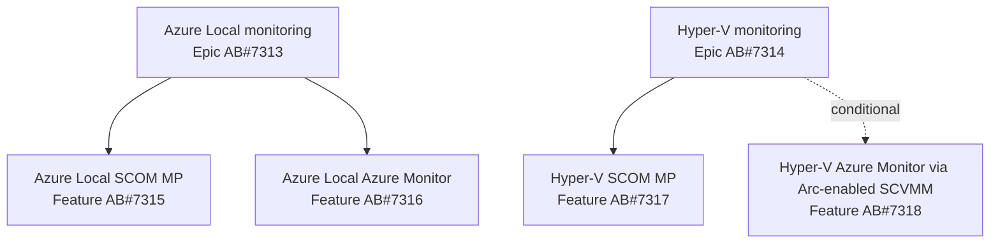

# Roadmap

The roadmap is organized by platform first and delivery surface second. Azure DevOps owns the
delivery hierarchy; this page is the published summary.

Repository and publishing migration is tracked by
[AB#7340](https://dev.azure.com/hybridcloudsolutions/Azure%20Local%20SCOM%20MP/_workitems/edit/7340)
and governed by [ADR 0024](../design/decisions/0024-repository-and-publishing-identity.md).

## Portfolio structure

| Epic | Delivery feature | Commitment | Status |
|---|---|---|---|
| [Azure Local monitoring — AB#7313](https://dev.azure.com/hybridcloudsolutions/Azure%20Local%20SCOM%20MP/_workitems/edit/7313) | [Azure Local SCOM MP — AB#7315](https://dev.azure.com/hybridcloudsolutions/Azure%20Local%20SCOM%20MP/_workitems/edit/7315) | Committed | Planned |
| [Azure Local monitoring — AB#7313](https://dev.azure.com/hybridcloudsolutions/Azure%20Local%20SCOM%20MP/_workitems/edit/7313) | [Azure Local Azure Monitor — AB#7316](https://dev.azure.com/hybridcloudsolutions/Azure%20Local%20SCOM%20MP/_workitems/edit/7316) | Committed | Planned |
| [Hyper-V monitoring — AB#7314](https://dev.azure.com/hybridcloudsolutions/Azure%20Local%20SCOM%20MP/_workitems/edit/7314) | [Hyper-V SCOM MP — AB#7317](https://dev.azure.com/hybridcloudsolutions/Azure%20Local%20SCOM%20MP/_workitems/edit/7317) | Committed | Research and design next |
| [Hyper-V monitoring — AB#7314](https://dev.azure.com/hybridcloudsolutions/Azure%20Local%20SCOM%20MP/_workitems/edit/7314) | [Hyper-V Azure Monitor through Arc-enabled SCVMM — AB#7318](https://dev.azure.com/hybridcloudsolutions/Azure%20Local%20SCOM%20MP/_workitems/edit/7318) | Conditional | Research gate; future roadmap |

## Now — foundation and decision gates

These items unblock safe implementation:

| Item | Outcome | Dependency |
|---|---|---|
| [Shared SCOM packaging spike — AB#7319](https://dev.azure.com/hybridcloudsolutions/Azure%20Local%20SCOM%20MP/_workitems/edit/7319) | Decide common library versus separate platform libraries | Feeds ADR 0022 and both SCOM Features |
| [Hyper-V topology and support spike — AB#7327](https://dev.azure.com/hybridcloudsolutions/Azure%20Local%20SCOM%20MP/_workitems/edit/7327) | Supported versions, topology, discovery sources, signals, and lab fixtures | Gates Hyper-V authoring |
| [Azure Local Health Models revalidation — AB#7323](https://dev.azure.com/hybridcloudsolutions/Azure%20Local%20SCOM%20MP/_workitems/edit/7323) | Revalidate APIs, preview limits, identity, and signal contracts | Gates Azure Local Azure Monitor authoring |
| [Arc-enabled SCVMM inventory spike — AB#7331](https://dev.azure.com/hybridcloudsolutions/Azure%20Local%20SCOM%20MP/_workitems/edit/7331) | Prove inventory and guest-management boundaries | Precedes telemetry proof |
| [Hyper-V Health Models feasibility spike — AB#7332](https://dev.azure.com/hybridcloudsolutions/Azure%20Local%20SCOM%20MP/_workitems/edit/7332) | Prove or disprove a useful supported entity and signal model | Precedes go/no-go ADR |

See [Research spikes](../design/research-spikes.md) for the evidence contract.

## Next — committed delivery

### Azure Local SCOM Management Pack

1. Author classes and discoveries — [AB#7320](https://dev.azure.com/hybridcloudsolutions/Azure%20Local%20SCOM%20MP/_workitems/edit/7320).
2. Author monitoring and overrides — [AB#7321](https://dev.azure.com/hybridcloudsolutions/Azure%20Local%20SCOM%20MP/_workitems/edit/7321).
3. Validate, package, and document the release — [AB#7322](https://dev.azure.com/hybridcloudsolutions/Azure%20Local%20SCOM%20MP/_workitems/edit/7322).

### Azure Local Azure Monitor

1. Author entities and signals — [AB#7324](https://dev.azure.com/hybridcloudsolutions/Azure%20Local%20SCOM%20MP/_workitems/edit/7324).
2. Implement deployment, alerts, and workbooks — [AB#7325](https://dev.azure.com/hybridcloudsolutions/Azure%20Local%20SCOM%20MP/_workitems/edit/7325).
3. Validate and document the release — [AB#7326](https://dev.azure.com/hybridcloudsolutions/Azure%20Local%20SCOM%20MP/_workitems/edit/7326).

### Hyper-V SCOM Management Pack

1. Author classes and discoveries — [AB#7328](https://dev.azure.com/hybridcloudsolutions/Azure%20Local%20SCOM%20MP/_workitems/edit/7328).
2. Author monitoring and overrides — [AB#7329](https://dev.azure.com/hybridcloudsolutions/Azure%20Local%20SCOM%20MP/_workitems/edit/7329).
3. Validate, package, and document the release — [AB#7330](https://dev.azure.com/hybridcloudsolutions/Azure%20Local%20SCOM%20MP/_workitems/edit/7330).

The execution order between the three committed Features will be set after research provides
credible effort and lab-capacity estimates. Adding Hyper-V does not silently compress the existing
Azure Local work.

## Later — conditional Hyper-V Azure Monitor

The Hyper-V Azure Monitor Feature stays deferred until:

1. Arc-enabled SCVMM inventory and guest management are proven in [AB#7331](https://dev.azure.com/hybridcloudsolutions/Azure%20Local%20SCOM%20MP/_workitems/edit/7331).
2. Supported telemetry and Health Models behavior are proven in [AB#7332](https://dev.azure.com/hybridcloudsolutions/Azure%20Local%20SCOM%20MP/_workitems/edit/7332).
3. [ADR 0023](../design/decisions/0023-hyper-v-azure-monitor-through-arc-enabled-scvmm.md)
   records a go decision through [AB#7333](https://dev.azure.com/hybridcloudsolutions/Azure%20Local%20SCOM%20MP/_workitems/edit/7333).
4. The conditional implementation plan in [AB#7334](https://dev.azure.com/hybridcloudsolutions/Azure%20Local%20SCOM%20MP/_workitems/edit/7334) is approved and activated.

A defer or no-go result is a valid outcome. The roadmap will not promise Azure Monitor parity where
Microsoft-supported inventory or telemetry cannot provide it.

## Cross-cutting release outcomes

Each committed delivery Feature includes:

- deterministic validation and lab evidence;
- support, prerequisite, security, cost, scale, upgrade, and removal guidance;
- versioned artifacts and release notes;
- upgrade-safe customization;
- monitoring-pipeline self-observability; and
- optional SquaredUp visualization guidance where it adds value.

## Future companion products

Application and guest-workload monitoring remains separate from the infrastructure platform tracks.
Potential companion products include VM workloads, AKS Arc workloads, SQL Managed Instance, and
Azure Virtual Desktop. Their health can depend on the appropriate Hyper-V or Azure Local platform
model without expanding the platform MPs into application monitoring suites.

## How to suggest a roadmap addition

[Open a discussion or issue](https://github.com/Hybrid-Solutions-Cloud/hybrid-health-monitoring/issues/new/choose).
Approved delivery work is represented in Azure DevOps and linked back to the applicable Epic or
Feature.
