# SCOM Health Rollup Tree — Azure Local

> Source: `docs/scom-mp/diagrams/health-tree.md`  
> Class names match [ADR 0005](../../design/decisions/0005-scom-class-hierarchy.md).
> Embed in docs using the `mermaid` fenced code block.

```mermaid
flowchart TD
    DA["Azure Local\nDistributed Application"]:::root

    DA --> CL["AzureLocal.Cluster\n(L1 — Dependency Monitor)"]:::l1
    DA --> SP["AzureLocal.StoragePool\n(L2 — Dependency Monitor)"]:::l2
    DA --> ND["AzureLocal.Node\n(L2 — Dependency Monitor)"]:::l2
    DA --> L3["AzureLocal.Azure.HCICluster\n(L3 — Dependency Monitor)"]:::l3

    CL --> AV["Availability\nAggregate Monitor"]:::agg
    CL --> PF["Performance\nAggregate Monitor"]:::agg
    CL --> CF["Configuration\nAggregate Monitor"]:::agg

    AV --> NDav["AzureLocal.Node\nAvailability UM"]:::unit
    AV --> SPav["AzureLocal.StoragePool\nAvailability UM"]:::unit
    AV --> DCav["AzureLocal.DCMA\nHeartbeat UM"]:::unit
    AV --> HRav["AzureLocal.HCIRegistration\nState UM"]:::unit

    PF --> CPU["AzureLocal.Node\nCPU % UM"]:::unit
    PF --> MEM["AzureLocal.Node\nMemory % UM"]:::unit
    PF --> VOL["AzureLocal.Volume\nFull % UM"]:::unit
    PF --> RDM["AzureLocal.NetworkIntent\nRDMA Util UM"]:::unit

    CF --> QUO["AzureLocal.Cluster\nQuorum UM"]:::unit
    CF --> VAL["AzureLocal.Cluster\nValidation UM"]:::unit
    CF --> NIS["AzureLocal.NetworkIntent\nState UM"]:::unit
    CF --> UST["AzureLocal.UpdateState\nLast Result UM"]:::unit

    SP --> V1["AzureLocal.Volume\nAvailability UM × N"]:::unit
    SP --> ST["AzureLocal.StorageTier\nHealth UM"]:::unit
    SP --> SR["AzureLocal.StorageReplica\nPartnership UM"]:::unit

    L3 --> L3A["AzureLocal.Azure.HCICluster\nArc Connected UM"]:::unit
    L3 --> L3B["AzureLocal.Azure.ArcMachine\nHeartbeat UM × N"]:::unit
    L3 --> L3C["AzureLocal.Azure.KeyVault\nExpiry UM"]:::unit
    L3 --> L3D["AzureLocal.Azure.RBAC\nDrift UM"]:::unit

    classDef root fill:#0078D4,color:#fff,stroke:none,font-weight:bold
    classDef l1   fill:#004B8D,color:#fff,stroke:none
    classDef l2   fill:#0072C6,color:#fff,stroke:none
    classDef l3   fill:#7719AA,color:#fff,stroke:none
    classDef agg  fill:#107C41,color:#fff,stroke:none
    classDef unit fill:#F0F0F0,color:#333,stroke:#999
```

